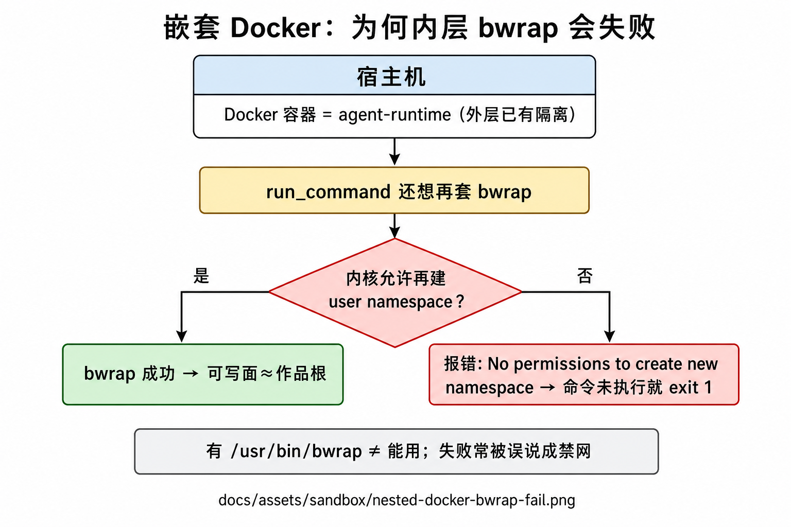
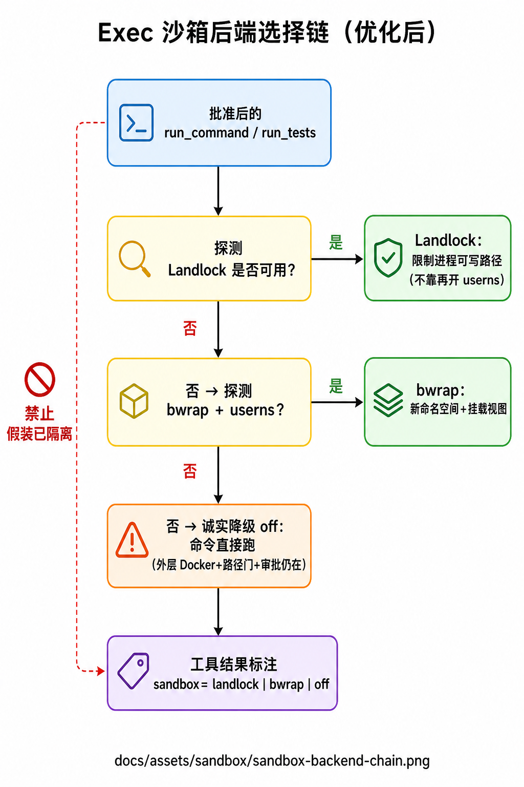
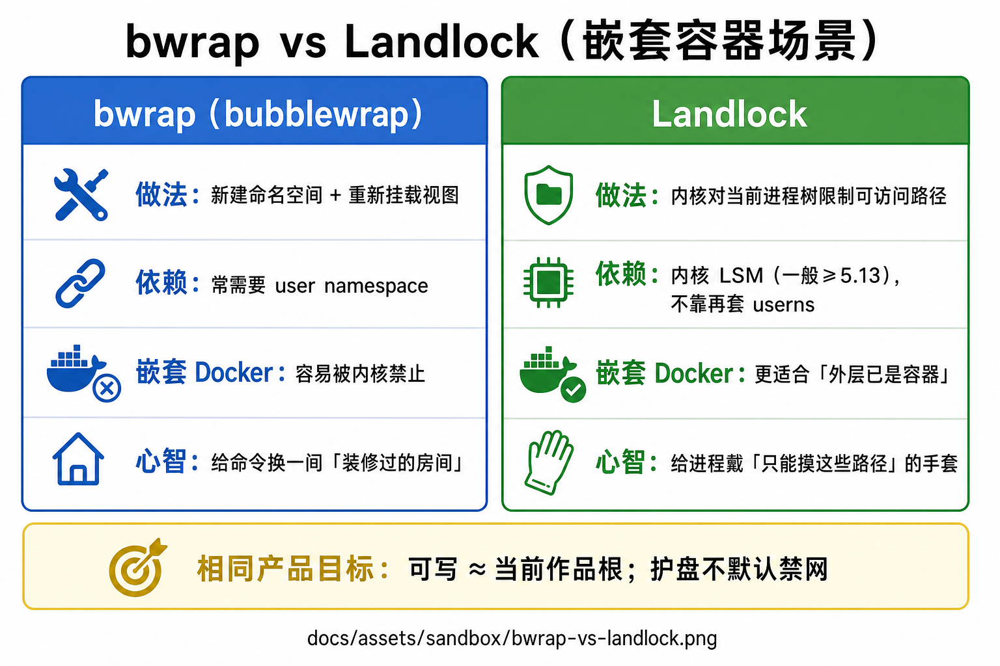
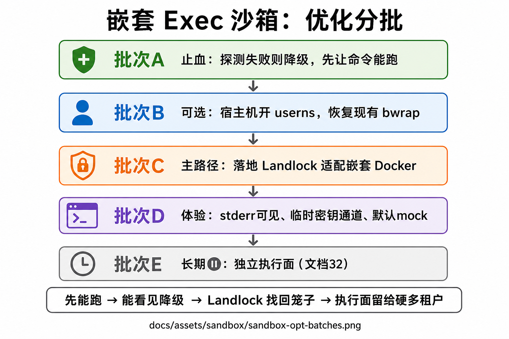

# 36 — 嵌套 Docker 下 Exec 沙箱优化方案

> **状态**：方案（待分批落地）· 2026-07-28  
> **触发**：Agent 自测 CLI 时 `run_command` 恒 `exit 1`；根因是镜像内有 bwrap，但宿主机/嵌套容器 **禁止非特权 user namespace**，命令在进业务 argv 前失败；模型误判为「禁网」。  
> **关联**：[31](31-sandbox-escape-and-hardening.md) · [32](32-execution-plane-and-local-runner.md) · [BWRAP-mental-model.md](BWRAP-mental-model.md) · 代码 `tools/core/sandbox.py` · `shell.py`  
> **约束**：不改 Agent loop / 工具名 / 审批状态机；速率服从 [13](13-rate-redlines.md)；默认仍 **护盘不禁网**。

---

## 0. 一句话

**runtime 继续跑在 Docker 里；OS 级 FS 笼子能开则开，开不了就诚实降级并让命令可跑；中期用 Landlock 适配嵌套；长期才考虑独立执行面。**

---

## 1. 问题陈述

| 现象 | 真实原因 | 常见误判 |
|------|----------|----------|
| `run_command` → exit 1 | `bwrap: No permissions to create new namespace` | 「沙箱禁网」「key 不对」 |
| `run_tests(任意 CLI)` → `test_command_not_allowed` | 启动器白名单（设计如此） | 「什么命令都不能跑」 |
| 临时 `KEY=… python3 …` 仍失败 | 业务进程未启动（卡在 bwrap） | 「前缀写法无效」 |
| Agent 让用户本机 `curl` / 贴 key | 文案幻觉 + 甩锅 | 当操作手册执行 |

**架构事实**：外层已是 Docker 隔离；内层再 bwrap = **嵌套 userns**。很多内核/云镜像默认不允许 → 「有二进制 ≠ 能用」。

### 1.1 图册（与 bwrap 心智图同目录）

图统一放在 `docs/assets/sandbox/`（与 [`BWRAP-mental-model.md`](BWRAP-mental-model.md) 共用，不另开重叠根目录）。

| # | 主题 | 图 |
|---|------|-----|
| 1 | 嵌套 Docker 为何内层 bwrap 失败 | [`nested-docker-bwrap-fail.png`](assets/sandbox/nested-docker-bwrap-fail.png) |
| 2 | 优化后后端选择链 Landlock→bwrap→off | [`sandbox-backend-chain.png`](assets/sandbox/sandbox-backend-chain.png) |
| 3 | **bwrap vs Landlock**（区别） | [`bwrap-vs-landlock.png`](assets/sandbox/bwrap-vs-landlock.png) |
| 4 | 优化分批 A→E | [`sandbox-opt-batches.png`](assets/sandbox/sandbox-opt-batches.png) |
| — | 已有：命令如何被 bwrap 包裹 | [`bwrap-exec-flow.png`](assets/sandbox/bwrap-exec-flow.png) |
| — | 已有：bwrap 挂载心智（中文） | [`bwrap-mounts-zh.png`](assets/sandbox/bwrap-mounts-zh.png) |

#### 为何失败（先看图）



#### 和 bwrap 的区别：后端怎么选（先看图）





| | **bwrap** | **Landlock**（方案批次 C） |
|--|-----------|---------------------------|
| 做法 | 新命名空间 + 重挂载「房间」 | 内核限制进程能摸的路径（「手套」） |
| 嵌套 Docker | 常卡在 user namespace | **更贴「外层已是容器」** |
| 你们现状 | ✅ 已实现（不可用则降级） | ❌ 方案中，待落地 |
| 产品目标 | 相同：可写≈作品根；护盘不默认禁网 | 同左 |

#### 分批路线（先看图）



---

## 2. 目标与非目标

### 目标

1. **可用性**：嵌套 Docker 下批准后的 `run_command` / `run_tests` **能真正执行**（自测 CLI、pytest 不再被 bwrap 前置杀死）。  
2. **诚实性**：健康检查 / 工具结果 / 日志能区分 `bwrap | landlock | off(degraded)`；禁止静默假装隔离。  
3. **可恢复隔离**：在可行环境恢复「可写面 ≈ work_root」；优先不依赖再开一层 userns 的方案（Landlock）。  
4. **Agent 行为**：不把临时密钥甩到用户本机；exit≠0 先读 stderr；不把 bwrap 降级说成禁网。

### 非目标（本方案不做）

- 默认禁外网（已产品否决，见 31 E4）。  
- 把 `TOOL_SANDBOX` 做成日常产品大开关（仅 break-glass / 探测结果）。  
- 立刻上 gVisor / Kata / 完整本地 Runner（32 仍 ⏸）。  
- 削弱 `run_tests` 白名单去「顺便跑任意 CLI」。

---

## 3. 分批方案

### 批次 A — 止血可用性（P0 · 已部分落地）

| ID | 项 | 做法 | 验收 |
|----|-----|------|------|
| **A1** | bwrap 可用性探测 | 启动/首次 resolve 时探测；stderr 含 namespace / 明确无权限 → **backend=off**，打 warning | 嵌套 Docker 上 `run_command echo ok` → exit 0，`sandbox=off` |
| **A2** | 部署吃到代码 | `make up-runtime`（或等价 rebuild） | 容器内 import 的 `sandbox.py` 含探测逻辑 |
| **A3** | Agent 文案纠偏 | system + `run_command` 描述：禁甩锅禁网、禁密钥进聊天、exit≠0 读 stderr | 回归话术不再默认「请到你电脑跑」 |
| **A4** | 可观测 | `sandbox_status` 暴露 `bwrap_usable`；可选 metrics 计数 `sandbox_degraded_total` | Ops/健康能看见降级 |

**已做**：A1 代码、A3 文案初稿。  
**待做**：A2 部署验证、A4 指标（可选）。

**安全口径（降级期）**：外层 Docker + 文件路径沙箱 + 审批 + deny-by-default env 仍在；**缺的是子进程 FS 笼子**。自用/内网可接受；多租户不信任代码不够。

---

### 批次 B — 运维可选：恢复 bwrap（P1 · 无代码或少代码）

适用：**想继续用现有 bwrap 实现**，且能改宿主机策略。

| ID | 项 | 做法 | 验收 |
|----|-----|------|------|
| **B1** | 文档化 userns | 在 03/31 写清：查 `bwrap --die-with-parent -- /bin/true`；`unprivileged_userns_clone` / `max_user_namespaces` | 运维可按文档自助 |
| **B2** | 宿主机打开 userns | 按发行版持久 sysctl（安全评审后） | 容器内探测成功 → `sandbox=bwrap`；越界写失败 |
| **B3** | 否决默认 privileged | 不把 `--privileged` 当产品默认 | 文档红线 |

**不做**：要求所有部署环境必须开 userns（云/加固机可能永远不开）→ 必须以 A 降级或 C Landlock 兜底。

---

### 批次 C — Landlock 适配嵌套 Docker（P1 · 工程主路径）

对标文档 31 原设计与 Codex：**进程树路径限制，不依赖嵌套 userns**。

| ID | 项 | 做法 | 验收 |
|----|-----|------|------|
| **C0** | 内核探测 | 检测 Landlock ABI / 是否可 `landlock_restrict_self` | CI 与 runtime 启动日志 |
| **C1** | 实现 | `sandbox.py` 增加 `landlock` 后端：RW≈work_root + 私有 tmp；系统路径策略与现 bwrap 心智对齐 | 单测 + 容器集成：界内写 OK、界外写失败 |
| **C2** | 策略链 | **Landlock → bwrap → off(degraded)**；每级探测失败降级并打点 | 嵌套 Docker 上优先落到 Landlock 或诚实 off |
| **C3** | 文档 | 更新 31 状态表、BWRAP 心智模型「后端选择」一节 | 面试/运维口径一致 |

**预估**：中等（内核能力封装 + 集成测 + 嵌套矩阵）。  
**依赖**：runtime 基础镜像内核 ≥ 5.13 且启用 Landlock；不满足则自动跳过到 B/A。

---

### 批次 D — Agent 自测体验（P2 · 小改，强体验）

| ID | 项 | 做法 | 验收 |
|----|-----|------|------|
| **D1** | 密钥注入通道（可选） | 会话/Turn 级「临时 env」注入子进程允许名单（如 `*_API_KEY`），**不进聊天正文**；或仅文档约定「命令行前缀」 | 临时 key 可测且不出现在用户可见气泡 |
| **D2** | 工具结果强调 stderr | UI/投影对 `exit≠0` 默认展开 stderr 摘要 | 人一眼看到 bwrap/连接错误原文 |
| **D3** | 自测默认 mock | agent system：优先无网 `--test`/pytest；真 API 为可选 | 少依赖外网抖动 |

---

### 批次 E — 独立执行面（P3 · 长期 · 与 32 对齐）

| ID | 项 | 做法 | 状态 |
|----|-----|------|------|
| **E1** | 控制面 / 执行面分离加强 | Turn 冻结执行落点；runner 回传与现工具结果同形 | ⏸ 见 32 |
| **E2** | 强隔离 runner | 专用机 / VM / 更重沙箱跑 argv | 仅当多租户不信任代码成为硬需求 |

**本阶段不排期实现**；方案里占位，避免和 A–C 抢优先级。

---

## 4. 推荐落地顺序

```text
现在     A2 部署验证 +（可选）A4 指标
本周可选 B1 文档；有权限再 B2
下一迭代 C0–C3 Landlock（嵌套 Docker 正经解）
穿插     D2（stderr 可见）→ D1/D3
以后     E* 仅当产品需要
```

口诀：**先能跑 → 再能看见降级 → 再用 Landlock 把笼子找回来 → 执行面留给真正的多租户硬需求。**

---

## 5. 风险与回滚

| 风险 | 缓解 |
|------|------|
| 降级期缺 FS 笼子 | 文档诚实；多租户场景加快 C；敏感环境可 fail-closed（拒绝 exec）作产品二选一 |
| Landlock 内核不够 | 探测失败自动跳过；行为同 A |
| 开 userns 的安全争议 | B 仅可选；默认不依赖 |
| 模型继续甩锅 | A3 + 评测金样「stderr 含 namespace 时应总结为沙箱降级/不可用」 |

回滚：A1 可用 `TOOL_SANDBOX=off` 或回退镜像；C 用后端开关关掉 landlock 路径。

---

## 6. 成功标准（方案完成时）

1. 当前这类宿主机上：**批准 `run_command` 不再因 bwrap userns 系统性失败**。  
2. 健康/工具结果能回答：「这台机子命令隔离是 bwrap、landlock，还是 degraded」。  
3. 嵌套 Docker 主流部署上，**C 落地后**越界写盘再次被挡（或明确仍 degraded 并告警）。  
4. Agent 自测临时 API 有一条不污染聊天记录的路径（前缀或 D1）。

---

## 7. 决策待确认（落地前勾选）

- [ ] **降级期策略**：dev/自用 fail-open（当前） vs 生产 fail-closed（无沙箱则拒 exec）？  
- [ ] **是否投入 C（Landlock）** 作为下迭代 P1，还是仅靠 A+B？  
- [ ] **D1 临时密钥注入** 要不要做（隐私/审计成本）？  
- [ ] **E 执行面** 是否继续 ⏸（建议是）？

---

## 8. 相关阅读

| 文档 | 用途 |
|------|------|
| [BWRAP-mental-model.md](BWRAP-mental-model.md) | 大白话心智 |
| [31](31-sandbox-escape-and-hardening.md) | 威胁与 SB 票 |
| [32](32-execution-plane-and-local-runner.md) | 执行面长期选项 |
| [03](03-docker-runtime.md) | 部署与排障旋钮 |
