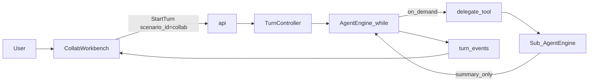

# 37 — 多 Agent 协作 Scenario（`collab`）

> **状态：设计定稿 · 代码未实施**（2026-07-29）  
> **产品意图：** 取消薄 stub 的 `interview`，第三入口改为 **编排型多 Agent 协作** `collab`。  
> **硬约束：**  
> 1. **不影响** Agent 交互速率与交互逻辑（服从 [13](13-rate-redlines.md) R1–R5）  
> 2. **不改** `AgentEngine` while / Intake / 审批门 / Plan 相位 / 事件契约形状  
> 3. **对齐** 成熟做法：协作 = 现有 `delegate` 产品化（[ADR-007](adr/007-subagent-delegation.md)），禁止 supervisor 图回潮  
> **关联：** [09](09-product-modes.md) · [05](05-agent-runtime.md) §10 · [06](06-tools-and-context.md) · [25](25-writing-runway.md) · [contracts.md](contracts.md)  
> **纪律：** 本文为唯一模块正文；实施只改本文票状态 + 对应代码；禁止另开 `*-execution` 平行文。

---

## 0. 一句话

**多 Agent 协作不是新内核**：同一 `AgentEngine` + 按需 `delegate`；差异只在 `ScenarioProfile`（编排者 system / 工具与 `subagent_types` 白名单）与 Web 对子 Agent 事件的**只读投影**。

```text
writing  = 成稿 / diff / RAG
agent    = 全能助手，按需委派
collab   = 编排者优先：update_plan + 多次 delegate，自己少下场
```

现状代码仍为 `writing` / `agent` / `interview`；**以本文为准的目标态**为 `writing` / `agent` / `collab`（删除 `interview`）。

---

## 1. 为什么取消 interview

| 现状 | 问题 |
|------|------|
| [`profiles/interview.yaml`](../services/runtime/app/scenarios/profiles/interview.yaml) | 无 `delegate`、无 `subagent_types`；工具面接近写作子集 |
| Web `InterviewWorkbench` | 直接 re-export `UnifiedWorkbench`，无独立协作语义 |
| Golden | 仅 1 条 stub（`interview.01`），证明价值低 |

访谈纪要能力可由 **writing**（`draft_section` / 大纲）覆盖；第三产品位应让位于**可演示、可证明**的多 Agent 协作姿态，而不是第二个半残写作壳。

---

## 2. 相对 `agent` 的产品差异

| 维度 | `agent` | `collab`（目标） |
|------|---------|------------------|
| 主角色 | 全能编码助手，按需委派 | **编排者（orchestrator）**：默认拆任务、少下场写大段 |
| 工具面 | 全工具（含 shell） | **对齐 agent**（含 shell / `delegate` / `update_plan`），避免第三场景变玩具 |
| `subagent_types` | explore / retrieve / verify / edit / planner / shell | 同上 + `researcher`（跨资料协作）；白名单**只写在 Profile** |
| UI | 时间线为主 | **角色条 + 子 Agent 卡片**（投影已有事件）；主对话仍一条 SSE |
| Plan | 步骤可见 | 文案偏向「角色分工 / 并行委派」 |
| 简单任务 | 可直答、少工具 | **禁止**无谓 `delegate`（system + golden 负例） |

共享宪法不变（[09](09-product-modes.md) / [ADR-013](adr/013-dual-product-modes.md)）：

```text
一个 Runtime，多个 Scenario；
一个 Loop，    多组 Tool；
一条事件管道， 多种工作台布局。
```

---

## 3. 架构（禁止改动的边界）



| 层 | 做什么 | 禁止 |
|----|--------|------|
| **TurnController** | `ScenarioRegistry.get("collab")` → ToolScope | 业务 if-else 堆在 Intake |
| **AgentEngine** | 与今日相同 while | `if scenario_id == "collab"` |
| **delegate** | 已有：独立 messages、收窄工具、深度 ≤ 2、摘要回灌 | supervisor 三节点；子 transcript 整包倒灌 |
| **Web** | 只读投影 `delegate` / `subagent_id` 事件 | 为渲染再开一轮模型；每步拉全量子 transcript 进主轨 |
| **审批 / 沙箱** | 继承 agent；子 agent 共享 abort + 同沙箱 | 为「流畅」默认 `delegate: never` |

执行真相：[`delegate_runner.py`](../services/runtime/app/tools/delegate_runner.py) · [ADR-007](adr/007-subagent-delegation.md) · [05 §10](05-agent-runtime.md)。

---

## 4. 速率红线（R1–R5）

| 红线 | `collab` 含义 |
|------|----------------|
| **R1** | 不挡 `turn.accepted`；roster 面板零同步重活 |
| **R2** | 首 token 前不加「选谁上场」的同步 LLM |
| **R3** | 热路径无重 tokenizer；不在 assemble 拼全量子 transcript |
| **R4** | 子 agent 全量 transcript → Ops / 折叠详情，不上用户等待 |
| **R5** | golden：复杂任务 ≥1 `delegate`；简单任务 **零** `delegate` |

**明确否决：**

- 固定 pipeline / supervisor 图回归（与 ADR-005/007 冲突）
- 每 Turn 强制 N 路并行子 Agent
- 协作「裁判」同步模型调用
- Skills 式全文预注入角色说明书（角色 = `subagent_types`，见 [19](19-skills-layer.md)）

---

## 5. 协作规则（写入 `scenarios/collab/system.md`，不进 Engine）

实施时 system 必须固化下列纪律（可英可中，语义不变）：

1. **主 loop 保留决策权**与对用户的最终答复。  
2. 子 agent **只回摘要 + 引用**；委派深度由平台封顶（现 `MAX_DELEGATE_DEPTH = 2`）。  
3. **简单单文件问答 / 一眼能答的问题：禁止 `delegate`。**  
4. 可并行多个 `delegate`（引擎已支持），**由模型按需触发**；平台不预调度、不强制 fan-out。  
5. 复杂任务优先：`update_plan`（角色分工可见）→ 再 `delegate`。  
6. 不把子 agent 中间过程当对用户的主叙事；用户主轨看编排结论。

---

## 6. Profile 目标规格（实施时落地）

```yaml
# 目标：services/runtime/app/scenarios/profiles/collab.yaml
scenario_id: collab
display_name: 多 Agent 协作
system_prompt_template: scenarios/collab/system.md
tool_names:
  # 与 agent 对齐；必含 update_plan、delegate
  - read_file
  - list_dir
  - glob
  - grep
  - propose_patch
  - write_file
  - edit_file
  - rename_file
  - search_codebase
  - update_plan
  - remember
  - recall
  - search_records
  - run_command
  - run_tests
  - read_lints
  - delegate
  - slow_tool
subagent_types:
  - explore
  - retrieve
  - verify
  - edit
  - planner
  - shell
  - researcher
max_steps: 50
approval_overrides:
  run_tests: never
  write_file: always
  edit_file: always
workspace_layout: repository
web_layout: collab-workbench
```

`_allowed_subagent_types`：**Profile 已带列表则只走白名单**；禁止为 `collab` 在 runner 内加硬编码 scenario 分支。

---

## 7. 契约与迁移（实施清单摘要）

目标枚举：`writing | agent | collab`（替换 `interview`）。

| 面 | 动作 |
|----|------|
| contracts | `commands.py` pattern、OpenAPI、`start_turn.json`、`turn_view` / `session_view` / `turn.accepted`、`golden_turn.schema.json` |
| runtime | 删 `interview` profile/system；增 `collab`；`plan_suggest`：`threshold_interview` → `threshold_collab`（可先复用 agent 阈值）；去掉 stub `_wants_interview` 特判 |
| web | `ScenarioId`、`/collab` 路由、MODE_OPTIONS、Ops 下拉、`scenarioMeta`；删 `scenarios/interview/` |
| eval | 删 `eval/golden/interview/`；增 `collab` 正/负例各 ≥1 |
| 历史 Session | `scenario_id=interview`：**只读打开或提示迁移**，禁止静默改写为 collab 后继续可写（避免行为突变） |

细节票见 §10；**本文定稿 ≠ 已改代码**。

---

## 8. Web：协作可见性（只读投影）

| 要做 | 不要做 |
|------|--------|
| 路由 `/collab`；复用 shared workbench / realtime | 为 collab 复制一套 SSE 客户端 |
| 侧栏「团队 / 子任务」：委派起止、`agent_type`、摘要、折叠详情 | 主时间线刷子 agent 全量 token |
| 角色条展示 Profile `subagent_types`（静态配置） | 每 Turn 调模型生成「推荐团队」 |
| 链到 Ops Raw（若有 `OPS_TEST_SECRET`） | 热路径拉旁路 API |

数据来源：现有 `turn_events` 中 tool / delegate 相关事件及 runner 已戳记的 `subagent_id`（见 `delegate_runner` 转发规则）。

---

## 9. 证明（R5）

| Golden | 意图 |
|--------|------|
| `collab.*` 复杂任务 stub | 轨迹含 ≥1 次 `delegate`；可含 `update_plan` |
| `collab.*` 简单任务 stub | **断言无** `delegate`（守速率 / 防过度委派） |
| 既有 `agent` / `writing` delegate golden | **不得回归**（证明未伤共享内核） |

门禁仍走 `make gate`；不把 live 多 Agent 成本塞进默认 CI。

---

## 10. 实施票（开闸后按序；状态仅维护于此）

| ID | 内容 | 状态 |
|----|------|------|
| **CL0** | 本文定稿 + 索引交叉引用 | ✅ |
| **CL1** | 契约枚举 `interview` → `collab` + OpenAPI / JSON Schema | ⏳ |
| **CL2** | `collab.yaml` + `system.md`；删除 interview profile/system | ⏳ |
| **CL3** | Web `/collab` + 子 Agent 投影面板；删除 interview UI | ⏳ |
| **CL4** | `plan_suggest` / gateway stub / 单测清理 | ⏳ |
| **CL5** | golden 正负例 + docs/09·02·contracts 与实现同步 | ⏳ |
| **CL6** | 历史 `interview` Session 只读降级策略 + 手测 | ⏳ |

开闸条件：评审确认本文 §0–§5；实施 PR **不得**改 `AgentEngine` while 语义。

---

## 11. 非目标

- Org / 多人实时共编 / Agent 间独立公网会话（与 [27](27-multi-tenancy.md) 否决 Org 一致）  
- Agent 团队市场、MCP 编排层  
- 改变 Cancel / 审批 / Landlock 语义  
- 把 `collab` 做成第二套 runtime 或固定多 Agent pipeline  

---

## 12. 文档地图

| 主题 | 文档 |
|------|------|
| 本文 | `37` |
| 场景宪法 | [09](09-product-modes.md) |
| Loop / delegate | [05](05-agent-runtime.md) §10 · [ADR-007](adr/007-subagent-delegation.md) |
| 工具主路径 | [06](06-tools-and-context.md) §0.1 |
| 速率 | [13](13-rate-redlines.md) |
| Plan | [25](25-writing-runway.md) · [26](26-plan-suggest-complexity.md) |
| 契约 | [contracts.md](contracts.md) |
