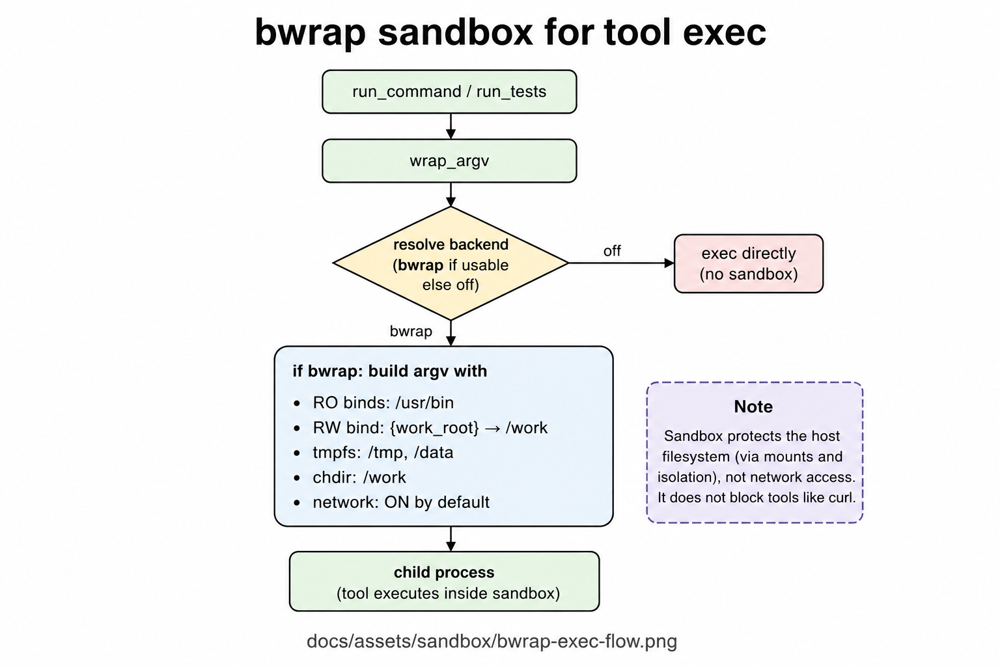
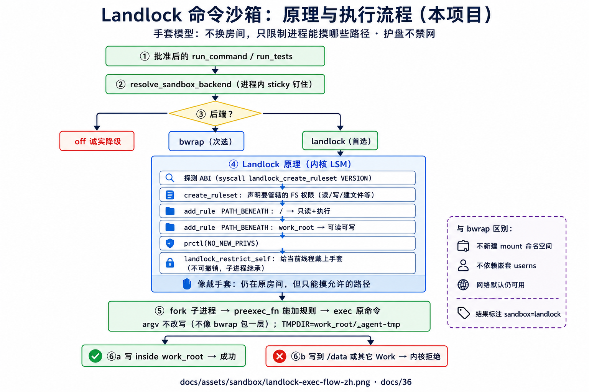
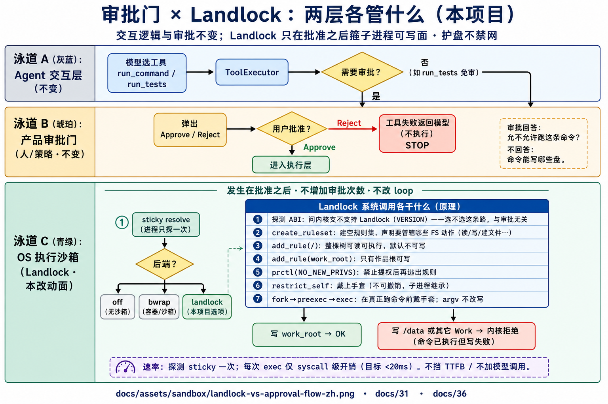
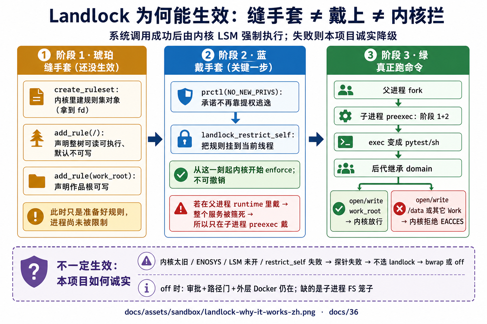
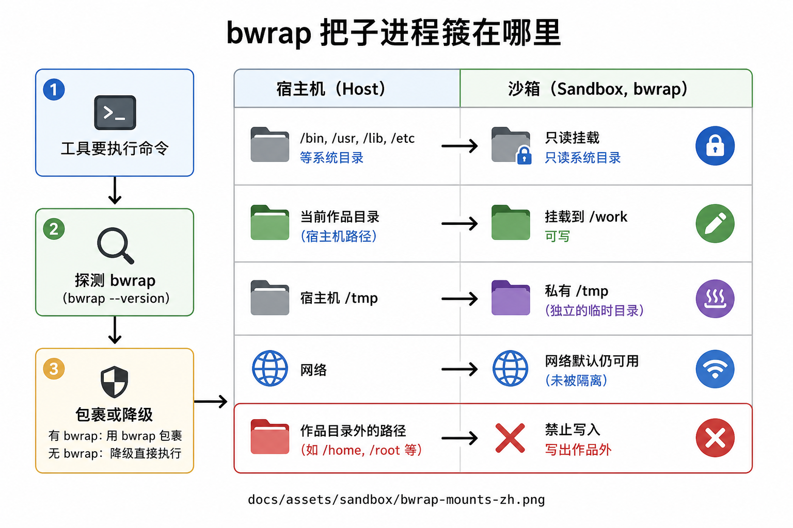

# bwrap 沙箱心智模型

> 本文用**中文大白话**固定：「Agent 要跑命令时，OS 沙箱把子进程箍在哪」。  
> **核心承诺：护主机盘、护别的作品目录；默认并不禁止上网。**  
> 权威：[`31-sandbox-escape-and-hardening.md`](31-sandbox-escape-and-hardening.md) · [`36`](36-sandbox-nested-exec-plan.md)；代码：`sandbox.py` · `landlock_fs.py`。  
> 图目录：`docs/assets/sandbox/`。

---

## 1. 先分清两层「安全」

很多人把「沙箱」混成一件事。本项目至少两层：

| 层 | 管什么 | 典型手段 |
|----|--------|----------|
| **文件工具层** | `read_file` / `write_file` 等 | 路径解析后必须落在**当前作品根**里 |
| **命令执行层（本文）** | `run_command` / `run_tests` 起的**子进程** | 优先 **Landlock**，否则 **bwrap**，再否则诚实降级 |

比喻：

- 文件工具像「只能打开自己工位抽屉的钥匙」；  
- Landlock / bwrap 像「临时工进厂房时套上的隔离服」——就算手里有锤子，也很难砸到隔壁车间。

**沙箱不改 Agent 的思考循环**，只改「命令真正跑起来时」的操作系统可见范围。

---

## 2. 一句话定义

**命令沙箱 = 跑 shell / 测试子进程时，把可写面箍在当前作品根：**

- **Landlock（优先）**：内核 LSM 限制进程路径（「手套」），**不靠再开 user namespace**，更适合嵌套 Docker；  
- **bwrap（其次）**：新命名空间 + 重挂载（「房间」）；系统目录只读，作品可写，`/tmp` 私有 tmpfs；  
- **网络默认仍然可用**（批准后的 `curl` 可以；护的是盘，不是「产品禁止上网」）。

| 它是 | 它不是 |
|------|--------|
| 命令执行外围的 OS 隔离 | 完整「不可信代码多租户堡垒」（那是 gVisor 等更重方案） |
| 按 **Landlock → bwrap → off** 探测；**进程内钉住** | 「没有笼子还假装很安全」 |
| 不可用时**降级裸跑**（要能发现） | 文件读写也走 OS 沙箱（文件走路径锁） |

口诀：**文件锁路径；命令靠 Landlock/bwrap 锁可写面；选一次用到底。**

后端选择链与对比图：见 [`36`](36-sandbox-nested-exec-plan.md) §1.1。

---

## 3. 图册

| # | 主题 | 路径 |
|---|------|------|
| 1 | 命令如何被 bwrap 包裹 | [`docs/assets/sandbox/bwrap-exec-flow.png`](assets/sandbox/bwrap-exec-flow.png) |
| 2 | **挂载心智（中文）** | [`docs/assets/sandbox/bwrap-mounts-zh.png`](assets/sandbox/bwrap-mounts-zh.png) |
| 3 | 嵌套失败原因 | [`docs/assets/sandbox/nested-docker-bwrap-fail.png`](assets/sandbox/nested-docker-bwrap-fail.png) |
| 4 | 后端选择链 / vs Landlock | [`36`](36-sandbox-nested-exec-plan.md) §1.1 · [`sandbox-backend-chain.png`](assets/sandbox/sandbox-backend-chain.png) · [`bwrap-vs-landlock.png`](assets/sandbox/bwrap-vs-landlock.png) |
| **5** | **Landlock 原理与执行流程（中文）** | [`landlock-exec-flow-zh.png`](assets/sandbox/landlock-exec-flow-zh.png) · [`36`](36-sandbox-nested-exec-plan.md) §1.1 |
| **6** | **审批门 × Landlock 分层** | [`landlock-vs-approval-flow-zh.png`](assets/sandbox/landlock-vs-approval-flow-zh.png) |
| **7** | **为何能生效（缝/戴/拦）** | [`landlock-why-it-works-zh.png`](assets/sandbox/landlock-why-it-works-zh.png) |

---

## 4. 什么时候包一层？（跟命令走一遍）

路径：[`docs/assets/sandbox/bwrap-exec-flow.png`](assets/sandbox/bwrap-exec-flow.png)



用中文拆步骤：

```text
① 模型（或测试）要执行一条命令
② 工具层准备好「真正要 exec 的参数」
③ 问：现在沙箱后端是什么？（进程内 sticky，只选一次）
      · 环境变量强制关掉（仅排障）→ 不包，直接跑
      · 优先 Landlock（内核 LSM，不靠嵌套 userns）→ 见下节详图
      · 否则 bwrap（能建命名空间）→ 拼出：bwrap [挂载参数] -- 原命令
      · 皆不可用 → 不包，直接跑（并打日志 / sandbox=off）
④ 子进程在「箍好的视图或手套规则」里运行
⑤ 输出仍回到工具结果，进对话窗
```

> **有二进制却包不了？** 常见于嵌套 Docker：内核禁止用户命名空间 → bwrap 探针失败 → **诚实降级**。优化分批见 [`36-sandbox-nested-exec-plan.md`](36-sandbox-nested-exec-plan.md)。

逃生舱：`TOOL_SANDBOX=off|landlock|bwrap`（文档化程度低，给测试/急救，不是产品日常开关）。

---

## 4.1 Landlock 怎么箍？（原理详图）

路径：[`docs/assets/sandbox/landlock-exec-flow-zh.png`](assets/sandbox/landlock-exec-flow-zh.png)



```text
原理一句话：不换房间（无新 mount ns），给线程戴手套（restrict_self）。

① 批准后的 run_command / run_tests
② resolve 钉住后端（Landlock → bwrap → off）
③ 若选 landlock：
   · 探测 ABI → create_ruleset（声明管辖哪些 FS 权限）
   · add_rule：/ 只读+执行；work_root 可读可写
   · prctl(NO_NEW_PRIVS) → landlock_restrict_self（不可撤销，子进程继承）
④ fork 后 preexec_fn 施加规则，再 exec 原 argv（不改写成 bwrap …）
   · TMPDIR = work_root/.agent-tmp
⑤ 写作品内 → OK；写 /data 或其它 Work → 内核拒绝
⑥ 工具结果标注 sandbox=landlock；网络默认仍可用
```

#### 和审批的关系（必读）

路径：[`docs/assets/sandbox/landlock-vs-approval-flow-zh.png`](assets/sandbox/landlock-vs-approval-flow-zh.png)



一句话：**审批决定「跑不跑」；Landlock 决定「跑了能写哪」。** 不增加弹窗，不改 Agent loop。

#### 为何这些 syscall「能生效」？（缝手套 ≠ 戴上 ≠ 内核拦）

路径：[`docs/assets/sandbox/landlock-why-it-works-zh.png`](assets/sandbox/landlock-why-it-works-zh.png)



```text
① create_ruleset / add_rule     → 只是在内核里「缝好手套」（尚未限制进程）
② prctl + restrict_self         → 「戴上」；成功后由内核 LSM 强制执行，不可撤销
③ 必须在子进程 preexec 里戴     → 否则父 runtime 自己被箍死
④ fork → preexec(①②) → exec    → 命令进程继承 domain；越界写 → 内核 EACCES
⑤ 戴不上（ENOSYS 等）           → 探针失败 → bwrap / off，禁止假装已隔离
```

口诀：**fork/preexec/exec 决定「谁戴」；restrict_self 成功才决定「内核扣没扣上」。**

---

## 5. 沙箱里「看得见 / 写得动」什么？

路径：[`docs/assets/sandbox/bwrap-mounts-zh.png`](assets/sandbox/bwrap-mounts-zh.png)



| 区域 | 权限直觉 | 为了什么 |
|------|----------|----------|
| `/usr`、`/bin`、`/lib`… | **只读** | 能跑 `python`、`pytest`、系统工具 |
| **当前作品根** | **可读写**（挂到 `/work` 等） | Agent 改项目文件的主战场 |
| `/tmp` | **私有临时盘** | 临时文件不随便落到宿主机敏感处 |
| 其它数据卷（如 `/data`） | 常被 **空盘盖住** | 降低误写到别的卷 |
| 网络 | **默认开** | 业务上批准的下载/请求还能用 |

**大红线：**  
在有 bwrap 的正常路径下，子进程想 `>` 写到作品外的绝对路径，应该失败或写不进真盘——这才叫「箍住了」。

---

## 6. 和「审批」「免审测试」怎么叠在一起？

三道门，别混成一道：

| 门 | 问的是 | 例子 |
|----|--------|------|
| **场景工具表** | 这个场景根本挂不挂命令工具？ | 写作默认不挂 `run_command` |
| **审批** | 人允不允许执行这次副作用？ | 写盘常要 Approve |
| **bwrap** | 就算允许执行，OS 上能写到哪？ | 难写穿主机 |

另外：`run_tests` 往往**免审**，但只允许「测试启动器」类命令——  
**免审 ≠ 免审任意 shell**；后面仍尽量走同一套沙箱入口。

成熟产品倾向：**用 OS 沙箱换自主性**（少骚扰用户点同意），而不是靠无限弹窗当安全。

---

## 7. 威胁直觉（不用背编号也能说）

| 坏念头 | 没有隔离时 | 有 bwrap 时 |
|--------|------------|-------------|
| `echo x > /etc/某文件` | 可能伤系统 | 系统只读，应失败 |
| 写到别人的作品目录 | 可能串租户数据 | 可写面约等于当前 Work |
| `curl` 外网 | 网络问题另说 | **默认仍可能成功**（护盘不护网） |
| 用 `run_tests` 伪装跑任意命令 | 靠启动器白名单挡 | 白名单 + 沙箱叠加 |

诚实边界：这不是「绝对安全证明」；运维面上若 API 挂着 `docker.sock`，那是**另一条威胁面**，不在 agent 默认工具路径里，但要心里有数。

---

## 8. 常见误解（中文）

| 误解 | 更准的说法 |
|------|------------|
| 「上了 bwrap = 不能上网」 | 默认能上网；禁网是可选产品策略，当前主线未默认关 |
| 「有图就等于绝对防逃逸」 | 降级路径、嵌套容器、运维面都要单独讲 |
| 「读文件也进 bwrap」 | 否；读文件走路径校验 |
| 「开发机没有 bwrap 也一样」 | 会裸跑；要以健康检查/日志能看出来为准 |
| 「多弹几次批准就更安全」 | 成熟做法是隔离执行面，不是靠用户点点点 |

---

## 9. 三十秒口述（可背）

> 跑命令时优先 Landlock（不靠嵌套 userns），否则 bwrap：可写≈作品根，网络默认开。  
> 护的是主机盘和跨作品误写，不改 Agent 循环本身。  
> 选一次钉住；都没有就降级并暴露状态。细节见文档 31 / 36。
