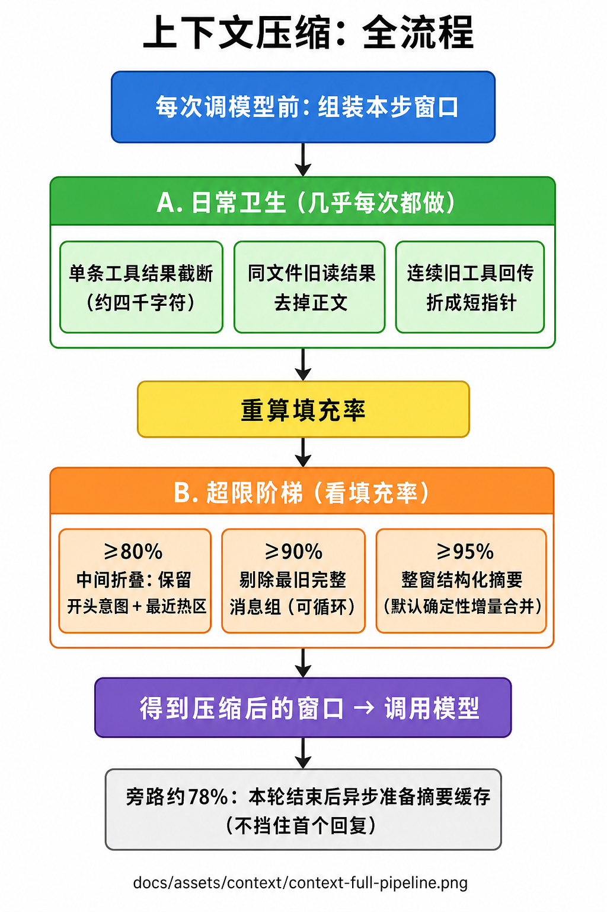
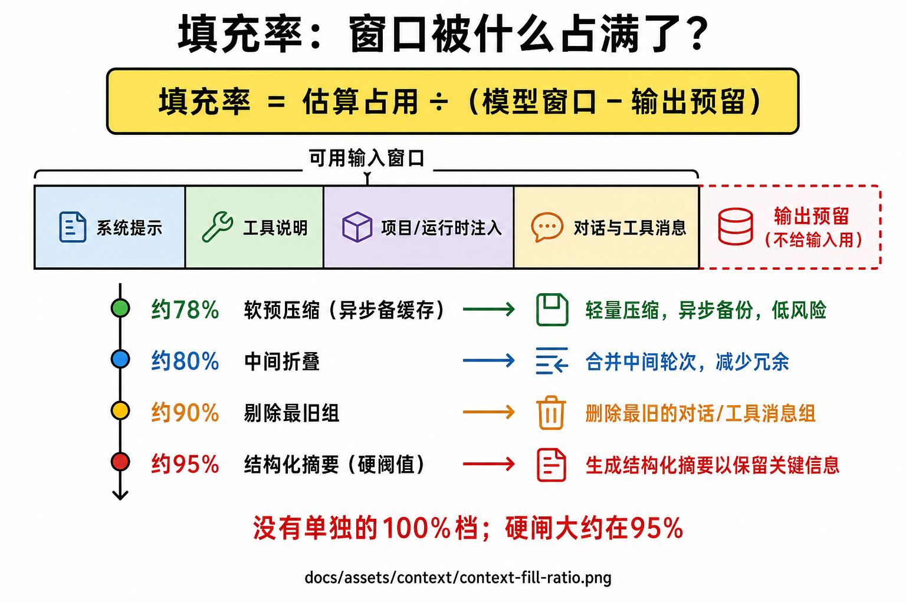
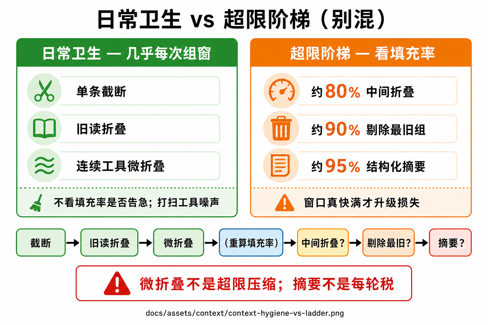
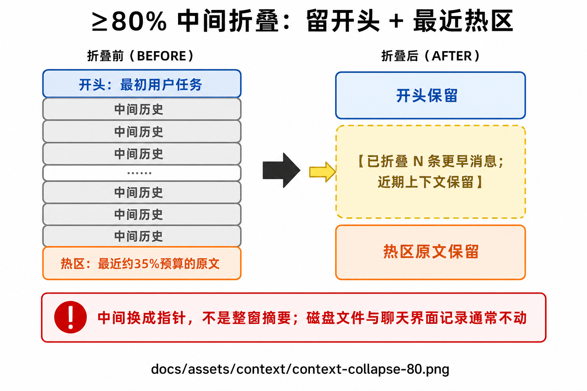

# 上下文压缩心智模型

> 本文用大白话固定「组窗时上下文在干什么」。**卫生天天做；80/90/95 是超限阶梯，不是 100%。**  
> 数字演练与逐步模拟见 [`20-context-compaction-walkthrough.md`](20-context-compaction-walkthrough.md)；面试口述对照 [`21-agent-system-qa.md`](21-agent-system-qa.md) Q9。  
> 实现入口：`services/runtime/app/context/engine.py`（`_build_envelope`）。  
> 流程图目录：`docs/assets/context/`（与 RAG 图 `docs/assets/rag/` 分开放，互不重叠）。

## 1. 一句话

**上下文压缩 = 每次准备调模型前，把「本步真正发给模型的那一窗 messages」整理到塞得下；不删磁盘草稿，通常也不改 Web 聊天记录。**

两套机制必须分开记：

| 套别 | 何时 | 在解决什么 |
|------|------|------------|
| **日常卫生** | 几乎每次组窗，**不看**填没填满 | 单条别太长；历史里别堆多余工具正文 |
| **超限阶梯** | 填充率到约 **80% / 90% / 95%** 才升级 | 窗真要满了，必须丢更多历史才能发出请求 |

口诀：**先扫卫生，再按填充率升级损失；摘要是最后一档，不是每轮税。**

---

## 2. 端到端在干什么

路径：[`docs/assets/context/context-full-pipeline.png`](assets/context/context-full-pipeline.png)



```text
用户说话 / 工具返回
  → Agent loop 准备再调一次模型
  → ContextEngine 组装本步窗口（_build_envelope）
        【卫生 · 几乎必做】
          budget        超长 tool_result 截到约 4k 字符（留再读指针）
          read_fold     同一 path 的旧 read_file 正文去掉，只留最近一次
          microcompact  历史里成串旧 tool 结果折成短占位（不拆当前配对）
        【重算 fill】
        【超限 · 看阈值】
          ≥ 0.80  collapse   留 head + 热区 tail；中间 → [collapsed…]
          ≥ 0.90  snip       删最旧完整消息组（可循环，直到 <0.90）
          ≥ 0.95  autocompact 整窗 → 一条结构化摘要（默认确定性增量）
  → 得到 ContextEnvelope（压缩后 messages + compaction_trace + 用量）
  → 只把压缩后的窗送给模型

【旁路 · 不挡本轮首 token】
  Turn 结束后若 fill ≳ 0.78 → 异步刷新 sessions.context_summary（软预压缩缓存）
```

要点：

| 谁 | 负责什么 |
|----|----------|
| Agent loop | 决定何时再调模型；把本 turn 累积的 `state.messages` 交给引擎 |
| ContextEngine | **只改本步模型窗**；写出 `compaction_trace` / `fill_ratio` |
| 磁盘 / revisions | **不动**；中间原文出窗 ≠ 文件没了 |
| Web 聊天记录 | **通常完整**；你看见「一开始问了什么」≠ 模型窗里还有原文 |
| 软预压缩 | Turn **间隙**备摘要；硬阈值来时优先吃缓存 |

系统**不会**「会话活得越久档位越高」。每一拍组窗都**从头**按固定顺序检查；fill 低时整链可空转。

---

## 3. 填充率是什么

路径：[`docs/assets/context/context-fill-ratio.png`](assets/context/context-fill-ratio.png)



### 3.1 公式（心智版）

```text
usable     = model_window_tokens − output_reserve_tokens
fill_ratio = estimated_tokens(整窗) / usable
```

默认（可配，见 `CompactionPolicy` / settings）：

| 字段 | 默认 | 含义 |
|------|------|------|
| `model_window_tokens` | 128_000 | 模型上下文上限 |
| `output_reserve_tokens` | 16_384 | **预留给输出**，不算进「可塞输入」 |
| `fill_soft_precompact` | 0.78 | Turn 间隙异步备摘要 |
| `fill_collapse` | **0.80** | 中间历史折叠 |
| `fill_snip` | **0.90** | 剔最旧消息组 |
| `fill_autocompact` | **0.95** | 硬阈值：结构化摘要 |
| `hot_zone_ratio` | 0.35 | collapse 时热区约占「可用消息预算」的 35% |
| 工具结果字符预算 | ~4_000 | budget 单条截断 |

**没有单独的「100% 再做一件事」。** 硬闸约在 **95%**；再满就发不出合规请求。你印象里的「到 100」≈ 这一档。

### 3.2 估算进窗的是什么

`fill` 估的是**即将发给 provider 的整窗**，不只是用户聊了几句：

| 分项 | 例子 |
|------|------|
| system | 场景 system.md |
| tools | 挂上的工具 name/description/parameters |
| project / runtime / volatile | 工作区注入、step 计数、写作 volatile |
| messages | user / assistant / tool 正文 |

Token 是**廉价高估**（CJK≈1、ASCII≈1/3），宁可偏多，避免乐观低估把窗撑爆。

### 3.3 为什么窗口会锯齿

```text
工具返回一大坨  →  fill 冲高  →  可能连续触发多层
压缩一轮结束    →  fill 掉下去 →  后面几步可能什么都不做
下一轮又读大文件 →  fill 再冲高 →  又出现 collapse / snip
```

UsageMeter 上一会儿只有 `budget`，一会儿 `budget → collapse`，再过几轮冒出 `snip`——不是策略乱跳，是 **fill 在涨落，闸门在开关**。

---

## 4. 卫生 vs 超限（别混）

路径：[`docs/assets/context/context-hygiene-vs-ladder.png`](assets/context/context-hygiene-vs-ladder.png)



| # | 套别 | 触发 | 机制 | 丢掉什么 / 留下什么 |
|---|------|------|------|---------------------|
| 1 | 卫生 | 几乎每步 | **budget** | 单条超长 tool 尾截断；留「可再读」标记 |
| 2 | 卫生 | 几乎每步 | **read_fold** | 同 path 旧 `read_file` 去正文，只留最近一次 |
| 3 | 卫生 | 几乎每步 | **microcompact** | 历史成串旧 tool → 一条 `[microcompact: folded N…]`；**不**动紧跟当前 `tool_use` 的合法配对 |
| 4 | 超限 | fill ≳ 80% | **collapse** | 留意图 **head** + 热 **tail**；**中间**换指针 |
| 5 | 超限 | 仍 ≳ 90% | **snip** | **不可逆删**最旧一组（保配对） |
| 6 | 超限 | 仍 ≳ 95% | **autocompact** | 大段收成结构化摘要（默认确定性增量） |

实现顺序（以代码为准）：

```text
budget → read_fold → microcompact
  → 算 fill
  → collapse?（≥80% 且消息足够多）
  → while fill ≥ 90%: snip 一组
  → autocompact?（≥95%）
```

每层做完会**重算 fill**：前面若已把占用压下去，后面直接跳过。

---

## 5. 日常卫生（每一次组窗）

### 5.1 budget：单条工具结果上限

一次 `read_file` / 检索结果就可能吃满窗。规则：

- 对 `role=tool` 的正文，超过约 **4000 字符** → 截断并加 `...[budget_truncated]`
- 短目录列举等可保留（`preserve_short`）
- 写作章节摘录带 `writing_section_extract` 的 **不截断**（避免章节腰斩）

心智：给**单次观测**设长度上界；需要全文 → 再调工具读。

### 5.2 read_fold：同文件旧正文

同一 path 被读过多次时，组装视图里只保留**最近一次**正文；更早的 `read_file` 结果换成瘦 payload（指针式）。  
便宜、始终开；在 microcompact 之前跑。

### 5.3 microcompact：连续旧工具回传

```text
折叠前：… T1, T2, T3, T4 …（已不跟在「当前刚发起的 tool_use」后面）
折叠后：… [user] [microcompact: folded 4 tool results; re-read with tools if needed]
```

**硬约束：** 紧跟「助手刚发起的 `tool_use`」的配对 `tool` 消息**不能乱折**——否则 provider 要求的 `tool_call_id` 配对会断。

所以：微折叠 = **打扫历史噪声**，不是「满了才压」，也**不是**调用总结模型。

---

## 6. ≥80% collapse：折中间，保头尾

路径：[`docs/assets/context/context-collapse-80.png`](assets/context/context-collapse-80.png)



### 6.1 切分怎么做

```text
可用消息预算 = model_window − output_reserve − system − tools
热区预算     = 可用消息预算 × ~35%
从最新消息往前凑够热区 → tail（并对齐，避免从 tool 半截切开）
head   = 第一条 user（若存在）→ 常含初始任务 / 硬约束
middle = head 之后、热区之前
tail   = 最近热区原文
```

折叠结果示意：

```text
[user] 写第一章；主角姓赵；禁止出现飞机          ← head
[user] [collapsed 28 earlier messages; dropped tools: read_file×3, …; recent context preserved]
       （可选附带 pinned 短工具摘要）
…tail 最近消息原文…                              ← 含刚说的「续写」等
```

### 6.2 和你印象的对照

| 你的印象 | 更准 |
|----------|------|
| 去掉中间大部分，只留引用和指针 | **对中间**：换成指针；但 **head + 热尾原文还在**，不是「只剩指针」 |
| 80% 就做总结 | **否**；collapse **不是** summarizer，只是中间换壳 |

中间正文副本出窗 ≠ 磁盘没了；要细节应再 `read_file`。

---

## 7. ≥90% snip：删最旧完整组

路径：[`docs/assets/context/context-snip-autocompact.png`](assets/context/context-snip-autocompact.png)（左栏）

### 7.1 做什么

折叠后若仍 `fill ≥ 0.90`：

```text
while fill ≥ 0.90 且还能安全删:
    删掉最老一组连贯消息
    再算 fill
```

「一组」要保配对，例如：

- 最老是带 `tool_use` 的 assistant → 连同紧随的 tool 结果一起删  
- 最老是 user → 删到下一个 user 之前的一整段  

这是**不可逆地从模型窗删除**，不是折成指针。

### 7.2 和你印象的对照

| 你的印象 | 更准 |
|----------|------|
| 去掉开头，只留尾部 + 开头摘要 | **部分像**：常删最旧（可能含最初 user）；但 **不会**在这一步「把开头变成摘要」 |
| snip = 轻度摘要 | **否**；摘要在 **95% autocompact** |

collapse 之后窗常变成：`[最初 user] + [collapsed…] + [热区]`。下一次 snip 时，最老往往就是最初 user——**一次 snip 就可能只删掉头上那句**，留下 collapsed 占位和热区。

体感「还知道一开始问了什么」，多半因为：还没到 snip、热区又复述了目标、或后来摘要写回了约束，再加 UI 历史仍完整。

---

## 8. ≥95% autocompact：真正的「总结档」

路径：同上图右栏 · [`docs/assets/context/context-snip-autocompact.png`](assets/context/context-snip-autocompact.png)

### 8.1 做什么

仍 `fill ≥ 0.95` 时，把当前窗收成**一条**结构化摘要消息（示意）：

```text
[autocompact]
目标：…
约束：…
产物路径：…
近期动作：…
叙事摘要：…
```

默认路径：

| 路径 | 行为 |
|------|------|
| **确定性增量**（默认） | `新摘要 = 合并(旧摘要, 新片段)`；不挡、不另付同步 LLM |
| **软预压缩缓存** | Turn 间隙 fill ≳ 0.78 已备好的 `context_summary`，硬阈值优先吃 |
| **同步 compact LLM** | 仅 `context_hard_autocompact_allow_llm=true` 时；默认关（避免卡首 token） |
| **用户 `/compact`** | 显式付成本；可走更重全量/重建 |

### 8.2 和「100%」的关系

```text
❌ 满到 100% 再做另一套神秘逻辑
✅ 硬阈值约 95% = autocompact；再满就装不下
```

微折叠 / collapse / snip **都不是**「调用总结模型」。只有走到摘要档（或用户 `/compact`）才叫总结动作。

### 8.3 第 11 轮：增量还是全量？

```text
第 10 轮结束时已有摘要 S_1…10
第 11 轮：模型窗 ≈ 系统/工具 + S + 最近热区原文
若再触硬阈值：S' = 合并(S, 第 11 轮新片段)
              —— 不是把 1…11 全文再塞进 summarizer
```

全量重算留给主动压缩或运维重建。

### 8.4 原件还要吗？

| 仓 | 作用 |
|----|------|
| **模型窗** | 摘要 + 热区 + 工具表——发给模型的作业面 |
| **原始对话仓** | append-only；审计 / 摘要烂了重建；**永不直接当模型窗** |

答「原件不要了」会踩坑：坏例无法回放，烂摘要无法从原件重做。

---

## 9. 控制流（伪代码）

与 `engine._build_envelope` 对齐的人话版：

```text
messages = 本 turn 当前消息副本
trace = []

# —— 卫生：尽量先做，不看 80/90/95 ——
对每条超长 tool_result：按约 4k 截断 → budget
同 path 旧 read_file 去正文 → read_fold
可折叠的连续旧 tool 折成短占位 → microcompact
（紧跟「助手刚发起工具调用」的配对结果不乱折）

# —— 超限：各自看当前 fill，做完立刻重算 ——
重新计算 fill

若 fill ≥ 0.80 且消息足够多：
    collapse：head + [collapsed N…] + 热区 tail
    再算 fill

当 fill ≥ 0.90 且还能安全删：
    snip：删除最老一组（可循环）
    直到 fill < 0.90 或无法再删

若 fill ≥ 0.95：
    autocompact：整窗 → 结构化摘要
      · 可 pending → 优先软缓存 / 确定性增量
      · 同步 compact LLM 仅显式打开时

写出 tokens_before / tokens_after / fill / compaction_trace
发出 context.reported → UsageMeter
把压缩后的 messages 送给模型
```

三点钉死：

1. **顺序固定**，不是随机挑一层。  
2. **闸门独立**：不是「做了 collapse 就必须 snip」。  
3. **每层后重算 fill**：够瘦就停。

「渐进」唯一沾边：故意把**更狠**的手段放后面、要求更高 fill——这是优先试轻手段，不是严重度刻度盘。

---

## 10. 同一次组装，常见结果

| 卫生后 fill 走势 | 实际发生 | UsageMeter「压缩:」常见样子 |
|------------------|----------|------------------------------|
| 先 0.72，更低 | 可能只有预算/微折叠，或空转 | `budget` / `microcompact` 或空 |
| 0.86 → collapse 后 0.70 | 只到 collapse | `… → collapse` |
| 0.93 → collapse 后仍 0.91 → snip 几次到 0.85 | collapse + snip | `… → collapse → snip` |
| 前面之后仍 ≥0.95 | 再上 autocompact | `… → snip → compact` |

也可能「看起来像跳层」：某次工具结果极大，budget 后直接 ≥0.90。流水线仍会先问 collapse（因为 ≥0.80）；折不动则主要靠 snip；仍 ≥0.95 再上摘要。

---

## 11. 压缩后「还在 / 不在」

| 对象 | collapse / snip / autocompact 之后 |
|------|-------------------------------------|
| UI 聊天记录 | 通常仍完整 |
| workspace / revisions 文件 | **仍在** |
| 模型窗中间原文 | **可能不在** |
| 初始硬约束原文 | collapse 常留在 head；**snip 后可能没了**；autocompact 可能以摘要回来 |
| 最近用户句 / 刚发生的 tool | 优先在热区 |
| `Compact: N` | N = **压缩产物还在窗里的体积**，不是「删了 N」 |

**好压缩**：模型说「草稿在某路径，我再读一下」，或摘要里仍有硬约束。  
**坏压缩**：路径和硬约束都丢了，或开始编造正文。

---

## 12. 自动链 vs `/compact`

| | 自动压缩链 | `/compact` |
|--|------------|------------|
| 触发 | 每次组窗，按 fill | 用户 slash |
| 作用面 | **本步模型窗** | **session** 摘要落库 |
| 是否每轮总结 | **否** | 用户显式要 |
| 全量重算 | 默认不做 | 可走更重路径 |

另：UsageMeter 上的 `Compact: N` = 窗里压缩**产物**占的 token，不是「省了 N」。

---

## 13. 常见误解对照

| 误解 | 更准 |
|------|------|
| 微折叠 = 超限压缩 | 卫生；几乎每步；不看 fill |
| 80% = 总结 | collapse：中间换指针，保 head+热尾 |
| 90% = 开头变摘要、留尾 | snip：删最旧**整组**；摘要在 95% |
| 满到 100% 才摘要 | 硬阈值约 **95%** |
| 会话越长档位越高 | 每拍独立评估 fill |
| 压缩删了草稿/聊天记录 | 只改模型窗；文件与 UI 通常不动 |
| 每一轮都要总结 | 平时追加+卫生；摘要是硬阈值/主动压缩 |
| 第 11 轮全量重摘要 1…11 | 默认增量合并 |
| 原件进了摘要就可以扔 | 原件另仓，不进窗，但要留着审计/重建 |
| 三层是同一动作三个强度 | 三种不同手段：折中间 / 删最旧 / 整窗摘要 |

---

## 14. 图册索引

| # | 主题 | 图 |
|---|------|-----|
| 1 | 全流水线（卫生 → 阶梯 → 模型） | [`context-full-pipeline.png`](assets/context/context-full-pipeline.png) |
| 2 | fill_ratio 与阈值 | [`context-fill-ratio.png`](assets/context/context-fill-ratio.png) |
| 3 | 卫生 vs 超限 | [`context-hygiene-vs-ladder.png`](assets/context/context-hygiene-vs-ladder.png) |
| 4 | ≥80% collapse | [`context-collapse-80.png`](assets/context/context-collapse-80.png) |
| 5 | ≥90% snip vs ≥95% autocompact | [`context-snip-autocompact.png`](assets/context/context-snip-autocompact.png) |

**推荐阅读顺序：** 1 → 3 → 2 → 4 → 5；数字演练接 [`20`](20-context-compaction-walkthrough.md)。

---

## 15. 三十秒背板

> 组窗先卫生：单条截断、旧读折叠、连续工具微折叠——几乎每步，不看 fill。  
> 超限按填充率：约 **80%** 折中间留 head+热尾；**90%** 删最旧完整组；**95%** 结构化摘要（默认增量，不是每轮、也不是 100%）。  
> 只改本步模型窗；文件与 UI 聊天通常还在。软阈值旁路备缓存，硬阈值优先吃。  
> 口诀：**先扫卫生，再按填充率升级损失；摘要是最后一档，不是每轮税。**

---

## 16. 相关文档

| 文档 | 用途 |
|------|------|
| [`20-context-compaction-walkthrough.md`](20-context-compaction-walkthrough.md) | 带数字的逐步模拟 |
| [`21` Q9](21-agent-system-qa.md) | 面试问答口径 |
| [`06-tools-and-context.md`](06-tools-and-context.md) | 工具与上下文规范 |
| [`10-product-experience.md`](10-product-experience.md) | 产品体验里的满窗行为 |
| [`33-harness-maturity-backlog.md`](33-harness-maturity-backlog.md) | HM1 软预压缩 / HM3 增量摘要 |
| 代码 | `context/engine.py` · `context/policy.py` · `context/precompact_cache.py` · `context/summary.py` |
