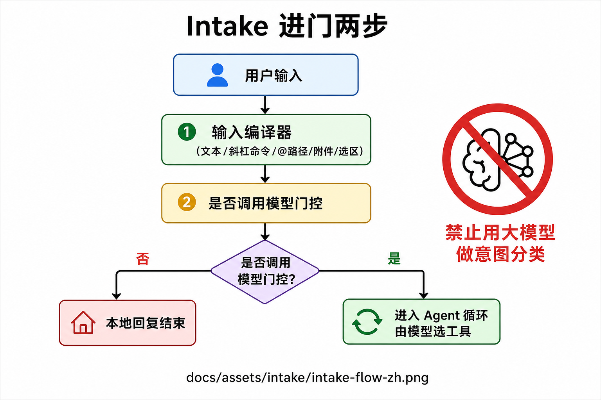
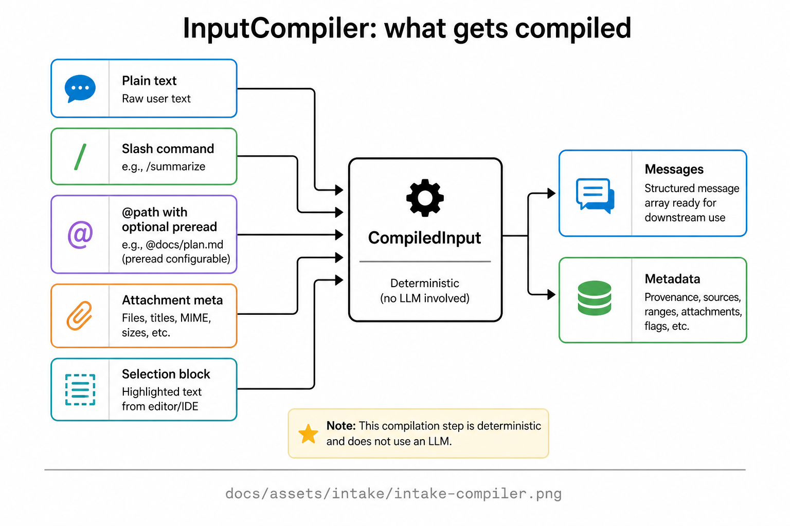

# Intake 心智模型（进门）

> 本文用**中文大白话**固定：「用户点发送之后、大模型开始想之前，系统先干什么」。  
> **两个词就够：编译（整理输入）+ 门控（要不要叫醒模型）。全程用规则，不用大模型猜意图。**  
> 权威：[`05-agent-runtime.md`](05-agent-runtime.md) §3.1 · [ADR-014](adr/014-turn-intake-over-intent-pipeline.md)。  
> 图目录：`docs/assets/intake/`。  
> 它属于 Harness 的**入口面**（[`HARNESS-mental-model.md`](HARNESS-mental-model.md)）。

---

## 1. 为什么要单独有 Intake？

如果用户一说话就扔进大模型：

- `/help` 也要花钱、耗时；  
- `@文件` 可能把整份大文件无预算地塞进去；  
- 还容易让人想「再加一个意图分类模型」把流量导到写作/检索/验证——这正是旧项目固定大图的坑。

所以本项目把「进门」收成**可测试的规则层**：

> **先把输入变成标准消息；再问一句：这件事值不值得调模型？**  
> **值 → 进单循环；不值 → 本地办完，本轮正常结束。**

---

## 2. 一句话定义

**Intake（摄入 / 进门处理）= Turn 启动后、Agent 循环前：**

1. **InputCompiler（输入编译器）**：把杂乱输入编成规范 `messages`；  
2. **shouldQuery（是否询问模型）**：一张规则表，决定进不进大模型。

| 它是 | 它不是 |
|------|--------|
| 确定性规则 + 单测 | 旧项目那种「意图分类节点」 |
| 场景由用户/API 指定 | 让 LLM 猜「现在是写作还是 Agent」 |
| 允许零模型结束本轮 | 每条消息都强制打满模型 |

口诀：

> **编译归规则，场景归用户，要不要搜/改文件归循环里的模型自己选工具。**

---

## 3. 图册（优先看中文总流程）

| # | 主题 | 路径 |
|---|------|------|
| 1 | **进门两步（中文）** | [`docs/assets/intake/intake-flow-zh.png`](assets/intake/intake-flow-zh.png) |
| 2 | 总流程（英文标注版） | [`docs/assets/intake/intake-flow.png`](assets/intake/intake-flow.png) |
| 3 | 编译器吃哪些输入 | [`docs/assets/intake/intake-compiler.png`](assets/intake/intake-compiler.png) |

路径：[`docs/assets/intake/intake-flow-zh.png`](assets/intake/intake-flow-zh.png)



---

## 4. 用中文跟一遍完整路径

```text
用户在工作台输入一句话
  （可能还带：选中的文稿片段、@某个路径、上传附件、/命令）

        ↓
【第一步 · 输入编译】
  规则把它们折成标准消息列表 + 一点元数据
  · 普通聊天 → 一条用户文本
  · /help → 结构化「本地帮助」意图（不是让模型理解斜杠）
  · @sections/02.md → 文件指针，必要时预算内预读一小段
  · 选区 → 带上「用户正盯着哪一段」
  · 附件 → 元数据 + 可引用路径（不在进门时盲目塞全文）

        ↓
【第二步 · 要不要叫醒模型】
  · 空消息 → 拒收或提示
  · /help、/version → 直接回静态说明，本轮完成（零模型）
  · /compact 等 → 触发本地压缩类动作，仍可不进循环
  · 没配模型密钥（开发环境）→ 明确失败，别装成功
  · 其它正常任务 → 进入 Agent 循环

        ↓
【进循环之后才发生的事 · 已不是 Intake】
  模型首轮自己决定：直接回答，还是调用 search_sources / 改文件 …
```

**大红叉（架构红线）：**  
不要再做「大模型意图分类 → 强制检索节点 → 强制验证节点」那种固定大图。  
场景分流靠**产品入口**；工具调用靠**循环里的 Function Calling**。

**体验细节：**  
API 一旦受理，尽快写出「本轮已接受」类事件——人会感觉「系统活着」，这叫首包要快；它属于进门体验，不是又一个 workflow 节点。

---

## 5. 输入编译器：每种输入在干什么（细讲）

路径：[`docs/assets/intake/intake-compiler.png`](assets/intake/intake-compiler.png)



| 你打的东西 | 编译器怎么理解 | 为啥要这样 |
|------------|----------------|------------|
| 普通中文/英文 | 原样进用户消息 | 最常见路径，零花样 |
| `/help`、`/polish`、`/outline`… | **正则/规则**解析成结构化意图 | 斜杠是产品语法，不该浪费一次「理解斜杠」的模型调用 |
| `@路径` | 变成「文件指针」；可在预算内预读摘要 | 让模型知道你指哪；全文通读仍应靠后面的 `read_file` |
| 附件 | 记录类型与路径引用 | 进门不默认同步解析整份 PDF（速率/成本） |
| 编辑器选区 | 带上 selection 块 | 写作「改这一段」必须对准选区，不能靠模型猜光标 |

输出心智：

```text
CompiledInput ≈ {
  messages:  已经规范化的对话块,
  metadata:  给后续门控/日志用的附加信息
}
```

---

## 6. 「要不要调模型」门控：再举几例

| 情况 | 进不进大模型 | 用户侧体感 |
|------|--------------|------------|
| 只发了空格 | 不进（或直接提示） | 「没内容」 |
| `/help` | 不进 | 立刻看到帮助 |
| `/compact` | 通常不进循环正文生成 | 「已触发压缩」类确认 |
| 「帮我根据资料改第三章」 | **进** | 后面才可能出现检索/改稿工具 |
| 模型密钥没配好 | 不装成功 | 明确报错，便于排障 |

原则：**门控必须能写单元测试**；禁止「再问一次小模型：这像不像帮助命令？」

---

## 7. 分工表（最容易考的口试题）

把四个问题分开答，面试官会觉得你边界清楚：

| 问题 | 谁说了算 | 一句话 |
|------|----------|--------|
| 现在是写作还是 Agent？ | **用户 / API 场景 ID** | 进门前就定了，不猜 |
| 这条要不要花钱调模型？ | **shouldQuery 规则** | `/help` 可以不花 |
| 要不要搜资料、改哪个文件？ | **循环里的模型 + 工具** | Intake 不替它做 RAG 决策 |
| 要不要多步计划？ | **模型调计划/委派工具** | 按需，不是强制阶段 |

所以：  
**Intake 不管「搜不搜」**；它只把路修到「进不进循环」。  
搜不搜是进循环后调不调 `search_sources`（见 RAG 心智模型）。

---

## 8. 和 Harness 其它面的衔接

```text
Intake 结束
  → 若进循环：下一拍就是 Context 组窗 → Model → Tools …
  → Guard 从进循环起就可以取消
  → Proof 从「已受理」事件就开始记账
```

Intake **不**修改 while 的终止条件；它站在 while **门外**。

---

## 9. 常见误解（中文）

| 误解 | 更准 |
|------|------|
| 「Intake 就是意图识别 AI」 | 是规则编译器 + 门控表 |
| 「所有斜杠命令都要模型理解」 | 很多斜杠在门控就被本地消化 |
| 「@ 了文件 = 全文永远焊在系统提示里」 | 预算预读；焦点一变还焊死会破坏缓存 |
| 「进了 Intake 就算开始思考」 | 思考在 Model；Intake 可能零模型结束 |
| 「Intake 决定挂哪些工具」 | 工具表白名单主要在场景配置；Intake 管输入 |

---

## 10. 三十秒口述（可背）

> 用户发送后先 Intake：规则编译文本、斜杠、@路径、附件、选区；再用规则决定要不要调模型。  
> 不要 → 本地结束；要 → 进单循环，由模型自己选工具。  
> 写作/Agent 场景不靠模型猜。细节见文档 05 的 Intake 小节。
