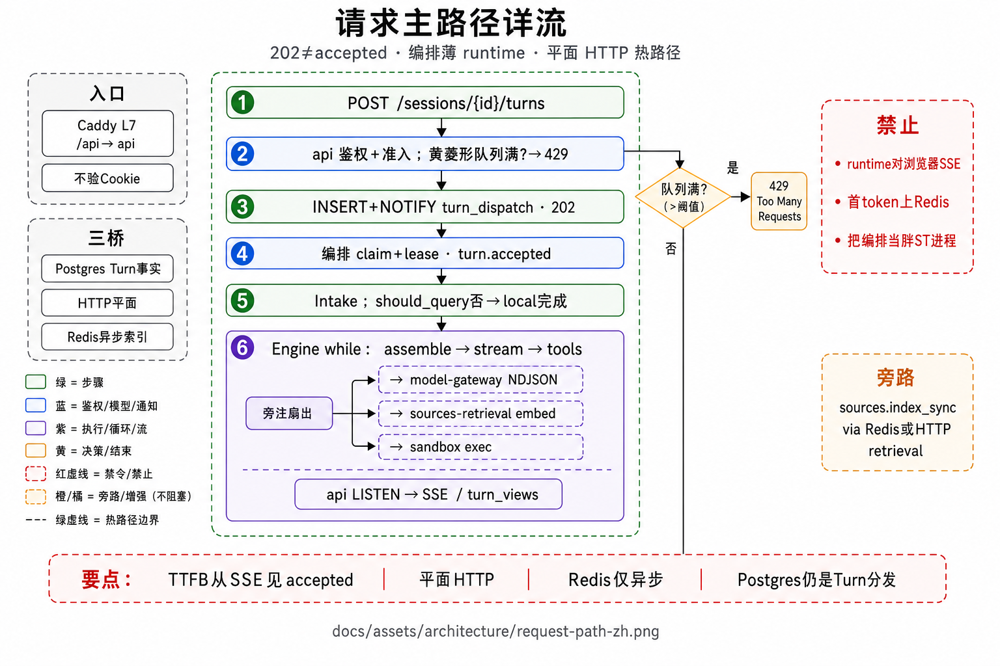
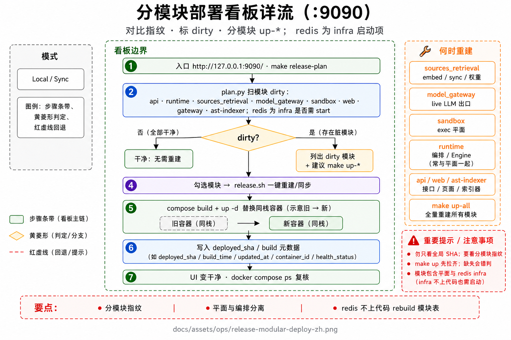
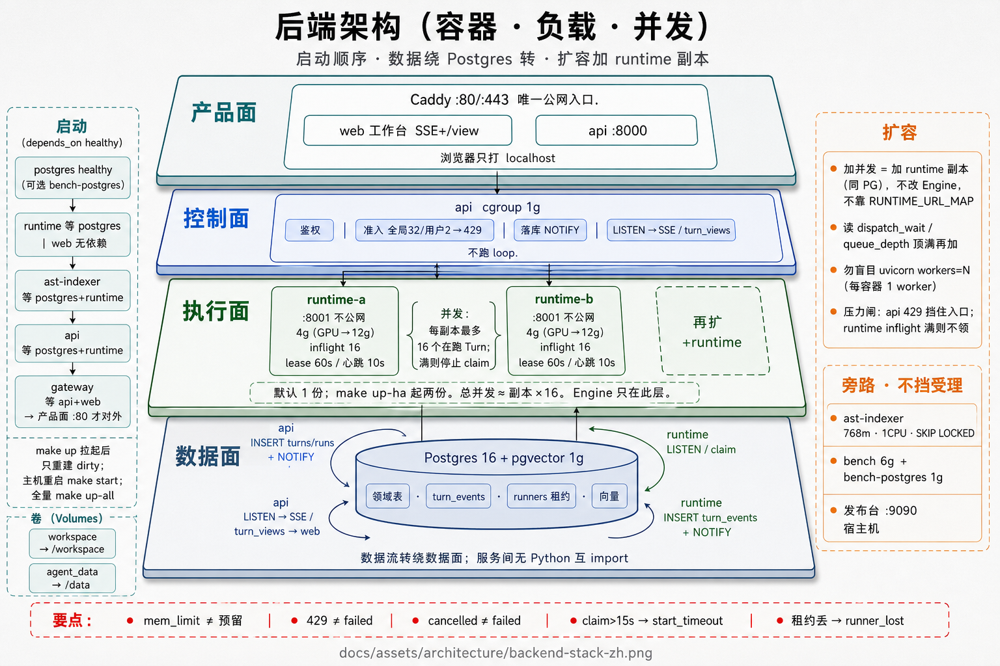
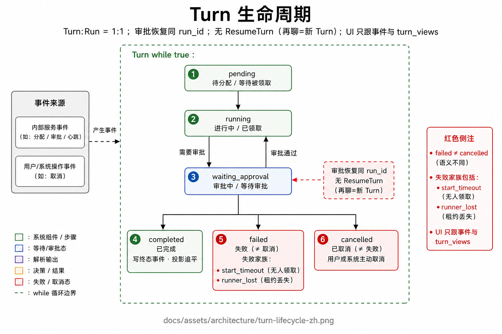

# 架构

部署拓扑、分模块发布、容器负载与并发、领域对象、场景与速率红线。主图：请求路径、发布台、后端栈。

## 图

1. [请求主路径](../assets/architecture/request-path-zh.png) — 浏览器 → 领取制 → Engine → 事件/SSE → Web  
2. [分模块发布台](../assets/ops/release-modular-deploy-zh.png) — `:9090` · dirty · 分模块重建 · 如何确认已更新  
3. [后端栈 · 容器 / 负载 / 并发](../assets/architecture/backend-stack-zh.png) — 四层栈 · `depends_on` · NOTIFY/LISTEN · runtime 副本  





## 1. 部署拓扑

```text
Client
  → Caddy :80/:443
       ├─ /          → web（工作台）
       └─ /api/* · /health/* → api :8000
              │
              ├─ 默认 TURN_DISPATCH=pull
              │    INSERT turns/runs → 准入 → pg_notify(turn_dispatch_channel)
              │    → runtime LISTEN / claim + 心跳续约 → TurnController
              │
              └─ 回退 push：HTTP /internal/commands/start-turn → runtime :8001（不公网）

Postgres 16 + pgvector
  · 领域表 · turn_events · 产品向量
  · 另：run_commands / runners 租约（分发与控制命令）

旁路（不挡受理）
  · ast-indexer：后台解析工作区符号；Turn 热路径只读已构建投影，不重解析全仓。领取 `work_ast_index_jobs` 使用 `FOR UPDATE SKIP LOCKED`
  ·（可选）bench-postgres：Ops L1 / 官方评测向量与产品库隔离

卷：宿主 workspace → `/workspace`；`agent_data` → `/data`
```

| 组件 | 职责 | 明确不做 |
|------|------|----------|
| **gateway（Caddy）** | TLS、路由 | 业务状态、鉴权逻辑 |
| **web** | 场景工作台；消费 SSE + `GET /view` | 推断 Turn 阶段；直连 runtime |
| **api** | 鉴权、准入、Session/Turn 落库与分发通知、LISTEN、SSE、投影、Ops 旁路 | 跑 Agent loop |
| **runtime** | 领取任务并续约、Intake、AgentEngine、工具、检索、checkpoint、写 `turn_events` | 对浏览器开 SSE；UI 投影 |
| **ast-indexer** | 后台扫工作区符号：入队时 SKIP LOCKED 领取解析（一台拿了别人拿不到同一文件）；内存里供查询；DB 只做快照 | 进 Turn 热路径；替代语言服务器；不进资料检索的向量面 |
| **postgres** | 领域表 · 事件 · 向量 · 分发/命令通道 | — |
| **发布台** | 本机 `:9090` 健康/脏模块/一键重建 | 第二套产品栈；不替代 `:80` |

硬约束：

- 服务之间 **无 Python 互 import**。  
- 跨服务实时事实桥 = **Postgres**（`INSERT` + `NOTIFY` / `LISTEN`）。  
- 契约源在 `packages/contracts`（OpenAPI、事件 JSON Schema、DDL）；api/web 由此派生。

### 1.1 默认资源上限（`make up`）

`mem_limit` 是 cgroup 上限，不是预留。建议宿主 **≥16 GiB**、磁盘空闲 **≥40 GiB**。

| 容器 | mem_limit | 作用 |
|------|-----------|------|
| postgres / bench-postgres | 各 1g | 产品库+向量 / Bench 隔离库 |
| runtime | 4g（GPU overlay → 12g） | loop · RAG · LSP |
| ast-indexer | 768m · cpus 1.0 | AST parse（与 Turn 分进程） |
| api | 1g | 控制面 |
| bench | 6g（GPU → 12g） | 官方评测 worker |
| web / gateway | 未设硬限 | 工作台 / Caddy |

无 GPU → **gte-small@384**（CPU）；VRAM≥8GiB → **bge-m3@1024**。由 `scripts/resolve_embedding_profile.sh` 写 `embedding.auto.env` / `gpu.auto.yml`。runtime 与 bench **各加载一份**权重。

并发：默认 `TURN_DISPATCH=pull`。每副本 inflight 默认 16；未领取队列满则准入 HTTP **429**。水平扩容增加 runtime 副本与旁路 indexer；符号表构建与资料同步不进入 Turn 热路径。细则见下节与 [Pull 分发运维手册](../ops/pull-dispatch-runbook.md)。

起栈：`make up`（分模块重建脏服务）+ 发布台 `:9090`；全量 `make up-all`。配置入口 `.env`；**模型供应商在 Web「设置 → 模型」配置**。可选 overlay：queue、ha（双 runtime，同为 pull）、runtime-lite、ops-eval、bench。  
Ops coding：看板 **SWE 评测环境** 一键完成挂 sock + 预拉/冒烟（`make ops-swe-eval-ready`）。

<a id="backend"></a>

### 1.2 容器、负载与并发

下图按**分层位置**画现行 compose 栈，不是逐步流程图。产品面承接公网；控制面负责鉴权、准入与投影；执行面运行 AgentEngine；数据面是唯一跨服务实时桥。左栏为 `depends_on` 启动约束；右栏为扩容旋钮与旁路；中间环为 `INSERT` + `NOTIFY` / `LISTEN`。发布台 `:9090` 只做 dirty 重建，不进入热路径。

#### 分层

| 层 | 容器 | 职责 | 明确不做 |
|----|------|------|----------|
| **产品面** | `agent-gateway` :80/:443 · `agent-web` | TLS、路由；工作台消费 SSE 与 `GET /view` | 业务状态；直连 runtime |
| **控制面** | `agent-api` :8000 · cgroup 1g | 鉴权、准入、落库、LISTEN、SSE、投影 `turn_views`、Ops 旁路 | 跑 Agent loop |
| **执行面** | `agent-runtime` :8001（不公网）· 4g（GPU overlay → 12g） | claim、lease、Intake、AgentEngine、工具、检索、checkpoint、写 `turn_events` | 对浏览器开 SSE；UI 投影 |
| **数据面** | `agent-postgres`（Postgres 16 + pgvector）· 1g | 领域表、`turn_events`、产品向量、`runners` 租约、`run_commands` | — |
| **旁路** | `agent-ast-indexer` · `agent-bench` · 发布台 `:9090` | 符号表、官方评测 worker、分模块重建 | 阻塞 Turn 受理 |

HTTP 平面：浏览器只访问 Caddy。Caddy 将 `/` 交给 web，将 `/api/*` 与 `/health/*` 交给 api。无 FastAPI CORS（假定经网关同源）。观测 `GET /metrics` 使用 `INTERNAL_SERVICE_TOKEN`。

#### 启动顺序

Compose 用 `depends_on` + `service_healthy`，不是无序并行拉起。

| 服务 | 等待 | 健康探针 | 备注 |
|------|------|----------|------|
| postgres | — | `pg_isready` | 产品库先就绪；`bench-postgres` 仅 profile `bench` |
| runtime | postgres | `GET :8001/health/live` | `start_period` 120s；未配置模型仍可起栈（`/health/ready` 才要求模型） |
| web | 无 | 本容器 `GET /` | 可与库并行 |
| ast-indexer | postgres + runtime | `/data/ast_indexer_heartbeat` 年龄 < 120s | 与 Turn 分进程；同 runtime 镜像、独立 PID |
| api | postgres + runtime（`bench` 为 `required: false`） | `GET :8000/health/live` | lifespan：pool → Alembic → 回收陈旧 Turn / 滞后投影 / 过期租约 → `LISTEN turn_events_channel` |
| gateway | api + web | `GET /health` | 此后产品面 `:80` / `:443` 对外 |

起栈命令：

| 命令 | 语义 |
|------|------|
| `make start` | 已有镜像，不 rebuild（主机重启后优先） |
| `make up` | 先拉起，再只重建 dirty 模块；附带发布台 `:9090` |
| `make up-all` | 强制全量 `compose --build` |
| `make up-ha` | `--scale runtime=0` 后起 `runtime-a` / `runtime-b` |

api `/health/ready` 会探测 runtime `/health/ready`；compose 健康检查用 `/health/live`，避免未配模型阻塞起栈。

#### 数据流转

服务之间禁止 Python 互 import。跨服务实时事实只经 Postgres：

| 方向 | 机制 | 载荷 |
|------|------|------|
| api → PG | 同一事务 `INSERT` turns/runs（及视图种子）+ `pg_notify('turn_dispatch_channel')` | 待领取 Run；`pull_eligible=true` |
| runtime ← PG | `LISTEN turn_dispatch_channel` + poll claim | 写入 `runners` 租约后进入 TurnController |
| runtime → PG | `INSERT turn_events`（触发器 `pg_notify('turn_events_channel')`） | 事件行；runtime 不向浏览器推 SSE |
| api ← PG | `LISTEN turn_events_channel` → 唤醒 SSE / 投影 `turn_views` | web 只读投影与 `GET /view` |
| api → runtime | `INSERT run_commands` + `pg_notify('run_commands_channel')` | 取消 / 批准 / 补丁；`TURN_DISPATCH=push` 才回退 HTTP `start-turn` |
| runtime/api → indexer | 入队 `work_ast_index_jobs` | indexer `FOR UPDATE SKIP LOCKED`；不在提问热路径上重解析 |

`queue` overlay 才启用 Redis + outbox worker（`WORKER_MODE=outbox`）；默认 `inline`。

#### 并发与扩容

| 机制 | 旋钮（compose / settings 默认） | 饱和时 |
|------|-------------------------------|--------|
| 分发 | `TURN_DISPATCH=pull` | LISTEN / claim；`push` 为 HTTP 回退 |
| 准入 | `DISPATCH_QUEUE_MAX` 未设或 0 → 32；`PER_TENANT_QUEUE_MAX=2` | HTTP **429** + `Retry-After: 5`（`dispatch_queue_full` / `per_tenant_queue_full`）；Turn 尚未创建，不是 `failed` |
| 副本 inflight | `RUNTIME_MAX_INFLIGHT_TURNS=16` | 停止 claim，压力留在未领取队列，不打满 cgroup |
| 租约 | `RUNNER_LEASE_SECONDS=60` · 心跳 10s | `failed(runner_lost)`，可被其他副本回收 |
| claim 超时 | `TURN_CLAIM_TIMEOUT_SECONDS=15` | 先 202，后 `failed(start_timeout)` |
| AST | indexer `SKIP LOCKED` | 与 Turn 分进程，可多副本 |
| HTTP 进程 | Dockerfile `CMD` 为单进程 uvicorn，未设 `--workers` | 扩容器副本；勿盲目 `workers=N` |
| 周期任务 | `pg_try_advisory_lock` | 单跑 lease reclaim / claim timeout / 事件保留 |

加并发：`make up-ha`（或再增加 runtime 副本，共用同一 Postgres 与 `agent_data` 卷）。总 inflight ≈ 副本数 × 16。HA **不**配置 `RUNTIME_URL_MAP`（push 遗留）；claim 走数据库，不靠共享内存。`ha.yml` 将 api 的 `RUNTIME_URL` 指到 `runtime-a:8001`，仅供 push 回退。

读指标再扩：`dispatch_wait_seconds` 持续偏高，或 `dispatch_queue_depth` / `unclaimed_accepted` 接近帽 → 增加 runtime。勿在 `event_pipeline_lag_seconds` 回退时盲目加副本。见 [Pull 分发运维手册](../ops/pull-dispatch-runbook.md)。

`mem_limit` 是 cgroup 上限，不是预留；容器 RSS 之和仍可能打满宿主物理内存。GPU overlay 把 runtime / bench 抬到 12g 并 `gpus: all`。日志 `json-file` 10m × 3。

| 卷 | 用途 |
|----|------|
| 宿主 `workspace/` → `/workspace` | 默认 / 遗留 Work 根 |
| `agent_data` → `/data` | 模型、ops-eval、AST heartbeat、`/data/works/{id}` |
| seed writing / intel → `sources/seed/*`（RO） | 站立语料，不拷入用户沙箱 |
| `pg_data` / `caddy_data` | 产品库；Caddy 证书与状态 |



## 2. 分模块发布（:9090）

产品面始终是 `http://localhost/`（Caddy）。发布台是**同仓旁路控制台**，不另起一套业务服务。

```text
make up / make release-plan / 浏览器 :9090
  → 对比 HEAD · 工作树 · 已部署标记
  → 标出 dirty：api / runtime / web / gateway / ast-indexer（+ embedding / 索引健康）
  → 勾选模块 → 对应 up-* 重建
  → mark 写入已部署指纹
  → 容器 healthy + 看板变绿 = 已更新
```

### 2.1 模块 ↔ 路径

| 模块 | 脏前缀（概念） | 重建 |
|------|----------------|------|
| **api** | api 服务 · 契约包 | `make up-api` |
| **runtime** | runtime 服务 · 契约包 | `make up-runtime`（常 recreate ast-indexer） |
| **ast-indexer** | 工作区索引包 · compose 入口 | `make up-ast-indexer` |
| **web** | web 服务 | `make up-web` |
| **gateway** | Caddy · compose 入口 | compose recreate |

改契约包会同时弄脏 **api + runtime**。改工作区 AST 包会弄脏 **runtime + ast-indexer**。

### 2.2 怎样算 dirty（需重建）

| 信号 | 含义 |
|------|------|
| **已提交相对 deployed** | 上次 mark 之后有提交落在该模块前缀 → **`make up-*`** |
| **工作树指纹** | 未提交改动；已 bake 进上次重建的同指纹不再当 dirty |
| **容器未起** | **不是** rebuild dirty。重启主机后镜像仍在 → **`make start`**（或 `make up` 会先拉起再只重建真正脏的模块） |

看板模式：本地开发看「已提交 + 未提交」；同步部署只看已提交。Ops Bench 未起同样是 `make start-bench`，不 rebuild。

**依赖 vs 代码缓存**：`deps`（pip/pnpm/ST）与 `app` 分层；`*:deps` 锚点镜像保住 deps 层；`deploy/base-images.env` 钉死基础镜像 digest + compose `pull: false`（该文件已列入 `paths.env`，bump digest 后 `make up` 会脏 api/runtime/web/ast_indexer）。多 GB 的 `model-bake-cache` / `torch-wheel-cache` / `ts-grammar-cache` 在 `.dockerignore` 里，经 compose `additional_contexts` 按需挂载。清理磁盘用 `make docker-prune-safe`（`deploy/docker-keep.list` 白名单，默认**不清** BuildKit）。只改 `app/**` 不应重装依赖；改 `pyproject`/lock 会随模块路径自动重建；怀疑缓存脏时才用 `*_REBUILD_DEPS=1`。

### 2.3 如何确认更新已生效

1. 看板该模块由 action → **ok**。  
2. `make release-plan` 终端对照同一份健康 JSON。  
3. `docker compose ps`：核心 `agent-*` **healthy**。  
4. 产品面：`curl -fsS http://localhost/health/live`；改 UI 则硬刷新。  
5. 新生成的 Ops 密钥会触发 api recreate。

强制全量：`make up-all`。日常优先 `make up`（先拉起已有镜像，再只重建脏模块）。主机重启后优先 `make start`；只有代码相对已部署有变才需要 `up-*`。

## 3. 领域对象与状态



```text
Principal → default Work（work_id, work_root）
                └── Session*（对话线程，携带 work_id）
                      └── Turn（一次用户输入的业务闭环）
                            ↔ Run（1:1 执行实例，checkpoint / cancel / 租约）
                                 └── Step*（组窗 → 模型 → 工具；欠验证时可再一轮；仅事件粒度）
```

| 对象 | 含义 | 关键约束 |
|------|------|----------|
| **Work** | 稿件与资料的世界根 | 不随 Session compact 拆散 |
| **Session** | 连续性容器：transcript、策略、压缩摘要 | 换 Session 不换默认 Work |
| **Turn** | 从受理到终态的一次用户闭环 | **恰好一个** Run |
| **Run** | agentic loop 执行实例；持有 runner 租约 | 审批挂起仍用同一 `run_id` |
| **Artifact** | 产物引用（补丁、文件） | 归属 Turn |

Turn 状态机：

```text
pending → running ⇄ waiting_approval
               ↓
        completed | failed | cancelled
```

分发相关失败（仍属 `failed` 族，≠ cancelled）：

| 原因 | 含义 |
|------|------|
| **start_timeout** | 超过 claim 时限仍无人领取 |
| **runner_lost** | 副本租约丢失且无法安全续跑 |

- **取消是终态**：`cancelled ≠ failed`。  
- **没有 ResumeTurn**：取消或跑完后再聊 = 同 Session **新 Turn**。  
- 重试/恢复审批：仍是 **同一个** `run_id` + checkpoint。

## 4. 场景（ScenarioProfile）

产品入口差在配置，不在第二套图：

| `scenario_id` | 定位 |
|---------------|------|
| `writing` | 写作：大纲/草稿/diff-first、资料检索 |
| `agent` | 编码：打开查找/改文件/跑测试全套工具。找定义、看波及、改完再验写进这些工具的返回值；官方评测题还会把 pytest 改去该题 Docker 镜像里跑。**没有**资料检索工具，不以检索资料来找代码位置 |
| `intel` | 情报向资料与提示 |
| `collab` | 多 agent 协作（目标态） |

Profile 提供：工具白名单、系统提示、审批覆盖、检索 path 过滤、子 agent 类型等。  
**AgentEngine 禁止** `if scenario == "..."`；差异只经 Profile / ToolScope 注入。

### 4.1 扩展点清单（官方替代方案）

场景差异只能走下列挂载点（实现见 `scenarios/registry.py` · `scenarios/hooks.py` · profiles `*.yaml`）：

**标量 / 声明式字段（Profile）**

| 字段 | 作用 |
|------|------|
| `tool_names` / `approval_overrides` / `subagent_types` | 工具面与审批（ToolScope） |
| `retrieval` | 检索 path 过滤（工具侧消费） |
| `generation.temperature` | 采样温度 |
| `patch_auto_apply` | `propose_patch` 后自动 apply（settings 总闸仍可关） |
| `structural_prewarm` | StartTurn LSP 软预热 |
| `plan_suggest.threshold` | Plan 建议阈值 |
| `subagent_prompt_suffix` | 子 agent 系统提示追加文案 |
| `post_turn_jobs` | Turn 终态后 api outbox 额外任务（如 `sources.index_sync`） |

**命名 Hook 槽位（`Profile.hooks` → 实现名）**

| 槽位 | 典型实现 | 何时 |
|------|----------|------|
| `system_prompt_composer` | `writing_cards` | StartTurn 组窗 |
| `volatile_composer` | `collab_orchestrator` | StartTurn volatile |
| `step_checkpoint` | `collab_gap_hint` | 每步 checkpoint |
| `post_turn` | `writing_continuity` | Turn 收尾旁路 |
| `compact_bookmark` | `writing_focus` | `/compact` |

槽位集合固定；未知槽位 / 未知实现名 → **启动期 fail-fast**。  
静态门禁：`make constitution-check`（`scripts/check_scenario_leak.py`）禁止新增 `if scenario == "…"`。

## 5. 速率红线

扩能力时必须守住交互速度，不能为了分数把重活塞进用户提问的热路径。五条验收如下。

| # | 原则 | 验收含义 |
|---|------|----------|
| **R1** | 不挡受理 | `turn.accepted` / TTFB 不因新逻辑同步恶化 |
| **R2** | 首 token 前不加同步模型 | 禁止热路径同步摘要/裁判/改写 |
| **R3** | 热路径 CPU 毫秒级 | 整库 embed、大扫描禁止上主链 |
| **R4** | 重活异步 | 索引、审计、软预压缩走旁路 |
| **R5** | 可测才合并 | `make gate` / Ops `suite=ci` 等同完整证明 |

索引、Ops、Golden 都必须是 **环外或工具中介**，不能为了分数改 loop 语义。

## 6. Ops L1 评测（环外）

效果温度计，不进 StartTurn 热路径。契约：[`docs/contracts.md` §4](../contracts.md)。

```text
/official 或 make *-agent
  → eval_path=agent（非 agent 拒）
  → 产品 Session / Turn / 真实工具
       ├ retrieval      BEIR     search_sources → 多轮 RRF → nDCG/R/MAP
       ├ retrieval_zh   C-MTEB   同上（独立 latest_ 指针，勿与 BEIR 混栏）
       ├ context        LongBench  passage.md → Answer: → F1/EM
          └ coding         SWE Lite  checkout → 评测态等符号表 ready
                                   → pytest/|tail 改去该题 Docker 镜像跑完整测试（复用容器 + 增量 sync）
                                   → git_diff / baseline repair
                                   → 官方 harness 判是否通过（没有通过率则套件 failed）
  → latest_<suite>.json · manifest ⊨ ops_run_manifest.schema.json
```

产品默认仍是先受理、不等索引（不挡 TTFB）；`workspace_index_wait_ready` **只**在评测套件打开。Harness 失败不得标 `completed`。

官方编码评测环境（看板一键 / `make ops-swe-eval-ready`）做三件事：给 api/runtime 挂 docker.sock、预拉每道题的官方镜像、对每张镜像跑 python/pytest/`/testbed` 冒烟。看板「就绪」依赖后两件都过。解题时默认**复用这道题的容器**，只把改过的文件增量同步进 `/testbed`（禁网）；模型在 `run_command` 上写的 pytest/`|tail` 会改道进这条路径。缺镜像或冒烟失败硬失败并写明原因。

现行冒烟日记：[`eval/official/baseline/RESULTS.md`](../../eval/official/baseline/RESULTS.md)（第4–5轮 coding **4/5**，未升 SCORECARD 主栏）。

### 6.1 编码一题（ASCII · 与原图风格一致）

```text
① checkout base_commit（写 .agent_swe_instance.json）
② 后台建符号表 ──等 ready──► ready|stale （仅评测；产品对话不等）
③ StartTurn ──► 读题 → 找定义 → 改文件（结果带波及摘要、诊断、相关测试命令）
                 → 改完再验（邻文件诊断 / 测试失败首条 / issue 例子 / 想收工却还欠验证则再跑一轮）
   └ pytest/|tail 改去该题 Docker 镜像跑完整测试（复用容器，sync→/testbed，--network none）
④ 抽 patch：git_diff ─残缺► baseline repair ─拒收► l2.patch_rejected
⑤ predictions.jsonl
⑥ 官方 harness ──┬─ 通过率 ──► completed
                 └─ harness 挂了 ──► failed（可见，不得粉饰成模型零分）
```

### 6.2 检索一题（ASCII）

```text
① pull BEIR|C-MTEB → materialize → HNSW
② Turn(writing) → search_sources（可多轮）
③ 评测侧 RRF 融合各次 ranked（k=60）
④ nDCG / Recall / MAP
⑤ latest_retrieval.json | latest_retrieval_zh.json （互不覆盖）
```

## 7. 改 X 去哪

| 改什么 | 落点 |
|--------|------|
| REST 字段 / 状态码 | `packages/contracts` → `services/api/app/routers/*` |
| StartTurn 写序 / 幂等 | `api/.../resource/turns.py` · `routers/sessions.py` |
| Intake / 领取 / 租约 | `runtime/.../turn_controller.py` · `turn_dispatch.py` |
| Engine / 审批粘性 / 想收工却还欠验证 | `engine/agent_engine.py` · `engine/verify_receipt.py` |
| 组窗阶梯 | `context/engine.py` · `context/policy.py` |
| 新工具 / handler 改道 | `tools/bootstrap.py` + `tools/core/*` · `structural/*_redirect.py` |
| 场景差 | `scenarios/profiles/*.yaml` + `system.md`（禁止 Engine `if scenario`） |
| 找定义 / issue 例子覆盖 | `structural/` · `workspace_index/` · `issue_repro.py` |
| RAG | `retrieval/*` · compose `EMBEDDING_*` |
| AST 旁路 | `structural/workspace_index/*` · ast-indexer compose |
| 沙箱 / 官方编码解题 | `tools/core/sandbox.py` · `swe_solve_env.py` |
| 模型配置 | Web「设置 → 模型」· `model/factory.py` |
| Bench / harness | `scripts/official_bench/` · `eval/official/` |
| GPU / 嵌入档 | `scripts/resolve_embedding_profile.sh` |
| 合入门禁 | `scripts/ci_proof.sh`（勿把 Ops Bench 当 gate） |

