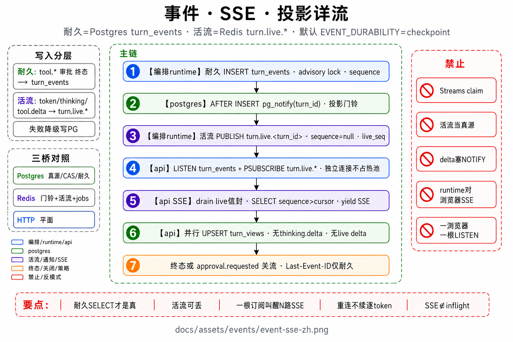
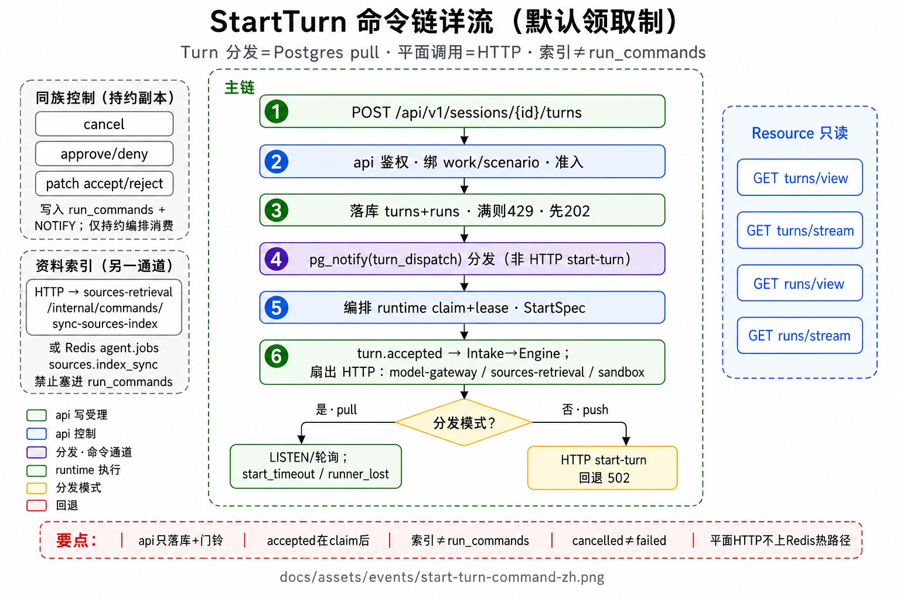

# 事件与契约

事实事件如何从 runtime 到达 Web，以及 Turn 如何被启动、取消与审批。两张图覆盖管道与 StartTurn 链。

## 图

1. [事件 · SSE · 投影](../assets/events/event-sse-zh.png) — INSERT → NOTIFY → LISTEN → SSE / views  
2. [StartTurn 命令链](../assets/events/start-turn-command-zh.png) — 默认 runtime 自己领取；api HTTP 推送是回退  





## 1. 事实管道（事件拉取）

采用 **事件表拉取**，不用 runtime→api 内存推送，也不让 runtime 对浏览器开 SSE。

```text
runtime（TurnController / AgentEngine）
  · 关键节点 append-only INSERT turn_events（递增 sequence）
  · 大正文进 artifacts；事件行带摘要/指针
  · AFTER INSERT → pg_notify(turn_events 通道, turn_id)

Postgres

api
  · 启动时 LISTEN
  · 收到 turn_id → 队列（SSE 与投影共用触发）
  · 队列空闲约 2s 轮询 turn_events 兜底

分流：
  · SSE  GET …/turns/{id}/stream
        按 sequence 回放；thinking.delta 只走 SSE
        约 14s :ping；可用 Last-Event-ID 重连
  · Projection
        同批 UPSERT turn_views
        列表 / 首屏 / 重连 / 终态 → GET /view（可 ETag/304）
        thinking.delta 默认不进 view 快照
```

禁止：runtime 直连浏览器 SSE；仅靠进程内 channel 当事唯一源；Turn 热路径上同步重投影。  
UI **不推断**阶段：只跟事件流与 `turn_views`。

## 2. 写主权

| 所有者 | 写什么 |
|--------|--------|
| **runtime** | `turn_events`、runs/turns 执行态、checkpoint、transcript 真源、工具产物引用 |
| **api** | `turn_views`、对外 SSE、触发/更新 `sessions.context_summary`（常异步） |

无分布式事务：领域表若短暂落后，用事件序 **reconcile** 修。  
checkpoint 除 messages 外须能恢复「还欠测试 / 还欠 issue 例子」，否则审批挂起后续跑会把行为门弄丢。

## 3. 命令与资源

### 3.1 StartTurn（默认 runtime 领取）

api 尽快只做落库和分发通知，**不把任务推到 runtime**。runtime 有空位才领，领了之后心跳续约。客户端先拿到 202；业务上「这题开始了」要等 runtime 发出 `turn.accepted`。首 token 时间看该事件经 SSE 到达的时刻。

```text
1. 客户端 POST …/sessions/{id}/turns
2. api 鉴权，校验 session · work · scenario
3. 准入：全局/租户未领取队列满 → 429 + Retry-After
4. 同一事务落库 turns + runs（+ 视图种子）；
   领取制且可领取 → NOTIFY 分发通道；客户端先得 202
5. runtime 有空位才领 + 租约心跳；
   读 StartSpec（含计划相位；官方评测还会带无人值守标记和模型密文）
6. runtime 发 turn.accepted → Intake → shouldQuery → Engine 或本地完结
```

这次提问带官方评测标记时，StartTurn 即预批准写盘/exec（无人值守），字段随 checkpoint 存活。编码评测另可在开题前等符号表 ready（只评测套件，不挡产品首 token）。

超过领取时限仍无人领 → `failed(start_timeout)`；租约丢失且无法安全续跑 → `failed(runner_lost)`。回退模式才是 api HTTP 调 runtime 的 `start-turn`，传输失败则客户端 502。

运维旋钮与故障注入：[Pull 分发运维手册](../ops/pull-dispatch-runbook.md)。

### 3.2 同族控制命令

默认走 **`run_commands` + NOTIFY**，由持有租约的 runtime 消费（HTTP 内部命令可作兼容回退）：

| 命令族 | 用途 |
|--------|------|
| 取消 | 软 / 硬取消 |
| 工具审批 | 批准 / 拒绝 tool_call |
| patch | 接受 / 拒绝 diff |
| 索引 | 资料索引同步 / 取消 |
| 其它 | 验证 pass、检索预热等 |

### 3.3 只读资源（不触发 loop）

`GET /turns/{id}` · `/view` · `/stream` · `GET /runs/{id}` · Sessions/Works/健康检查等。

公开契约与版本以契约包为准；改字段先改契约，再改实现与 web 生成类型。

## 4. 常见事件形态

| 阶段 | 例 |
|------|-----|
| 受理 | `turn.accepted`（runtime 领取后） |
| 模型 | `turn.thinking.delta` · 文本增量 |
| 工具 | `tool.started` / `tool.completed` · `approval.requested` |
| 终局回执 | `tool.completed` 且 `verify_receipt=true`（模型想收工却还欠验证时平台塞的提醒；**不是**模型点的工具） |
| 检索旁路 | `retrieval.completed`（审计，给 Ops，**不进**模型窗） |
| 终态 | `turn.completed` / `turn.failed` / `turn.cancelled` |

完整枚举与 payload 以契约包事件 schema 为准。
