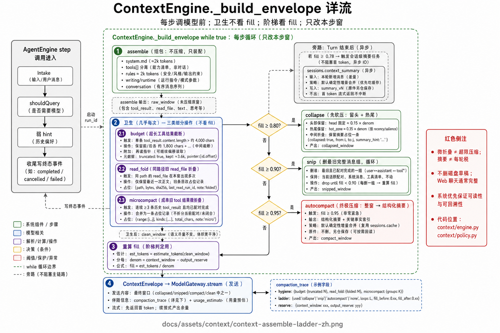
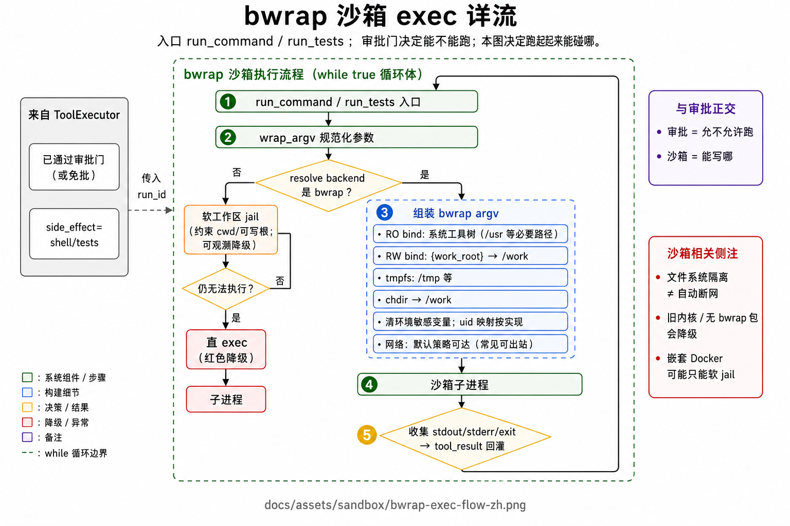
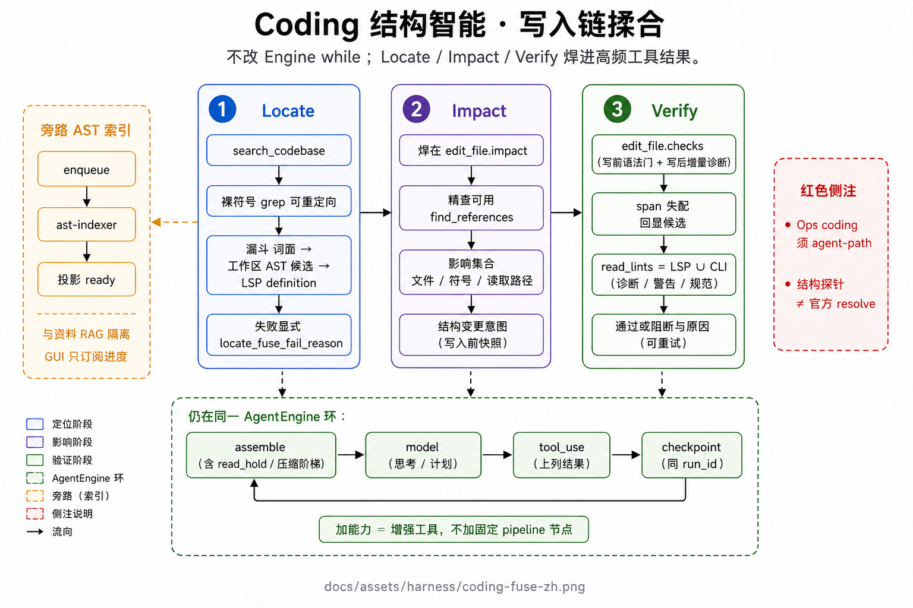

# 工具与上下文

工具协议、组窗压缩阶梯、exec 沙箱，以及 Coding 结构智能如何焊进工具结果。

## 图

1. [组窗详流](../assets/context/context-assemble-ladder-zh.png) — 卫生 → fill 阶梯 → 模型  
2. [exec 沙箱](../assets/sandbox/bwrap-exec-flow-zh.png) — Landlock · bwrap · 软 jail  
3. [Coding 写入链揉合](../assets/harness/coding-fuse-zh.png) — Locate / Impact / Verify  







## 1. 能力即工具

检索、改稿、exec、委派、验证、结构智能都是 **工具**（或焊进既有工具结果），由模型在 AgentEngine 循环内按需调用。  
加能力 = 注册 / 增强 `ToolSpec` + handler，**不改 while、不加固定 pipeline 节点**。

| 字段 | 作用 |
|------|------|
| `name` / `description` / `input_schema` | 进请求级 `tools[]`（与 system 文本分离） |
| `side_effect` | 只读 / 写盘 / shell … 决定并行与审批默认 |
| `approval` | 是否打断等待用户 |
| `timeout_s` | 单次调用上限 |
| `handler` | async；可流式打事件 |

约束：

- 工具结果进窗前统一过 **budget**。  
- 只读可并行；写盘 / shell 默认审批更严。  
- RAG **只**以 `search_sources` 等 `tool_result` 回灌，禁止每轮预注入向量包。  
- 多 agent **只**经 `delegate` 子 Run，摘要回灌。

## 2. Coding 结构智能（agent 场景）

不新增「模型必须学会点的」独立结构工具名作为主路径；把能力焊进高频动词：

| 车道 | 焊点 | 要点 |
|------|------|------|
| **Locate** | `search_codebase`；裸符号 `grep` 可重定向 | 词面 →（可选）工作区 AST 粗筛 → LSP definition；失败显式原因 |
| **Impact** | `edit_file.impact` | 改动影响摘要；精查仍可用 `find_references` |
| **Verify** | `edit_file.checks` · `read_lints` | 写前语法门 + 写后增量诊断；LSP ∪ CLI；span 失配回显候选 |

工作区 **AST 索引**是旁路：入队 → `ast-indexer` 领取解析 → 投影 ready；GUI 只订阅进度，**禁止假装已就绪**。与资料 RAG 向量面硬隔离。  
写作 / 情报场景继续走 RAG，不默认打开上述结构白名单。

## 3. 请求通道怎么拼

| 通道 | 内容 | 注意 |
|------|------|------|
| System | 场景 `system` 提示 | 跨 step 求字节稳定；**不焊**工具 schema / 大纲全文 |
| Tools | `tools[]` how-to + schema | 与 system 文本分离 |
| Rules | 作品规矩 / 大纲摘要等 ≈2k | 不焊进 system |
| Writing / Runtime / Session | 焦点、计划、步进注入 | Runtime 宜在 Conversation 之后 |
| Conversation | user / assistant / tool_results / compact | **卫生与 80/90/95 主要作用于此** |

物化顺序：**稳定前缀 → 历史 → 易变垫底**；`tools[]` 不进 message 串。

## 4. ContextEngine 逐步经过

每次准备调模型前跑组窗。

### 4.1 卫生（几乎每步）

| 步骤 | 做什么 |
|------|--------|
| **budget** | 单条超长 `tool_result` 截断，留再读指针 |
| **read_fold** | 同一 path 的旧 `read_file` 正文去掉，只留最近一次 |
| **microcompact** | 历史里成串旧 tool 结果折成短占位；**不拆**当前配对 |

微折叠是卫生，**不是**超限压缩。

> Coding 注：纯 pager 型 `run_command` 的工具级改写尚未落地；目前靠场景纪律文案引导改用 `read_file`（见 plan CSI §7.3 W2）。

### 4.2 填充率与阶梯

```text
fill_ratio ≈ 本窗估计 token / (context_window_tokens − output_reserve_tokens)
```

| 阈值 | 动作 | 损失形态 |
|------|------|----------|
| ≥ **0.80** | **collapse** | 留 head + 热尾；中间折叠 |
| ≥ **0.90** | **snip** | 删最旧完整消息组 |
| ≥ **0.95** | **autocompact** | 整窗 → 结构化摘要（默认确定性增量） |

摘要是最后一档，不是每轮税。只改本步模型窗；磁盘稿与 Web 聊天记录通常仍完整。  
Turn 结束后若 fill 偏高：可异步刷新会话摘要缓存，**不挡**本轮首 token。

## 5. exec 沙箱（与审批正交）

```text
审批已过（或本工具免审）
  → run_command / run_tests
  →（可选）Landlock：进程能力收紧
  → 解析后端
       ├─ bwrap 可用 → RO/RW/tmpfs 组装 → 子进程
       ├─ 否则 → 软工作区 jail（约束 cwd / 可写根；可观测降级）
       └─ 再失败 → 直 exec（最后手段；威胁面更大）
```

| 项 | 做法 |
|----|------|
| RO bind | 必要系统树 |
| RW bind | 工作区 → `/work` |
| tmpfs | `/tmp` 等 |
| chdir | `/work` |
| 网络 | 默认可达；断网需显式策略（沙箱主责是文件系统隔离） |

| 门 | 问题 | 失败形态 |
|----|------|----------|
| **审批** | 允不允许跑这次工具 | `waiting_approval` / deny `tool_result` |
| **Landlock / bwrap / 软 jail** | 跑起来能碰哪 | EACCES / 降级路径 |

不在热路径上再套一层 LLM 安全裁判。
