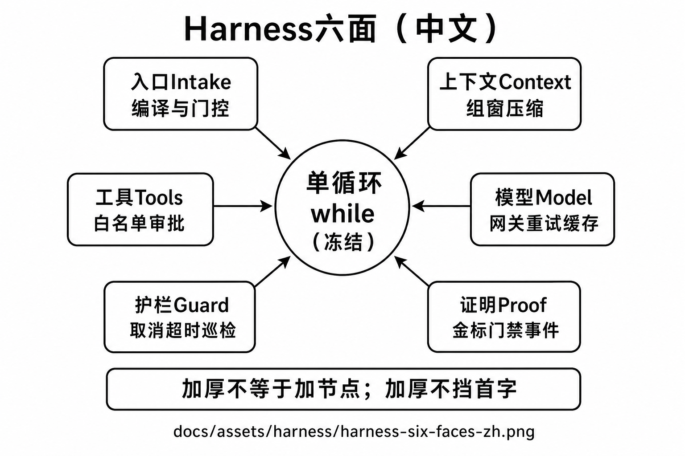
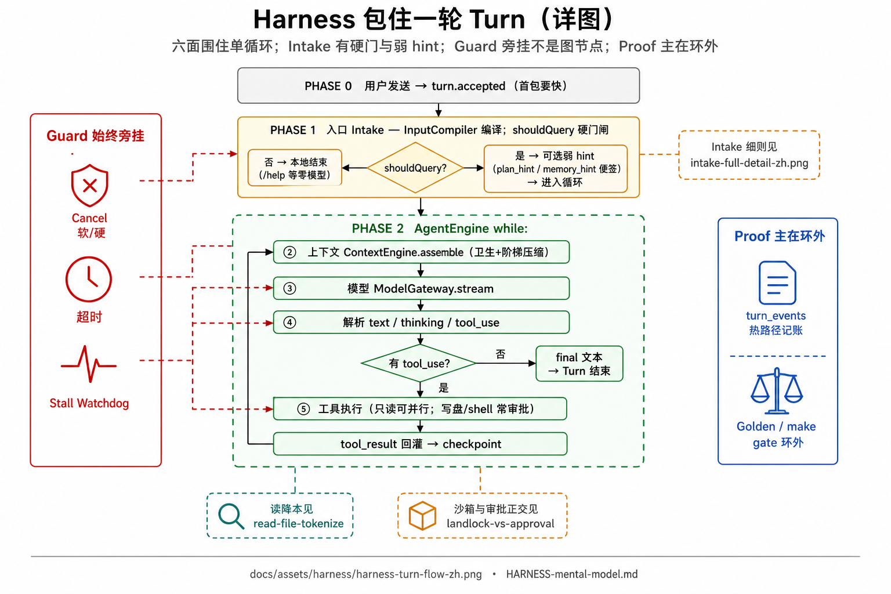
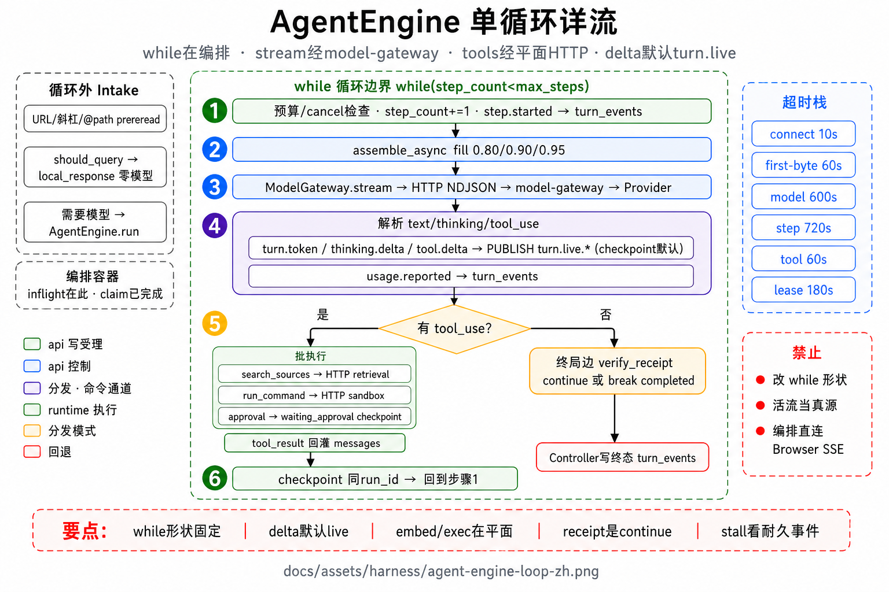
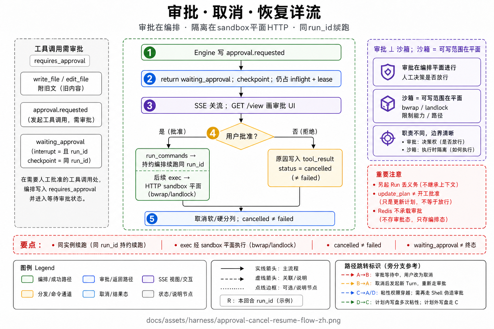

# Harness 心智模型（六面）

> 本文用**中文大白话**固定「Agent Harness 在干什么」。  
> **六面 = 包住「单循环」的六种能力厚度，不是必须串完的六层流水线。**  
> 权威总纲：[`12-model-harness.md`](../../core/12-model-harness.md)；面试：[`21`](../agent-system-qa.md) Q14。  
> 图目录：`docs/assets/harness/`。

---

## 1. 先用生活比喻

把「裸模型 + while 循环」想成一个会干活的学徒：

| 没有 Harness | 有 Harness |
|--------------|------------|
| 学徒自己乱拆家、改错目录、死循环没人喊停 | 进门先登记、桌上只摊当前作业、工具要领用单、打电话有重拨规则、随时可叫停、干完有验收单 |

**Harness（挽具 / 套具）** 这个词的意思就是：  
不是换一匹更壮的马（换更强模型），而是给马套上缰绳、鞍具、刹车——**同一匹马，骑起来才可控。**

本项目口诀：

> **循环形状已经对了；好不好用，差在这套「套具」厚不厚。**  
> **套具可以加厚，但不能把「第一句话出来」拖死。**

---

## 2. 一句话定义

**Harness = 决定 Agent「好不好用」的工程外壳：**

1. **入口稳**（乱输入先被编译/挡掉）  
2. **窗干净**（模型每次只看见整理过的上下文）  
3. **工具跟手**（该挂的挂、该审的审、读可并行）  
4. **模型调得稳**（超时、重试、缓存有规矩）  
5. **能停、能超时**（人按 Stop、系统发现假活）  
6. **结果可证明**（金标、门禁、事件字段——不是嘴上说稳）

| 它是 | 它不是 |
|------|--------|
| 六种能力面的策略与可观测 | 换一个更聪明的聊天模型 |
| 可取消、可降级、可测 | 再画一张 13 节点固定流程图 |
| 用缓存/硬上限抵消加厚成本 | 每轮再雇一个「裁判小模型」拖慢首字 |

---

## 3. 图册（先看中文图）

| # | 主题 | 路径 |
|---|------|------|
| 1 | **六面总览（中文）** | [`docs/assets/harness/harness-six-faces-zh.png`](../../assets/harness/harness-six-faces-zh.png) |
| 2 | **包住一轮 Turn（详图）** | [`docs/assets/harness/harness-turn-flow-zh.png`](../../assets/harness/harness-turn-flow-zh.png) |
| 3 | **AgentEngine 单循环（详图）** | [`docs/assets/harness/agent-engine-loop-zh.png`](../../assets/harness/agent-engine-loop-zh.png) |
| 4 | **审批 · 取消 · 恢复（详图）** | [`docs/assets/harness/approval-cancel-resume-flow-zh.png`](../../assets/harness/approval-cancel-resume-flow-zh.png) |

推荐顺序：**先 #1，再 #2；进循环细节看 #3；停/批看 #4。**  
入口细则另见 [`intake-full-detail-zh.png`](../../assets/intake/intake-full-detail-zh.png)。

路径：[`docs/assets/harness/harness-six-faces-zh.png`](../../assets/harness/harness-six-faces-zh.png)



---

## 4. 六面逐个讲清楚

中间永远是同一个 **「一边想、一边调工具」的 while 循环**（语义冻结，不往里塞 `如果是写作场景就…`）。  
六面是围在循环四周的能力，不是循环里的六个固定阶段。

### 4.1 入口面 Intake（进门）

**人话：** 用户话先过「前台」——整理成标准消息，并决定要不要叫醒大模型。

- `/help` 这类本地命令：可以直接回答，**零次模型调用**。  
- `@某文件`：按预算预读一点内容，超时就只留指针。  
- **写作还是 Agent**：由你点的入口 / API 的 `scenario_id` 决定，**不让模型猜**。

细文：[`INTAKE-mental-model.md`](intake.md)。

### 4.2 上下文面 Context（组窗）

**人话：** 每次再问模型前，把「这一步真正塞进模型的那一窗话」打扫干净。

- 日常卫生：超长工具结果截断、旧读文件折叠……  
- 窗快满了：约 80% / 90% / 95% 才升级压缩，不是活得越久档位越高。

细文：[`CONTEXT-mental-model.md`](context.md)。

### 4.3 工具面 Tools（干活规矩）

**人话：** 模型只能从「当前场景挂上的工具表」里选；参数先过 schema；写盘等常要人批准；只读类可以并行。

- 写作场景不挂危险 shell；Agent 场景才挂命令/测试。  
- 检索是工具（如 `search_sources`），不是强制流水线阶段。  
- 真正跑 shell 时，外面还有 **bwrap** 箍文件系统（见沙箱文）。

### 4.4 模型面 Model（打电话的总机）

**人话：** 所有对大模型的调用走统一网关，不要各写一套重试。

- **还没吐出第一个字** 才允许按规则重试；已经开始流式了，别傻侧重拨把半截答案搞乱。  
- 首字节要有快超时；取消要能打断等待。  
- Prompt 缓存：稳定前缀与易变对话分家，少付冤枉钱。

### 4.5 护栏面 Guard（刹车与假活检测）

**人话：** 人要停就能停；模型/工具/单步都有超时；进程还在但很久没新事件 → 卡住巡检（先告警，默认不立刻当失败乱杀）。

- **Stop / 取消 ≠ 失败**：产品语义要分开讲。  
- 取消要贯串：backoff、组装、预读、HTTP 流都要听得见「停」。

### 4.6 证明面 Proof（可证明，不是口头保证）

**人话：** 好不好用要靠金标、延迟门禁、事件字段说话；评测台在旁路，不挡写作热路径。

- `make gate`、Golden Turn、SLO。  
- 事件里带上重试次数、缓存命中、组装耗时等，方便事后对账。

---

## 5. 包住「一轮用户发言」（Turn）时怎么走

路径：[`docs/assets/harness/harness-turn-flow-zh.png`](../../assets/harness/harness-turn-flow-zh.png)



**读图要点：**

| 块 | 记住一句 |
|----|----------|
| Intake | `shouldQuery` 硬门 + 可选弱 hint；细则见 Intake 详图 |
| while | assemble → model → tools → checkpoint；有 tool 再绕回 |
| Guard | 旁挂 Cancel/超时/Watchdog，不是循环里多两个节点 |
| Proof | 热路径写事件；Golden/`make gate` 在环外 |

用中文跟一遍：

```text
用户点发送 / API 受理一轮
  → 尽快标记「已受理」（体感：别让人干等）
  → 【入口】编译输入；shouldQuery 要不要调模型？
        不要 → 本地答完，本轮结束
        要 → 可选弱 hint → 进入循环：
              【上下文】组装这一窗
              【模型】流式想 / 可能提出调工具
              【工具】执行（可读并行、可写常审批；read 有硬闸）
              【护栏】全程可取消、可超时、可巡检假活
              （有工具结果就回到「再组装 → 再调模型」）
  → 【证明】事件已落库；金标/门禁在环外持续证明
```

注意：

- **护栏**不是循环里多出来的两个「步骤节点」，而是**始终挂着的刹车**。  
- **证明**主要在环外（CI、评测），热路径只负责把可观测事件写清楚。

### 5.1 AgentEngine 单循环（进门后）

路径：[`docs/assets/harness/agent-engine-loop-zh.png`](../../assets/harness/agent-engine-loop-zh.png)



TurnController（Intake / shouldQuery / 弱 hint / 收尾）在 **while 门外**；循环内可审批挂起、流中取消、`read_file` 硬闸 skipped。

### 5.2 审批 · 取消 · 恢复

路径：[`docs/assets/harness/approval-cancel-resume-flow-zh.png`](../../assets/harness/approval-cancel-resume-flow-zh.png)



要点：Cancel ≠ failed；审批续同一 `run_id`；写盘粘性免批 ≠ Plan 同意门；审批与 Landlock 正交。

---

## 6. 和其它心智文档怎么串

| 想搞懂… | 读 | 主要落在哪一面 |
|---------|-----|----------------|
| 进门编译 / 要不要调模型 | [`INTAKE-mental-model.md`](intake.md) | 入口 |
| 窗怎么压缩 | [`CONTEXT-mental-model.md`](context.md) | 上下文 |
| 检索 BM25/向量 | [`RAG-mental-model.md`](rag.md) | 工具（`search_sources`） |
| shell 怎么箍住 | [`BWRAP-mental-model.md`](bwrap.md) | 工具执行外围（不改循环） |

---

## 7. 加厚时的硬规矩（速率）

面试/评审常问：「你们加了这么多机制，会不会变慢？」

统一答法：

1. **受理要快**（先告诉用户「收到了」）。  
2. **首字前少干活**（别在首 token 前再调一个裁判模型）。  
3. **热路径 CPU 要可预算**（毫秒级；重活异步）。  
4. **加厚用缓存或硬上限抵消**（例如 prompt cache、工具次数预算）。  
5. **可测才算合并**（门禁绿了才算数）。

口诀：**厚，但不能挡首字。**

---

## 8. 常见误解（中文对照）

| 容易听成 | 实际含义 |
|----------|----------|
| 「六层架构，一层层过完」 | 六种**能力面**；简单问题可以零工具、甚至入口短路零模型 |
| 「再画一张更细的状态图就更稳」 | 我们刻意不用意图分类大图；稳来自网关/组装/工具/护栏 |
| 「机制越多越高级」 | 挡首字的机制不算高级，算回归 |
| 「证明 = 线上再问模型你确定吗」 | 证明靠金标与门禁；热路径不雇同步裁判 |

---

## 9. 三十秒口述（可背）

> Harness 是套在单循环外的六面：入口编译门控、上下文组窗、工具纪律、模型网关、取消超时护栏、金标可证明。  
> 不是六步流水线，也不是换模型。  
> 加厚不挡首字。细节见文档 12。
