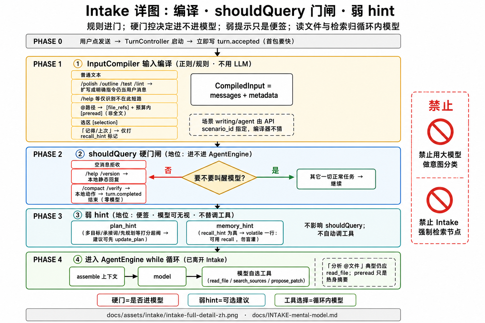

# Intake 心智模型（进门）

> 本文用**中文大白话**固定：「用户点发送之后、大模型开始想之前，系统先干什么」。  
> **三个词：编译（整理输入）+ 硬门控（要不要叫醒模型）+ 弱 hint（可选便签）。全程用规则，不用大模型猜意图。**  
> 权威：[`05-agent-runtime.md`](../../core/05-agent-runtime.md) §3.1 · [ADR-014](../../core/05-agent-runtime.md)。  
> 图目录：`docs/assets/intake/`（**详图优先** [`intake-full-detail-zh.png`](../../assets/intake/intake-full-detail-zh.png)）。  
> 它属于 Harness 的**入口面**（[`HARNESS-mental-model.md`](harness.md)）。

---

## 1. 为什么要单独有 Intake？

如果用户一说话就扔进大模型：

- `/help` 也要花钱、耗时；  
- `@文件` 可能把整份大文件无预算地塞进去；  
- 还容易让人想「再加一个意图分类模型」把流量导到写作/检索/验证——这正是旧项目固定大图的坑。

所以本项目把「进门」收成**可测试的规则层**：

> **先把输入变成标准消息；再问一句：这件事值不值得调模型？**  
> **值 → 进单循环；不值 → 本地办完，本轮正常结束。**

---

## 2. 一句话定义

**Intake（摄入 / 进门处理）= Turn 启动后、Agent 循环前：**

1. **InputCompiler（输入编译器）**：把杂乱输入编成规范 `messages` + metadata；  
2. **shouldQuery（硬门闸）**：规则表，决定**进不进**大模型；  
3. **弱 hint（便签）**：进循环时可选塞一行建议；**模型可无视，不替调工具**。

| 它是 | 它不是 |
|------|--------|
| 确定性规则 + 单测 | 旧项目那种「意图分类节点」 |
| 场景由用户/API 指定 | 让 LLM 猜「现在是写作还是 Agent」 |
| 允许零模型结束本轮 | 每条消息都强制打满模型 |
| 弱提示可有可无 | 强制规划 / 强制召回 / 强制检索 |

口诀：

> **编译归规则，场景归用户，硬门控进不进模型，弱 hint 只是便签，要不要搜/读/改归循环里的模型自己选工具。**

---

## 3. 图册

| # | 主题 | 路径 |
|---|------|------|
| 1 | **详图：编译 · shouldQuery · 弱 hint（中文）** | [`docs/assets/intake/intake-full-detail-zh.png`](../../assets/intake/intake-full-detail-zh.png) |

路径：[`docs/assets/intake/intake-full-detail-zh.png`](../../assets/intake/intake-full-detail-zh.png)



**读图要点：**

| 阶段 | 地位 | 记住一句 |
|------|------|----------|
| ① InputCompiler | 整理输入 | 正则/规则；`/polish` 等是**扩写仍进模型**；`@路径` 只做指针 + 预算 prereread |
| ② shouldQuery | **硬门闸** | 只答「要不要叫醒模型」；`/help` 等可零模型结束 |
| ③ 弱 hint | **便签** | `plan_hint` / `memory_hint`；不影响门控、不自动调工具 |
| ④ AgentEngine | 已出 Intake | 模型自选 `read_file` / `search_sources` …；「分析 @文件」典型仍应 read |

---

## 4. 用中文跟一遍完整路径

```text
用户在工作台输入一句话
  （可能还带：选中的文稿片段、@某个路径、上传附件、/命令）

        ↓
【第一步 · 输入编译】
  规则把它们折成标准消息列表 + 一点元数据
  · 普通聊天 → 一条用户文本
  · /polish /outline /test /lint → 扩写成明确指令（仍当用户消息，后面进模型）
  · /help 等 → 仅识别（短路在第二步）
  · @sections/02.md → 文件指针，必要时预算内预读一小段
  · 选区 → 带上「用户正盯着哪一段」
  · 「记得上次」→ 仅打 recall_hint（不盲灌记忆）
  · 多目标等 → 可能产出 plan_hint 文案进 metadata

        ↓
【第二步 · shouldQuery 硬门闸】
  · 空消息 → 拒收或提示
  · /help、/version → 直接回静态说明，本轮完成（零模型）
  · /compact、/verify → 本地动作，可不进循环
  · 其它正常任务 → 进入 Agent 循环

        ↓
【进循环前 · 弱 hint 便签（可选）】
  · plan_hint / memory_hint 写入上下文或 volatile
  · 模型可无视；不自动调 update_plan / recall

        ↓
【进循环之后才发生的事 · 已不是 Intake】
  模型首轮自己决定：直接回答，还是调用 read_file / search_sources / 改文件 …
```

**大红叉（架构红线）：**  
不要再做「大模型意图分类 → 强制检索节点 → 强制验证节点」那种固定大图。  
场景分流靠**产品入口**；工具调用靠**循环里的 Function Calling**。

**体验细节：**  
API 一旦受理，尽快写出「本轮已接受」类事件——人会感觉「系统活着」，这叫首包要快；它属于进门体验，不是又一个 workflow 节点。

---

## 5. 输入编译器：每种输入在干什么（细讲）

（总览见 §3 详图阶段 ①；下表对照实现。）

| 你打的东西 | 编译器怎么理解 | 为啥要这样 |
|------------|----------------|------------|
| 普通中文/英文 | 原样进用户消息 | 最常见路径，零花样 |
| `/help`、`/polish`、`/outline`… | **正则/规则**解析成结构化意图 | 斜杠是产品语法，不该浪费一次「理解斜杠」的模型调用 |
| `@路径` | 变成「文件指针」；可在预算内预读摘要 | 让模型知道你指哪；全文通读仍应靠后面的 `read_file` |
| 附件 | 记录类型与路径引用 | 进门不默认同步解析整份 PDF（速率/成本） |
| 编辑器选区 | 带上 selection 块 | 写作「改这一段」必须对准选区，不能靠模型猜光标 |

输出心智：

```text
CompiledInput ≈ {
  messages:  已经规范化的对话块,
  metadata:  给后续门控/日志用的附加信息
}
```

---

## 6. shouldQuery：地位与几例

**地位：廉价前置硬门闸**——站在 `AgentEngine` **门外**，只决定本轮要不要启动模型。  
**不是**意图分类器；**不管**读不读、搜不搜、改不改。

| 情况 | 进不进大模型 | 用户侧体感 |
|------|--------------|------------|
| 只发了空格 | 不进（或直接提示） | 「没内容」 |
| `/help` `/version` | 不进 | 立刻看到帮助 / 版本 |
| `/compact` `/verify` | 不进 loop 正文 | 本地压缩 / 核查确认 |
| `/polish` `/outline` `/test` `/lint` | **进**（先扩写指令） | 像正常对话，但指令更明确 |
| 「帮我根据资料改第三章」 | **进** | 后面才可能出现检索/改稿工具 |
| 「分析 @foo.md」 | **进** | prereread 可能有摘要；全文仍靠模型调 `read_file` |

原则：**门控必须能写单元测试**；禁止「再问一次小模型：这像不像帮助命令？」

代码：`services/runtime/app/controller/input_compiler.py` → `should_query()`。

---

## 6.1 弱 hint：地位与两种

**地位：进循环后的便签**——不影响 `shouldQuery`；**不自动调工具**；模型可无视。

| 种类 | 触发（规则） | 塞什么 | 不做什么 |
|------|--------------|--------|----------|
| **`plan_hint`** | 多编号目标 / 承接词 /「先规划」等打分超阈 | 一行：可考虑先 `update_plan`（optional） | 不强制开 Plan 模式 |
| **`memory_hint`** | 「记得 / 上次 / 之前说过 / recall…」 | volatile 一行：相关可用 `recall` | 不盲灌长记忆、不替调 `recall` |

实现要点：

- `plan_hint`：`detect_plan_hint` → `compiled.metadata` → `TurnState.plan_hint`（见 `plan_suggest.py`、docs/26）  
- `recall_hint` → TurnController 写入 `volatile_context` 的 `[memory_hint] …`  
- 二者都在 **`should_query=True` 之后**才对模型可见

口诀：

> **shouldQuery = 要不要叫醒模型；弱 hint = 叫醒之后贴一张便签。**

---

## 7. 分工表（最容易考的口试题）

把问题分开答，面试官会觉得你边界清楚：

| 问题 | 谁说了算 | 一句话 |
|------|----------|--------|
| 现在是写作还是 Agent？ | **用户 / API 场景 ID** | 进门前就定了，不猜 |
| 这条要不要花钱调模型？ | **shouldQuery 硬门闸** | `/help` 可以不花 |
| 要不要先列计划 / 要不要 recall？ | **模型**（可看弱 hint） | hint 可无视；不盲调 |
| 要不要搜资料、读哪个文件？ | **循环里的模型 + 工具** | Intake 不替它做 RAG / read 决策 |
| 要不要多步正式 Plan？ | **用户点 Plan / 采纳建议** | 弱 hint ≠ Plan 同意门 |

所以：  
**Intake 不管「搜不搜」**；它只把路修到「进不进循环」，最多再贴弱提示。  
搜不搜是进循环后调不调 `search_sources`（见 RAG 心智模型）。

---

## 8. 和 Harness 其它面的衔接

```text
Intake 结束
  → 若进循环：下一拍就是 Context 组窗 → Model → Tools …
  → Guard 从进循环起就可以取消
  → Proof 从「已受理」事件就开始记账
```

Intake **不**修改 while 的终止条件；它站在 while **门外**。

---

## 9. 常见误解（中文）

| 误解 | 更准 |
|------|------|
| 「Intake 就是意图识别 AI」 | 是规则编译器 + 硬门控 + 可选弱 hint |
| 「所有 `/xx` 都本地直答」 | 仅 `/help` `/version` `/compact` `/verify` 等短路；`/polish` 等扩写后**仍进模型** |
| 「贴了 `xx.md` 就本地答 / 自动全文读」 | 只有 `@路径` 进编译；preread 有预算；分析仍靠 loop 里 `read_file` |
| 「弱 hint = 强制规划 / 强制召回」 | 便签而已；模型可无视；不自动调工具 |
| 「shouldQuery 决定搜不搜」 | 它只决定进不进模型 |
| 「进了 Intake 就算开始思考」 | 思考在 Model；Intake 可能零模型结束 |
| 「Intake 决定挂哪些工具」 | 工具表白名单主要在场景配置；Intake 管输入 |

---

## 10. 三十秒口述（可背）

> 用户发送后先 Intake：规则编译文本、斜杠、@路径、选区；`shouldQuery` 硬门决定要不要调模型；  
> 进循环前可塞 `plan_hint` / `memory_hint` 弱提示（可无视）。  
> 不要模型 → 本地结束；要 → 进单循环，由模型自己选工具。  
> 写作/Agent 场景不靠模型猜。详图见本文 §3；权威见文档 05 §3.1。
