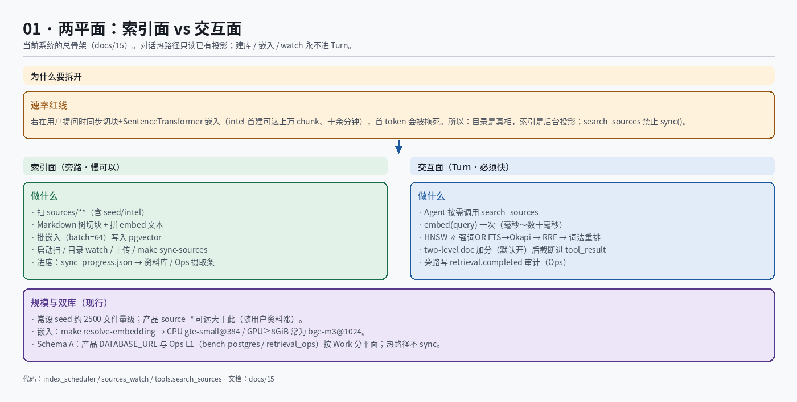
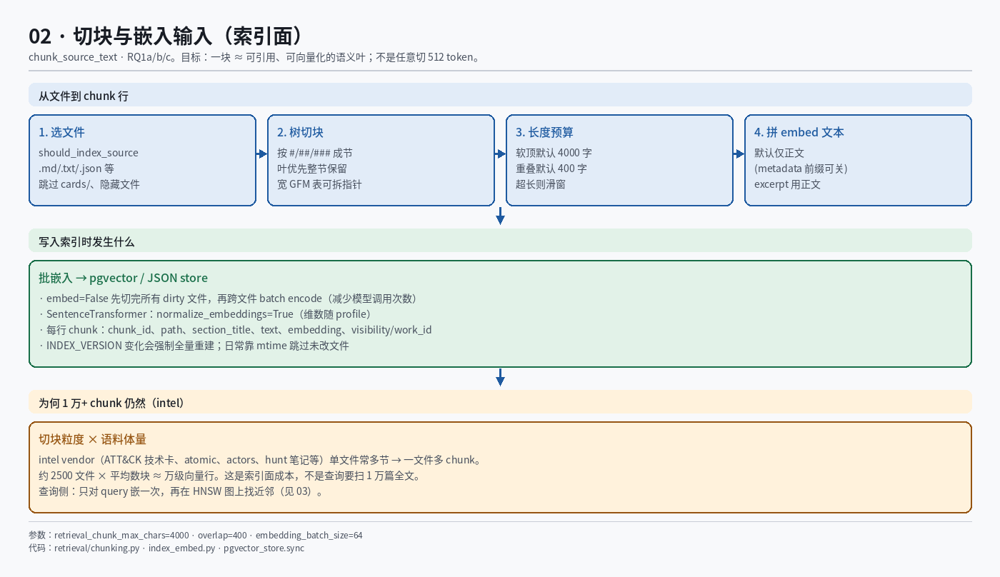
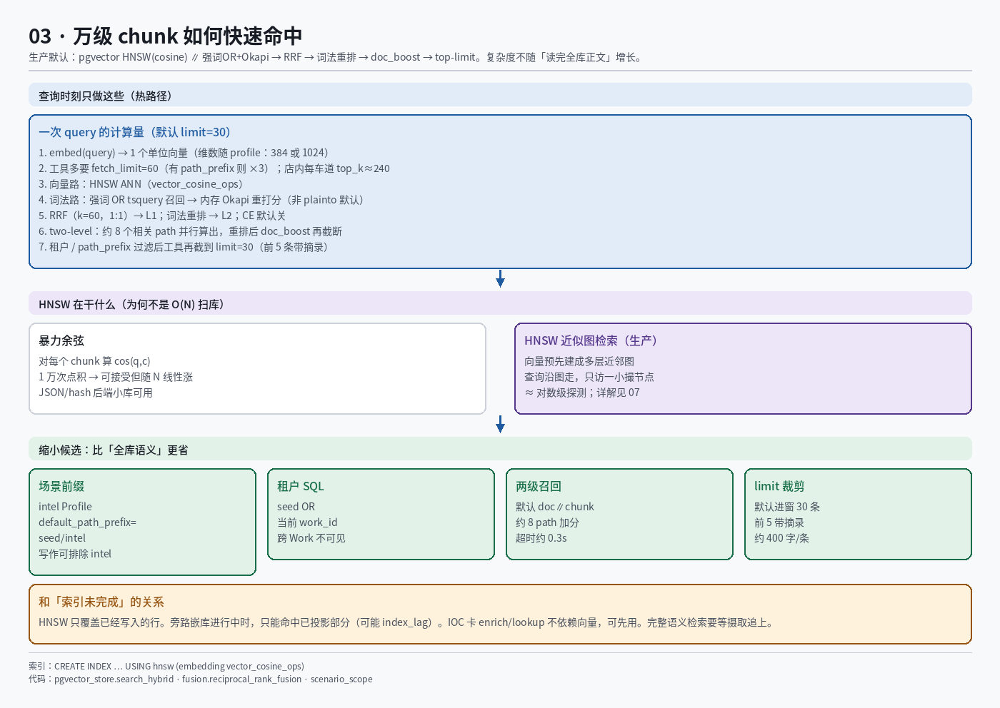
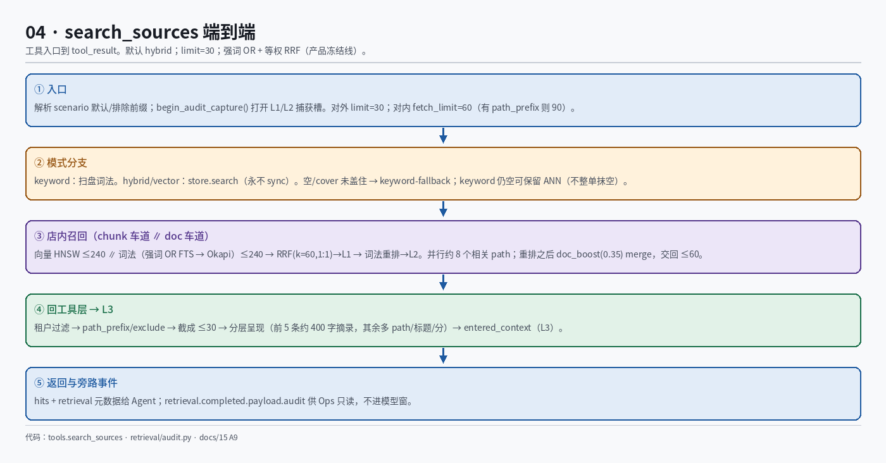
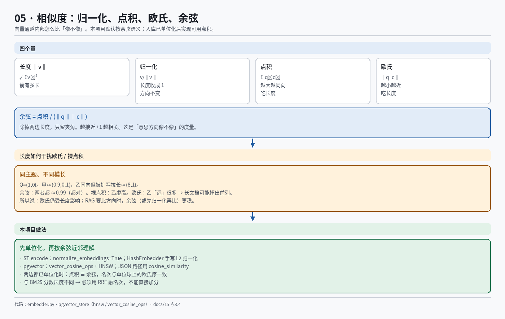
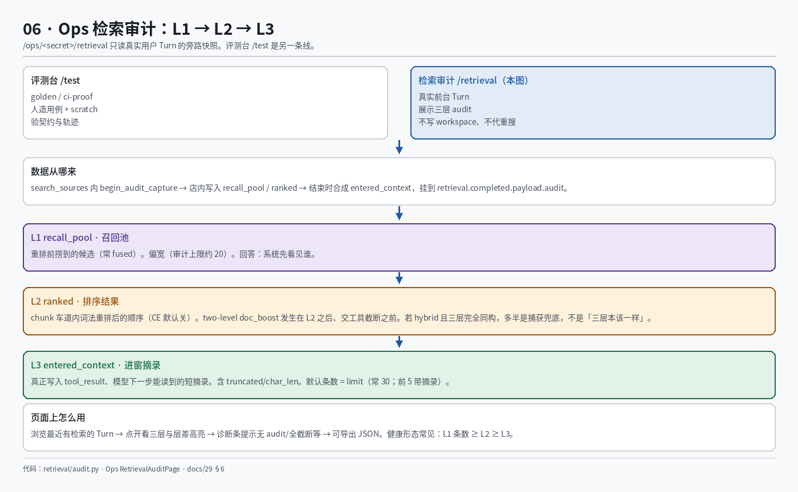
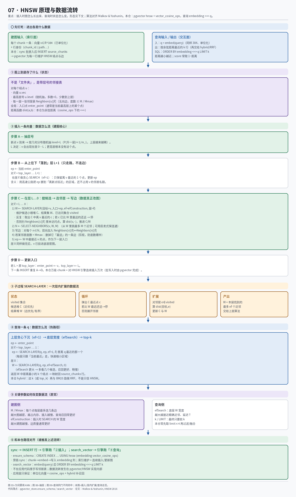
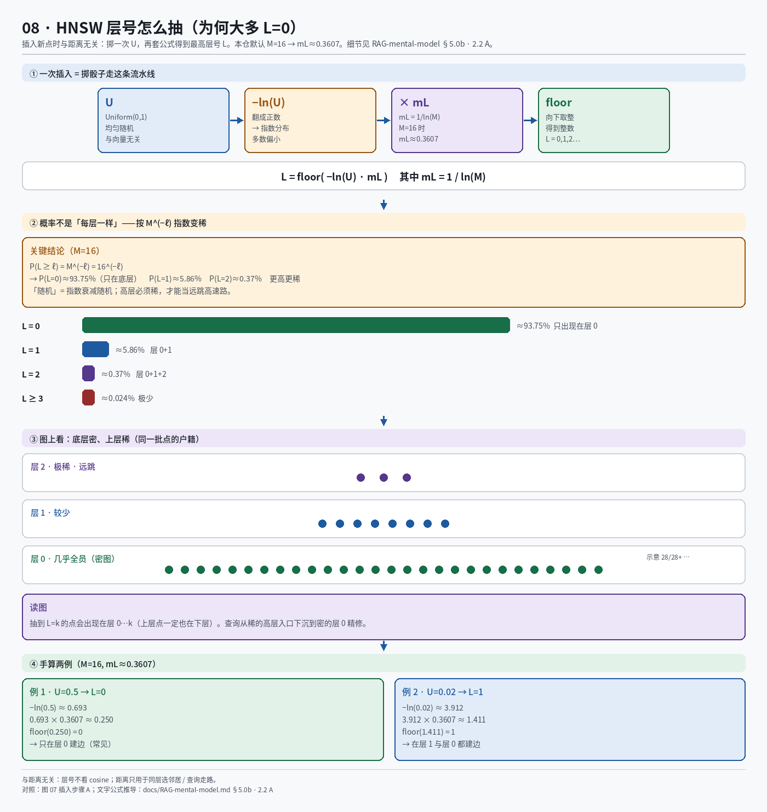
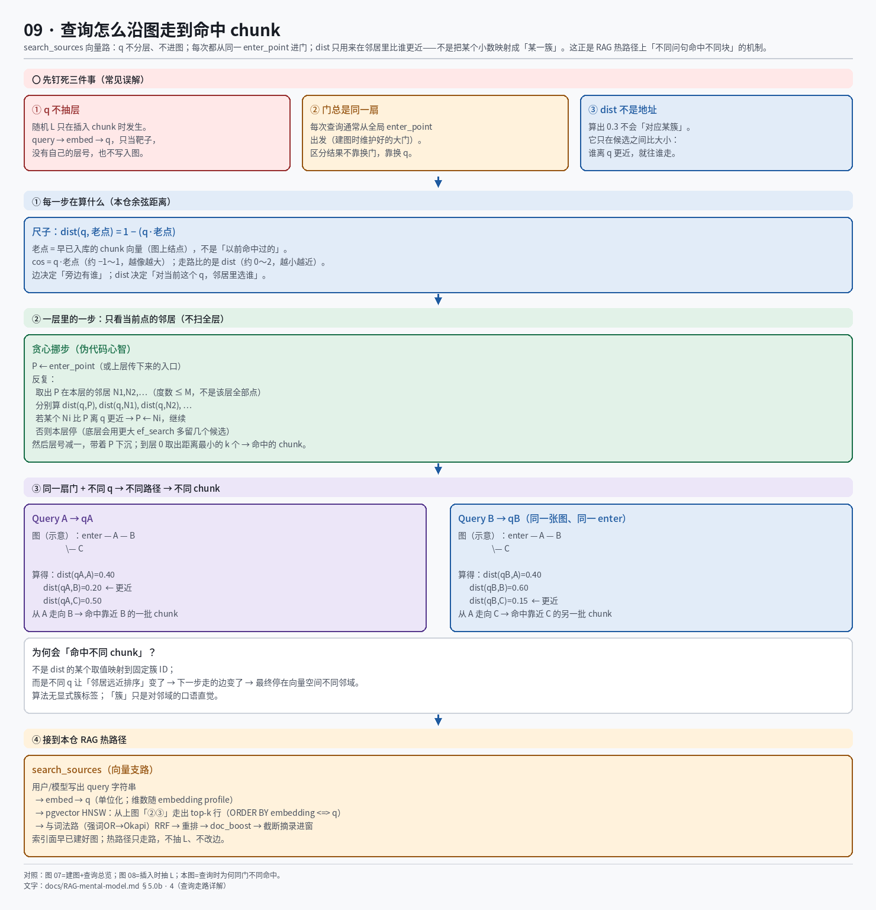

# RAG 心智模型（写作检索）

> 本文用大白话固定「检索在干什么」。**§5 嵌入→向量**是核心；**公式一律配流程图**，图路径见 §5「图册索引」。  
> 实现细节与票状态以 [`15-rag-and-sources.md`](../../topics/rag-and-sources.md) 为准；面试口述可对照 [`INTERVIEW-MOCK-RESUME.md`](../INTERVIEW-MOCK-RESUME.md) §五。

## 1. 一句话

**RAG = 模型需要事实时，用工具去资料库里捞出若干「块」的短摘录，再带着摘录继续答；不是把整库塞进上下文，也不是模型自己「背」语料。**

本项目里，写作场景的入口工具是 `search_sources`。

---

## 2. 端到端在干什么

```text
用户输入
  → Agent loop 里的模型决定：要不要搜、query 写成哪一句
  → 调用 search_sources(query)     ← 每次一个字符串
  → 工具内部（默认 hybrid）：
        BM25 路 ∥ 向量路
        → RRF 按名次融合成宽候选池
        → 小池词法重排（可选/默认廉价）
        → 截断成短摘录 + 引用 id 返回
  → 模型读 tool 结果，再决定直答 / 再搜 / read_file
```

要点：

| 谁 | 负责什么 |
|----|----------|
| 模型 | 理解用户意图；决定是否调用 `search_sources`；把意图收成一句（或几轮各一句）query |
| `search_sources` | 在**已建好的索引**上检索；不在这次请求里重建整库 |
| BM25 | 词法：query 里的词和块正文对得怎么样 |
| 向量 | 语义：意思近不近（换说法也能靠近）——依赖下面的「嵌入」 |
| RRF | 两路**名次**融合，不把两种原始分加减平均 |

系统**不会**自动把用户原话拆成多个 query 批量喂给 BM25。需要换关键词时，是模型再调 1～2 次工具（每 Turn 有次数预算）。

---

## 3. Query 怎么理解

- 工具参数：`query: str`，**始终是一个字符串**。  
  例：`"张白鹿 人物设定"` 或 `"AA BB CC"`。
- BM25 / 分词内部：把这一个字符串切成多个 **term**（词），再拿这些词去打分。  
  所以 `"AA BB CC"` = **一次检索、一个 query**；空格只影响「拆成哪些词」，不是三次独立搜索。
- 向量路：这个**同一个 query 字符串**还会再走一遍嵌入模型，变成一个向量（见 §5）。

---

## 4. 库里存的是「块」，不是整篇

资料变更后在**旁路/后台**切块入库（热路径查询不建库）。

一篇长 Markdown：

```text
整篇文档
  → 按标题切成节（一节尽量一个话题）
  → 太长再按字符预算切开（块之间可有重叠，避免专名卡在缝上）
  → 得到很多 chunk
```

每个 chunk 是一个对象，字段很多，但心智上先抓两个：

| 字段 | 是什么 | 干什么 |
|------|--------|--------|
| **`text`** | 这一块的**可读正文**（常含章节标题拼在正文前） | BM25 打分；返回给模型的摘录主要来自它。量级是「一小节 / 几百～几千字」，**不是整本书** |
| **`vector`** | 一段**定长浮点数组** | 向量近邻检索。人读不懂；只表示「语义指纹」。**怎么来的 → §5** |

其它常见字段（元数据，BM25 公式本身一般不「逐字段加权」）：

- `chunk_id` / `path` / `section_title` / 行号 → 定位与引用  
- `work_id` / `visibility` → 权限硬过滤（只能看见当前世界允许的资料）  
- `citation_id` → 引用核对  

索引时：`text` 存正文；真正送进嵌入模型的字符串往往还拼了 path 线索、tags（见 §5.1c）。查询返回给 Agent 的仍是短摘录，不是 384 个浮点数。

---

## 5. 嵌入 → 向量（重点：原理 + 模拟 + 维数）

向量检索能工作，全靠这件事：**同一台「嵌入机器」，把任意一段字符串压成同一个空间里的一个点。**  
本项目生产默认嵌入由 `make resolve-embedding` 决定（常见 **gte-small → 384 维**；GPU 可达 **bge-m3 → 1024 维**）。

> **读法：** 公式相关内容一律以**流程图为主**；图统一放在 `docs/assets/rag/`（与上下文压缩图 `docs/assets/context/` 分目录）。LaTeX 仅作备查，可跳过。

### 图册索引（7 张中文原理流程图）

> 重建命令：`python3 scripts/gen_rag_flowcharts.py`（会清空 `docs/assets/rag/` 并重写下列 PNG）。

| # | 主题 | 流程图 | 路径 |
|---|------|--------|------|
| 1 | **两平面：索引面 vs 交互面**（旁路建库 vs Turn 热路径 · 为何禁 sync） |  | [`01-two-planes.png`](../../assets/rag/01-two-planes.png) |
| 2 | **切块与嵌入输入**（树切块 · embed 文本拼装 · 批嵌入库 · 万级 chunk） |  | [`02-chunking-embed.png`](../../assets/rag/02-chunking-embed.png) |
| 3 | **万级 chunk 如何快速命中**（HNSW ∥ 强词OR+Okapi → RRF · two-level · limit=30） |  | [`03-fast-hit-ann.png`](../../assets/rag/03-fast-hit-ann.png) |
| 4 | **`search_sources` 端到端**（强词OR→Okapi→RRF→重排→doc_boost→L3） |  | [`04-search-sources.png`](../../assets/rag/04-search-sources.png) |
| 5 | **相似度：归一化 / 点积 / 欧氏 / 余弦**（长度影响 · 为何选余弦 · 本项目落点） |  | [`05-similarity-metrics.png`](../../assets/rag/05-similarity-metrics.png) |
| 6 | **Ops 检索审计 L1→L2→L3**（评测台边界 · 三层各回答什么 · 页面操作流） |  | [`06-ops-audit-l1-l2-l3.png`](../../assets/rag/06-ops-audit-l1-l2-l3.png) |
| 7 | **HNSW 原理与数据流转**（图状态 · 插入 A–D · SEARCH-LAYER · 查询下沉 · 参数） |  | [`07-hnsw-principle.png`](../../assets/rag/07-hnsw-principle.png) |
| 8 | **HNSW 层号抽样**（公式流水线 · \(M^{-\ell}\) 概率 · 层密度 · 手算） |  | [`08-hnsw-layer-sample.png`](../../assets/rag/08-hnsw-layer-sample.png) |
| 9 | **HNSW 查询走路**（同门 enter_point · dist 是尺子非地址 · 不同 q 不同命中） |  | [`09-hnsw-query-walk.png`](../../assets/rag/09-hnsw-query-walk.png) |

**推荐阅读顺序：** 1 → 2 → 3 → **7（建图）** → **8（抽层）** → **9（查询命中）** → 4 → 5 → 6。  
细节文字背板仍见下方各小节；图以这九张为准。  
**「建边 / 抽层 / 查询走路」** → [§5.0b](#50b-hnsw什么叫更近建边时怎么比)。

---

### 5.0b HNSW：什么叫「更近」、建边时怎么比

> 图 07 讲多层图与插入步骤；**图 08** 专讲层号抽样；**图 09** 专讲查询时如何从同一大门走到不同命中。  
> 本节钉死：**更近比什么；层号怎么抽；查询时 dist 如何只作比较尺、从而不同 query 命中不同 chunk。**  
> 生产路径：`RETRIEVAL_BACKEND=pgvector` + `vector_cosine_ops`（见 [15](../../topics/rag-and-sources.md) §3.4）。

#### 1. 先有点，再谈边

旁路 sync 时，每个 chunk 先变成一个 **已归一化的 384 维向量**（`normalize_embeddings=True`），写入 `source_chunks.embedding`。  
HNSW 要做的是：在这些点之间加「邻居」边，让以后查询可以沿边走，而不必扫全表。

**边不是人工画的语义关系**（不是「这两个文件主题相关所以连上」）。  
**边 = 算法根据距离函数，认为这两个向量在空间里足够近，值得互为邻居。**

#### 2. 「更近」的唯一定义：距离更小

本仓 HNSW 使用 **余弦距离**（pgvector：`vector_cosine_ops`，排序运算符 `<=>`）。

对两个**已单位化**的向量 \(\mathbf{a}\)、\(\mathbf{b}\)（本仓 ST `normalize_embeddings=True`，每个分量都是归一化后的 \(a_i,b_i\)）：

```text
点积 / 余弦相似度:
  cos = a·b = a1*b1 + a2*b2 + … + a384*b384
  （注意：是 384 个「分量乘积」全部加起来，不是 1−a1*b1 再加减后面项）

余弦距离（建边、查询比大小用的尺子）:
  dist(a,b) = 1 − cos = 1 − (a1*b1 + … + a384*b384)
```

- **cos 越大越像**（同向接近 +1，垂直约 0，反向接近 −1）。  
- **dist 越小越近**（同向接近 0）。  
- 「a 比 c 离 v 更近」⇔ `dist(v,a) < dist(v,c)` ⇔ `v·a > v·c`。

若某一环忘记归一化，应用仍应写 `cos=(a·b)/(|a||b|)`；**本仓入库与查询两侧都单位化**，所以上式成立，点积就是 cos。

#### 2.1 一个点要建多少条边？

不是「全连接」，也不是「够近就无限连」。每层有硬上限 **M**（最大邻居数）：

| 参数 | 本仓现状 | 含义 |
|------|----------|------|
| **M（m）** | 未在 SQL 里改 → **pgvector 默认 16** | 每个点在**每一层**最多连 16 条双向边 |
| **ef_construction** | 默认 **64** | 插入时先搜出最多 64 个候选，再从中挑 ≤M 个真正连边 |
| **ef_search** | 默认约 **40**（查询 GUC，可会话改） | 查询时底层候选宽度，与「每点边数」无关 |

因此对**单个点**的边数直觉：

```text
若该点最高层号 = L（出现在层 0…L）：
  边数上限 ≈ M × (L+1)
  默认 M=16 时：只在第 0 层 → 最多约 16 条边
               若还在第 1 层 → 再最多 16 条（两层合计上限约 32）
```

实际可能略少（候选不够、剪枝），但**量级由 M 和层数决定**，不是「和全库每个点比一遍都连上」。  
插入时：先用 `ef_construction` 找出一撮「够近」的候选 W，再 **SELECT 出最多 M 个**写入邻居表；邻居度数超限会删掉「距自己最远」的边。

本仓建索引语句未写 `WITH (m=…, ef_construction=…)`，即用上述默认：

```sql
CREATE INDEX … USING hnsw (embedding vector_cosine_ops)
-- 等价默认 WITH (m = 16, ef_construction = 64)
```

#### 2.2 「什么时候到下一层？」——分两种意思

**A. 插入时：这个点会不会出现在更高层？（层号抽样）**


与距离无关。新点 v 按论文里的公式随机抽最高层号 **L**（指数衰减；多数为 0）。  
抽到 L 之后：算法在层 L…0 **每一层**都为 v 选邻居、写边；并不是「距离够近才升层」。

##### 层号公式（展开）

经典 HNSW（Malkov & Yashunin）对每个新点独立抽一次：

```text
先取 U ~ Uniform(0, 1)     # 开区间 (0,1) 上的均匀随机数
再定归一化常数 mL = 1 / ln(M)    # M = 每层最大邻居数；本仓默认 M=16
最后 L = floor( -ln(U) · mL )
```

拆开每一步在干什么：

| 符号 / 步骤 | 含义 |
|-------------|------|
| **U** | 均匀随机：每次插入掷一次「运气」，与向量内容、距离都无关 |
| **ln(U)** | U∈(0,1) 时 ln(U) 为负；U 越接近 0，\|ln(U)\| 越大 |
| **−ln(U)** | 把负号翻成正数 → 服从 **指数分布** Exp(1)：多数时候偏小，偶尔很大 |
| **mL = 1/ln(M)** | 把「指数尾巴」缩放到与图的扇出 M 匹配；M 越大，mL 越小，高层更稀 |
| **floor(·)** | 向下取整成非负整数层号 0, 1, 2, … |

本仓默认 **M = 16**：

```text
ln(16) ≈ 2.7726
mL = 1 / ln(16) ≈ 0.3607
L = floor( -ln(U) × 0.3607 )
```

##### 为什么「大多落在第 0 层」？

要得到 **L ≥ ℓ**，需要：

```text
floor( -ln(U)·mL ) ≥ ℓ
⇔  -ln(U)·mL ≥ ℓ
⇔  -ln(U) ≥ ℓ / mL
⇔  U ≤ exp( -ℓ / mL )
```

又因 `mL = 1/ln(M)`，有 `1/mL = ln(M)`，于是：

```text
P(L ≥ ℓ) = P( U ≤ exp(-ℓ · ln(M)) ) = P( U ≤ M^(-ℓ) ) = M^(-ℓ)
```

（U 均匀时，\(P(U ≤ x) = x\)，对 \(x ∈ (0,1]\)。）

因此（M=16）：

| 事件 | 概率公式 | 约等于 |
|------|----------|--------|
| L ≥ 0（所有点） | \(16^{0} = 1\) | **100%** |
| L ≥ 1 | \(16^{-1}\) | **6.25%** |
| L ≥ 2 | \(16^{-2}\) | **≈ 0.39%** |
| L ≥ 3 | \(16^{-3}\) | **≈ 0.024%** |

「恰好等于某层」用差分：

```text
P(L = 0) = P(L≥0) − P(L≥1) ≈ 1 − 1/16      = 93.75%
P(L = 1) = P(L≥1) − P(L≥2) ≈ 1/16 − 1/256  ≈ 5.86%
P(L = 2) = P(L≥2) − P(L≥3) ≈ 1/256 − 1/4096 ≈ 0.37%
…
```

所以「随机」不是「每层等概率」，而是 **按 \(M^{-\ell}\) 指数变稀**：底层几乎人人都在，高层只留稀疏长跳点。这是刻意设计——高层若也塞满点，就失去「远跳」的意义。

##### 手算两个例子（M=16, mL≈0.3607）

```text
例 1：U = 0.5
  -ln(0.5) ≈ 0.693
  0.693 × 0.3607 ≈ 0.250
  L = floor(0.250) = 0     → 只出现在层 0

例 2：U = 0.02
  -ln(0.02) ≈ 3.912
  3.912 × 0.3607 ≈ 1.411
  L = floor(1.411) = 1     → 出现在层 0 和层 1
```

实现上各库可能对「U 是否含端点、L 是否再封顶」略有差异，但**心智模型不变**：指数衰减 + 与 M 挂钩，故绝大多数点 L=0。

**B. 插入/查询走路时：何时从当前层下沉到下一层？**

这是算法阶段切换，也不是「距离小于某阈值」：

1. 在**比 L 更高**的层：只贪心挪入口（通常 ef=1），**不给 v 连边**，然后层号减一。  
2. 进入层 L…0：每一层做完「搜 W → 选 ≤M 邻居 → 写边」后，**固定**进入下一更低层（ℓ ← ℓ−1），直到层 0。  
3. 查询同理：从顶层一路下沉到层 0，每层走完再下一层；底层再用更大的 `ef_search` 精修。

**没有**「dist < 0.1 就升层」这种阈值；升层是随机层号，下沉是 for 循环层号递减。

#### 3. 插入一个新点 v 时：距离如何驱动「搜 → 选 → 连」

下面「更近」一律 = **余弦距离更小**。

1. **抽层号 L**（与距离无关，公式见 §2.2 A）：决定 v 出现在第 0…L 层。  
2. **高层只走路**：从入口点出发，在高于 L 的层上贪心挪位置——每一步看当前点的邻居，谁 `dist(v,·)` 更小就走向谁。此阶段**不写边**。  
3. **在层 L…0 每一层：**
   - **SEARCH-LAYER**：用候选堆扩展邻居；比较的仍是 `dist(v, 候选)`。离 v 近的优先展开；明显变远则停。得到集合 **W**（本层「离 v 较近」的一批点）。  
   - **SELECT-NEIGHBORS**：从 W 里再挑最多 **M** 个点作为 **N**（通常取距离最小的若干个；可用启发式，但打分轴仍是 `dist`）。  
   - **写边**：对每个 `n ∈ N`，在本层加双向边 `v ↔ n`。  
     **你觉得「该和谁建边」= 算法认为 `dist(v,n)` 足够小且挤进了前 M。**  
   - 若某老点边数超上限：删掉它邻居里 **距它最远** 的边（同样比 `dist`）。  
4. 若 L 创新高：更新全局入口点。

要点：**没有「主题标签相同就连边」**；只有「向量距离够小 → 进入 W/N → 连边」。

#### 4. 查询时「更近」是同一把尺——以及为何会命中不同 chunk


`search_sources` 向量路：图早已建好；热路径只**走路**，不抽层、不改边。

##### 4.1 先钉死三件事

| 误解 | 正解 |
|------|------|
| query 也要随机分一层 | **否**。随机 L 只在插入 chunk 时发生。`embed(query)→q` 只当靶子，不进图 |
| 不同 query 从不同入口进 | **否**。通常都从全局 **`enter_point`**（建图时维护的大门）出发 |
| `dist=0.3` 映射到「某一簇」 | **否**。标量**不是地址/簇 ID**；只在已碰到的候选里**比谁更近** |

「老点」= 早已入库、挂在 HNSW 上的 chunk 结点；不是「以前命中过的那些」。  
「命中」= 这次走路结束后取出的 top-k（再经 hybrid/RRF 等），是结果不是图的前提。

##### 4.2 每一步在算什么

本仓与建边同一度量（余弦距离）：

```text
cos  = q · 老点          # 约 −1～1，越像越大
dist = 1 − cos           # 约 0～2，越小越近 ← 走路比这个
```

SQL 心智：

```text
ORDER BY embedding <=> q LIMIT k
```

`<=>` 在 `vector_cosine_ops` 下就是上式的距离。  
应用里常见 `score = 1 − 距离`，只把「越小越好」翻成「越大越好」，**不改变谁更近的排序**。

##### 4.3 一层里怎么走（不扫全层）

**边**决定「旁边有谁」；**dist**决定「对当前这个 q，邻居里选谁」。

```text
P ← enter_point（或上层传下来的入口）
反复：
  取出 P 在本层的邻居 N1, N2, …（度数 ≤ M，不是该层全部点）
  分别算 dist(q, P), dist(q, N1), …
  若某个 Ni 比 P 离 q 更近 → P ← Ni，继续
  否则本层停（层 0 常用更大的 ef_search 多留候选）
层号减一，带着 P 下沉；到层 0 取出距离最小的 k 个 → 映射回 chunk 行
```

复杂度直觉：沿边局部走，大约近 \(O(\log N)\) 量级；**不是**对该层 N 个点暴力全扫。

##### 4.4 同门不同命中：数字例子

同一张示意边：`enter — A — B`，且 `A — C`。两次查询都从同一 `enter`/`A` 起步：

```text
Query A → qA：
  dist(qA,A)=0.40, dist(qA,B)=0.20, dist(qA,C)=0.50
  → 从 A 走向 B → 命中靠近 B 的一批 chunk

Query B → qB：
  dist(qB,A)=0.40, dist(qB,B)=0.60, dist(qB,C)=0.15
  → 从 A 走向 C → 命中靠近 C 的另一批 chunk
```

门一样、边一样；变的是每个 `(q, 老点)` 的**远近排序** → 走的下一步不同 → 停在向量空间不同邻域。  
算法**没有**显式簇标签；口语里的「簇」只是对邻域的直觉。

##### 4.5 接到 RAG 热路径

```text
模型写出 query 字符串
  → embed → q（单位化 384 维）
  → 上图走路 → top-k chunk 行
  →（本仓 hybrid）与 BM25 做 RRF → 截断摘录进窗
```

一句话：**门一样，尺（q）不一样；距离是比较用的尺子，不是地址。**

#### 5. 和 hybrid / BM25 的边界

| 通道 | 「近」的含义 |
|------|----------------|
| HNSW / 向量 | 嵌入空间余弦距离小 |
| BM25 | 词法相关分高（另一路） |
| RRF | 不比原始分，比两路名次 |

向量边 **不会** 用 BM25 分来建；词近不等于向量近，所以要 RRF，而不是把两种分加起来。

#### 6. 本仓落点（对照代码）

- 建边度量：`CREATE INDEX … USING hnsw (embedding vector_cosine_ops)`（`pgvector_store.ensure_schema`）。  
- 查询度量：`ORDER BY embedding <=> %s::vector`（`search_vector`）。  
- 向量：ST `normalize_embeddings=True`；维数 384。  
- 流程图：[`07-hnsw-principle.png`](../../assets/rag/07-hnsw-principle.png)（建图总览）；[`08-hnsw-layer-sample.png`](../../assets/rag/08-hnsw-layer-sample.png)（抽层）；[`09-hnsw-query-walk.png`](../../assets/rag/09-hnsw-query-walk.png)（查询走路）；总览 ANN：[`03-fast-hit-ann.png`](../../assets/rag/03-fast-hit-ann.png)。

---

### 5.0a 向量路完整流程（从文本到分数）

把「谁算什么、何时归一化、范数是什么」按时间顺序钉死。查询热路径总览见 **图 4**（ANN 见 **图 3** / HNSW 见 **图 7–9** 与 [§5.0b](#50b-hnsw什么叫更近建边时怎么比)）；相似度度量见 **图 5**。

#### 总流程（先看图）

路径：[`docs/assets/rag/04-search-sources.png`](../../assets/rag/04-search-sources.png)


```text
【建库 · 旁路 · 每个 chunk 做一次】
  path线索 + tags + 正文  → 拼成一条字符串
       → 嵌入模型 f（内部：分词→Transformer→pooling→压成384维）
       → 得到原始向量 c_raw = (c1_raw … c384_raw)
       → L2 归一化：c = c_raw × (1 / ‖c_raw‖)     ← 嵌入模型输出前做
       → 把 c 存进 chunk.vector（此时 ‖c‖=1）

【查询 · 热路径 · 每次 search_sources】
  search_sources(query="…") 里的那个 query 字符串
       → 同一个 f
       → 得到 q_raw
       → L2 归一化：q = q_raw × (1 / ‖q_raw‖)     ← 同样在 embed 里做
       → 得到 q（‖q‖=1）

【检索层 · 不是嵌入模型做的】
  对每个可见 chunk:
       score = q1*c1 + q2*c2 + … + q384*c384     ← 点积
       （q_i、c_i 都是「已经归一化之后」的分量）
  按 score 从高到低排 → Top-N
  返回那些块的 text 摘录（不是返回 384 个数）
```

职责分工：

| 步骤 | 谁做 |
|------|------|
| 文本 → 384 个原始数 | 嵌入模型 \(f\) |
| 归一化（× \(1/\|\cdot\|\)） | 仍在 **嵌入模型 / `embed()` 末尾** |
| 点积打分排序 | **检索层**（比较 q 与各 c） |

顺序口诀：**先（各自）归一化，再点积。**  
不是嵌入模型连点积一起做完。

#### 范数、倒数、归一化（先看图）

路径：[`docs/assets/rag/05-similarity-metrics.png`](../../assets/rag/05-similarity-metrics.png)


| 名字 | 是什么 | 例子 `v_raw=(3,4)` |
|------|--------|-------------------|
| **范数** \(\|\mathbf{v}\|\) | 向量的**长度** \(\sqrt{v_1^2+\cdots+v_d^2}\) | **5** |
| **范数的倒数** \(1/\|\mathbf{v}\|\) | 用来缩放的那个系数 | **0.2** |
| **归一化** | 整条向量 **×（范数的倒数）**，等价于 **÷ 范数** | `(3,4)×0.2=(0.6,0.8)`，长度变 1 |

```text
❌ 乘以「范数」本身（×5）→ 更长，不是归一化
✅ 乘以「范数的倒数」（×0.2）= 除以范数 → 长度变成 1
```

点积里出现的 \(q_1\)、\(c_1\)：

```text
= 已经 ÷ 范数（× 倒数）之后的第 1 维
≠ 原始 c1_raw / q1_raw
```

#### 为何归一化后点积才在 [-1, 1]

路径（点积示意）：[`docs/assets/rag/05-similarity-metrics.png`](../../assets/rag/05-similarity-metrics.png)

- 裸点积 **可以 > 1**（未归一化时）。  
- 两边都 \(\|\mathbf{q}\|=\|\mathbf{c}\|=1\) 后，\(|\mathbf{q}\cdot\mathbf{c}| \le 1\)。  
- 此时点积 = \(\cos\theta\)：越近 **+1** 越相关。

```text
未归一化: (3,0)·(3,0)=9
归一化后: (1,0)·(1,0)=1
```

#### 和 hybrid 怎么接

路径：[`docs/assets/rag/04-search-sources.png`](../../assets/rag/04-search-sources.png)


```text
向量路 Top-N（上面的 score）  ∥  BM25 路 Top-N
        → RRF 融名次 → 重排 → 截断进窗
```

BM25 流程图：[`docs/assets/rag/04-search-sources.png`](../../assets/rag/04-search-sources.png) —— **不走**范数/点积；只打 `text` 词袋。

#### 三十秒口述

> query 进 `search_sources`；chunk 建库时已嵌好。  
> 嵌入模型把字符串变成 384 个数，再 **÷ 范数**（× 倒数）变成单位向量。  
> 检索时用归一化后的 q、c 做点积当 cos，靠近 +1 排前。  
> 进窗的是摘录，不是向量。

---

### 5.0 先对齐你的理解（对 / 只改一处）

你现在的图景：

> chunk 已预先做成 384 维向量索引；query 也嵌成 384 维；用点积得到 cos；越靠近 1 越相关。

| 你的说法 | 判定 |
|----------|------|
| chunk 预先 384 维入库 | ✅ |
| query 现场嵌成同维向量再比 | ✅ |
| 用点积得到 cos（两边都单位化之后） | ✅ |
| 结果大约在 -1～+1，越近 +1 越相关 | ✅ |
| 「把 384 维**平均求和**得到一个综合值」 | ❌ 改这里 |

正确算法是：**第 i 维的 q 和第 i 维的 c 相乘，再把 384 个乘积全部加起来**（点积）。  
不是「384 个数加起来再除以 384」。

用 3 维假装 384，手算一次：

```text
q = (0.5, 0.5, 0.7)     ← query
c = (0.6, 0.4, 0.7)     ← 某个 chunk

第1维: 0.5 × 0.6 = 0.30
第2维: 0.5 × 0.4 = 0.20
第3维: 0.7 × 0.7 = 0.49
────────────────────────
点积 = 0.30 + 0.20 + 0.49 = 0.99
      ↑ 两边都单位化时，这就是 cosθ
```

不要这样理解：

```text
(0.5+0.5+0.7) / 3 = 0.57   ← 平均，不是余弦
0.5+0.5+0.7 = 1.7          ← 把各维加总，也不是余弦
```

流程板：

```text
① 建库：每个 chunk → 384 个数，存好（常已单位化）
② 查询：query → 同样 384 个数（同一模型）
③ 对齐：q_i 只和 c_i 相乘（同下标配对）
④ 求和：384 个乘积加总 → 得到 1 个分数
⑤ 两边单位化时：这个分数 = cosθ ∈ 约 [-1, 1]
⑥ 对可见 chunk 都算一遍，从高到低排 → Top-N
```

| 分数靠近 | 含义 |
|----------|------|
| **+1** | 几乎同向 → 很相关 → 应排前 |
| **0** | 几乎不相关 |
| **-1** | 反向（文本里少见极端值，分数会很低） |

#### 为什么点积不会超过 1？

**不是**「点积这个运算天生 ≤ 1」。  
未归一化时，\(q_1 c_1+\cdots\) **完全可以大于 1**（例如两边都是 `(2,0)`，点积 = 4）。

本项目（以及常见句向量检索）会先做 **L2 归一化**，让：

```text
‖q‖₂ = 1
‖c‖₂ = 1
```

此时有柯西不等式：

```text
|q · c|  ≤  ‖q‖ · ‖c‖  =  1 × 1  =  1
```

所以：

```text
q · c  ∈  [-1, 1]
```

且恰好等于夹角余弦 \(\cos\theta\)。  
**上限 1** = 两向量完全同向；**下限 -1** = 完全反向。

手算对照：

```text
未归一化:  q=(3,0)  c=(3,0)  → 点积=9   （可以 > 1）
先归一化:  q=(1,0)  c=(1,0)  → 点积=1
           q=(1,0)  c=(0,1)  → 点积=0
           q=(1,0)  c=(-1,0) → 点积=-1
```

一句话：**超过 1 被「单位化」挡住了；完整流程与「范数 vs 倒数」见 [§5.0a](#50a-向量路完整流程从文本到分数)。**

**符号对照（q1 / c1）：**

| 符号 | 是什么 |
|------|--------|
| \(\mathbf{q}=(q_1,q_2,\ldots,q_{384})\) | **这次 query** 经 \(f\) **且已归一化**后的 384 个数 |
| \(q_1\) | 其中第 1 维（不是「第一个词」；是 ÷ 范数之后的值） |
| \(\mathbf{c}=(c_1,c_2,\ldots,c_{384})\) | **某 chunk 预先**嵌好并归一化后存进索引的向量 |
| \(c_1\) | 该块向量第 1 维（同样是归一化后的） |
| \(q_1 \times c_1\) | 同下标维相乘 |

\(q_1\)、\(c_1\) **都不是文本**，也不是原始未归一化分量。  
「怎么从句子算到 384 个数」→ §5.1b；「整条流程」→ §5.0a。

---

### 5.1 一句话定义

> **嵌入 = 把文本变成 384 个浮点数。**  
> **检索 = 拿 query 的 384 个数，和每个 chunk 的 384 个数做「逐维相乘再求和」。**

```text
字符串 → 嵌入模型 → 384 个数 →（常）掰成长度为 1
       → 和库里向量点积 → 越接近 +1 越相关
```

工程上：`encode(text, normalize_embeddings=True)` → 长度 384 的列表。

---

### 5.1b 文本到底怎么「嵌」成 384 个数？（计算逻辑）

这里分两层记：

1. **检索时你手算的**：只有点积（上面已会）。  
2. **嵌入时机器算的**：\(f(\text{文本})=\mathbf{v}\)。生产用神经网络，权重是训好的；你不手算 MiniLM，但要知道步骤。下面先给一个**本仓库里可完全手算的简化版**，再对照真实模型。

#### A. 玩具版（Hash 嵌入）——逻辑完全透明

CI / stub 用的 `HashEmbedder` 大致是：

```text
1. 把文本切成词/字 n-gram（tokenize）
2. 准备一个长度为 d 的数组，全 0（d 常为 256）
3. 对每个词：hash(词) % d → 得到桶号 i → vec[i] += 1
4. 再整体除以 ‖vec‖₂（单位化）
→ 得到 d 个数
```

例子（假装 d=4，词只有两个）：

```text
文本: "张白鹿"
tokenize → ["张白鹿", "张白", "白鹿", …]（示意）

假设 hash 后桶号: 2, 0, 2
vec 开始: [0, 0, 0, 0]
词A → 桶2 → [0, 0, 1, 0]
词B → 桶0 → [1, 0, 1, 0]
词C → 桶2 → [1, 0, 2, 0]
再单位化 → 每个数除以 sqrt(1²+0+2²+0)=sqrt(5)
```

这就是「计算逻辑」：**规则确定、可复现**。  
缺点：几乎不理解同义改写（「冷静女主」和「张白鹿」未必近）。所以生产不用它当主嵌入。

#### B. 生产版（MiniLM / sentence-transformers）——同接口，内部是神经网络

对外还是同一个函数形态：

```text
v = f(text) ∈ R^384
```

内部计算链（结构级，不是让你手算权重）：

```text
① Tokenizer
   「冷静的女主叫什么」
   → 子词 id 序列，例如 [101, 3221, …, 102]   # 示意
   每个 id 是词表里的编号

② 查表（Embedding Lookup）
   每个 token id → 一行「词向量」（模型自带的大矩阵里取第 id 行）
   再加位置编码
   → 得到矩阵 H，形状约 (句子长度 n) × (隐层宽 h)
   这时还不是 384 维句向量，而是「每个词一个向量」

③ L 层 Transformer（核心计算）
   每一层大致：
     自注意力：词与词互相看，混合上下文
       Attention(Q,K,V) = softmax(QKᵀ / √d_k) V
     再过前馈网络 FFN（两层线性 + 非线性）
   权重 W 都是**训练时学死的数字**，推理时只做矩阵乘加
   → 输出仍是每个 token 一个向量，但已带全句上下文

④ Pooling（收成「整句一个向量」）
   常见：对所有 token 向量做平均（mean pooling）
   → 得到 1 × h 的句向量

⑤ 投影到输出维 d=384（若 h≠384）
   线性变换：v_raw = W_out · h_sentence + b

⑥ L2 归一化
   v = v_raw / ‖v_raw‖₂
   → 这就是你存进索引、或拿去点积的 (v1…v384)
```

所以：

- **\(q_1\)**：query 走完 ①→⑥ 后，结果数组的**第 1 个浮点数**。  
- **\(c_1\)**：该 chunk 建索引时走完同一套 ①→⑥，存下来的数组的**第 1 个浮点数**。  
- 两边必须用**同一套权重 \(f\)**，第 1 维才在同一空间里有意义。

你**算得出**的是检索分 \(q_1 c_1+\cdots+q_{384}c_{384}\)。  
你**不算、只调用**的是 \(f\)：几亿次乘加由框架执行，权重来自对比学习预训练（相近句拉近、不相近推远）。

#### C. 一张对照表

| | Hash（玩具/CI） | MiniLM（生产） |
|--|-----------------|----------------|
| 输入 | 文本字符串 | 文本字符串 |
| 核心计算 | hash 进桶 +1，再归一化 | 查表 + 多层矩阵乘 + pooling |
| 输出 | d 维向量 | **384** 维向量 |
| 能否手算 | 能 | 实际上不能（权重太大） |
| 同义改写 | 弱 | 相对强 |
| 本项目调用 | `HashEmbedder.embed` | `SentenceTransformer.encode` |

#### D. 和「点积」怎么接起来

```text
建库（每个 chunk 做一次 f）：
  text_chunk  --f-->  c = (c1…c384)  存盘

查询（每个 query 做一次 f）：
  text_query  --f-->  q = (q1…q384)

打分（你理解的部分）：
  score = q1*c1 + q2*c2 + … + q384*c384
```

**嵌入 = 算 q / 算 c 的那台机器 \(f\)；点积 = 已经有了 q 和 c 之后的比较。**

#### E. 流程图：怎么变成 384 个数

路径：[`docs/assets/rag/02-chunking-embed.png`](../../assets/rag/02-chunking-embed.png)


```text
输入字符串
   │
   ▼
Tokenizer（子词 id）
   │
   ▼
查表 + 位置编码     → 每个 token 一个向量（矩阵 n×h）
   │
   ▼
Transformer × L 层  → 注意力让词互相看上下文（权重已训好）
   │
   ▼
Pooling（常 mean）  → 收成「整句一个向量」
   │
   ▼
投影到 384 维 + L2 归一化
   │
   ▼
(v1, v2, …, v384)
```

query 和 chunk **走同一条流水线**；差别只是输入字符串从哪来（见 §5.1c）。

#### F. 为什么常用 Cosine，而不是生欧氏距离？

路径：[`docs/assets/rag/05-similarity-metrics.png`](../../assets/rag/05-similarity-metrics.png)


两种距离都可以在 \(\mathbb{R}^{d}\) 里算，但文本嵌入更常比**方向**：

| | 欧氏距离 \(\|\mathbf{q}-\mathbf{c}\|_2\) | 余弦 / 单位化后点积 |
|--|------------------------------------------|---------------------|
| 看什么 | 两点之间的直线距离（含长度差） | 夹角（几乎只看方向） |
| 句子变长、同义扩写 | 向量模长常变 → 欧氏容易变大，像「变远了」 | 归一化后模长都是 1，主要看是否同向 |
| 和本项目默认设置 | 若未归一化，欧氏会吃长度噪声 | `normalize_embeddings=True` 后，点积 = 余弦 |

公式对照：

```text
欧氏:  sqrt( (q1-c1)² + (q2-c2)² + … + (q384-c384)² )
       → 越小越近；长短不同也会拉开距离

余弦:  (q·c) / (‖q‖ ‖c‖)
       → 两边单位化后就是 q1*c1 + … + q384*c384
       → 越大越近（靠近 +1）
```

直觉：**语义像不像 ≈ 方向像不像；字多字少 ≈ 模长。**  
余弦（先归一化）刻意抹掉长短，所以做句向量检索通常更稳。  
（若你保证所有向量已单位化，按欧氏排序与按余弦排序在单位球面上可对齐；工程上仍直接写点积更干净。）

---

### 5.1c Query 是什么？Chunk 多字段怎么嵌？

路径：[`docs/assets/rag/02-chunking-embed.png`](../../assets/rag/02-chunking-embed.png)


#### Query text = `search_sources` 的那个 `query`

是的。工具参数大致是：

```text
search_sources(query="冷静的女主叫什么", limit=10, …)
                 └──────────────┘
                 这一串就是图上的 Query text
                 → 整串进 f → 得到 q
```

不是用户聊天原文的自动拷贝（模型可能改写成更聚焦的关键词），但**一定是这次工具调用传入的那个字符串**。

#### Chunk 是多字段对象，但不是「所有字段揉成一串再嵌」

一块在库里大概有：

| 字段 | 角色 |
|------|------|
| `text` | 正文（BM25 / 返回摘录主要用它） |
| `path` / `section_title` / `tags` | 元数据；**嵌入时可选拼进输入** |
| `vector` | **已经算好的 384 个数**（不是又一段叫 rag 的文本） |
| `work_id` / `visibility` / `chunk_id`… | 权限、定位；**一般不进嵌入字符串** |

嵌入时本项目用 `build_embed_text`，大致拼成**一条字符串**：

```text
path: sources/seed/writing/dramas/xxx.md
tags: drama …
（块正文 text）
```

然后：

```text
这一条字符串  --f-->  vector（384 维）存进该 chunk
```

所以：

- ✅ 「path + tags + 正文 → 一条较长字符串 → 再嵌入」——对（嵌入输入）  
- ❌ 「把 chunk 所有字段（含 vector、work_id）JSON 揉在一起嵌入」——不对  
- ❌ 「字段名叫 rag」——库里是 **`vector`**（向量），不是 rag 文本字段  
- BM25 仍主要打 **`text`**；向量路打的是 **`vector`**（由上面那条拼串算出来）

---

### 5.2 数学原理（流程图优先；公式备查）

> 归一化 / 点积 / 欧氏对照见 **图 5**；嵌入与 BM25/hybrid 热路径见 **图 2–4**。先看图，公式可折叠当备查。

#### （1）向量与范数 → 归一化

路径：[`docs/assets/rag/05-similarity-metrics.png`](../../assets/rag/05-similarity-metrics.png)


流程板（对应公式）：

```text
v_raw = (v1, v2, …, vd)
   → 范数 ‖v‖ = sqrt(v1²+…+vd²)          # 长度
   → 乘倒数：v = v_raw × (1/‖v‖)         # 不是 ×‖v‖
   → 此时 ‖v‖=1，只留方向
```

<details>
<summary>公式备查</summary>

\[
\mathbf{v}=(v_1,\ldots,v_d),\quad
\|\mathbf{v}\|_2=\sqrt{\sum_i v_i^2},\quad
\hat{\mathbf{v}}=\mathbf{v}/\|\mathbf{v}\|_2
\]

</details>

#### （2）余弦 = 归一化后的点积

路径：[`docs/assets/rag/05-similarity-metrics.png`](../../assets/rag/05-similarity-metrics.png)


流程板：

```text
已归一化的 q、c
   → 逐维：q_i × c_i
   → 把 384 个乘积加总 → score
   → score ∈ [-1, 1] 且 = cosθ
   → 越大越相关 → Top-N
```

<details>
<summary>公式备查</summary>

\[
\cos\theta=\frac{\mathbf{q}\cdot\mathbf{c}}{\|\mathbf{q}\|\|\mathbf{c}\|}
\xrightarrow{\|\mathbf{q}\|=\|\mathbf{c}\|=1}
\sum_{i=1}^{d} q_i c_i
\]

</details>

| score 靠近 | 含义 |
|------------|------|
| +1 | 同向，很相关 |
| 0 | 不太相关 |
| -1 | 反向（少见极端） |

**注意：** 此分只在同一 \(f\)、同一 \(d\) 内可比；**不能**和 BM25 原始分线性加权。

#### （3）模型内部（结构级流水线）

路径：[`docs/assets/rag/02-chunking-embed.png`](../../assets/rag/02-chunking-embed.png)


```text
文本 → Tokenizer → 查表+位置 → Transformer×L → Pooling → 投影到 384 → L2 归一化 → v
```

- \(d=384\) = MiniLM **输出宽度**，不是业务随便设的。  
- 单维通常无「第 17 维=女主」这种标签；看整段方向。

#### （4）和 BM25 对照（两套打分）

路径（BM25∥向量 / RRF，图 3–4）：[`docs/assets/rag/03-fast-hit-ann.png`](../../assets/rag/03-fast-hit-ann.png) · [`04-search-sources.png`](../../assets/rag/04-search-sources.png)


| | BM25 | 嵌入 + 余弦 |
|--|------|-------------|
| 对象 | `text` 词袋 | 归一化后的方向 |
| 流程 | 分词→TF→IDF→长度惩罚→排序 | embed→归一化→点积→排序 |
| 同义词 | 弱 | 相对强 |
| 稀有专名 | 往往强 | 可能被语义近邻淹没 |

融合：**只融名次（RRF）**，见 hybrid 图。

---

### 5.3 维数：是否越多越好？为什么是 384？一千多维怎么看？

#### （1）先分清两种「一千多维」——经常不是一回事

| 你看到的「维度」 | 通常是什么 | 和 RAG 向量检索 |
|------------------|------------|-----------------|
| **嵌入模型输出维** \(d\)（384 / 768 / 1024 / 1536 / 3072…） | \(f(\text{text})\in\mathbb{R}^{d}\)，专为相似度检索/聚类训练 | **就是**库里存的 `vector` 宽度 |
| **推理/聊天 LLM 的 hidden size**（常 2048、4096、8192…） | 每层残差流宽度，用来生成 token | **不是**检索用的句向量维；不能拿来和 MiniLM 的 384 比「谁更强」 |

面试别说：「推理模型一千多维所以比 384 嵌入更好。」——比的对象都不是同一个量。

#### （2）为什么本项目是 384？

**因为选的模型是 `all-MiniLM-L6-v2`，它的输出就是 384 维。**  
`EMBEDDING_DIMENSIONS=384` 是与模型对齐的配置，不是独立超参「把 256 改成 384 就变强」。

- 换更大嵌入模型（例如输出 768/1024）→ \(d\) 跟着变 → **必须重建索引**。  
- 只改环境变量维数、不换权重 → 错位，存储/检索会坏或无意义。

选 MiniLM 的工程理由通常是：**本地可跑、延迟与显存小、英文/通用语义够用、和混合检索（BM25+RRF）搭配**——不是「384 在数学上最优」。

#### （3）维数更多是否更好？

**不保证。** 维数是**容量与代价的折中**，质量由「模型 + 训练 + 你的语料任务」决定。

| 维数升高可能带来 | 同时带来 |
|------------------|----------|
| 更强表达能力（若模型按该 \(d\) 训好） | 存储：每块 \(d\cdot 4\) 字节量级（float32） |
| 细微语义更好分（有时） | ANN / 暴力点积算力随 \(d\) 涨 |
| | 高维下距离集中（「维数灾难」倾向）：点与点区分度变差，若数据少还易过拟合噪声 |
| | 更大 \(d\) 的模型通常更大、更慢、更贵 |

经验规则：

1. **同系列、同训练目标下**，更大模型 / 更大 \(d\) **有时**在公开榜更好——但是 **A/B 测你的库**，不是看维数广告。  
2. **跨系列**不能比维数：768 维的弱模型可以输给 384 维的强模型。  
3. 有的大嵌入模型支持 **Matryoshka / 截断维**：用前 256/512 维仍可用，那是训练时特制的，不是随便砍 `vector[:256]`。  
4. RAG 总质量还受 **切块、embed 输入拼装、hybrid、权限过滤** 影响；只加 \(d\) 解决不了切块烂。

#### （4）质量怎么评判？（不要用「维数」当分数）

按「能不能在你的任务上找回该回的块」评，不按 \(d\) 评。

**离线检索指标（有标注 qrels 时）：**

| 指标 | 含义（直觉） |
|------|----------------|
| **Recall@k** | 前 k 里有没有该中的块 |
| **MRR** | 第一条相关结果排多前 |
| **nDCG@k** | 排序是否把更相关的排更前 |

**公开嵌入榜：** [MTEB](https://huggingface.co/spaces/mteb/leaderboard) 等——看 retrieval 子任务，作选型参考，**不能**代替你的领域集。

**本仓库实践：**

- 改嵌入/切块/融合 → 跑 **prod-bench / 真相档**（见 docs/15），看 hybrid 是否真提升。  
- 工作台 + Ops 检索三层审计：召回池 / 重排后 / 进窗，区分「没召到」还是「召到没用」。  
- 对照基线：hash 嵌入、纯 BM25、纯向量、hybrid——**维数不是对照组，通道与流程才是**。

**选型检查清单：**

1. 目标任务：专名多还是释义多？（专名重 → 更依赖 BM25；释义重 → 嵌入更关键）  
2. 延迟/成本：本地 ST 384 vs API 1536+  
3. 同模型在你的 qrels 上 Recall@k / nDCG  
4. 换模型必须重建索引；与 BM25 仍用 RRF，不要按维数加权

---

### 5.4 喂给模型的「输入」是什么

不是聊天 UI 原文随便丢进去，而是为检索拼好的一段字符串。

**索引一块时**（旁路，资料变更后）大致拼成：

```text
path: sources/seed/writing/dramas/drama3.md
tags: drama 年代 …
女主张白鹿，性格冷静，擅长……
```

- 上面整段 → 进嵌入模型 → 得到该块的 `vector`（存库）  
- 块的 `text` 字段仍主要是正文（给 BM25 / 给人看的摘录），**不必**和嵌入输入逐字相同  

**查询时**：

```text
用户 / 模型写的 query，例如「那个冷静的女主是谁」
  → 同一嵌入模型
  → 得到 query_vector（临时算，一般不长期当「块」存）
  → 和库里各块的 vector 比远近 → Top-N
```

硬约束：**块和 query 必须同一模型、同一维度**。换模型或改 384→别的维，旧向量作废，要重建索引。

### 5.5 玩具模拟（2 维 + 把余弦算一遍）

真实是 384 维；下面用 **2 维假数**把公式算透（不是 MiniLM 真输出）。

库里三块（假定已单位化，\(\|\mathbf{c}\|_2=1\)）：

```text
块 A  「女主张白鹿，性格冷静……」     c_A = (0.90, 0.44)   # 约单位化后
块 B  「本剧类型：公路喜剧……」         c_B = (0.20, 0.98)
块 C  「数据库迁移与备份策略……」       c_C = (-0.99, 0.12)
```

（上表若未严格单位化，真实系统会先除以范数；这里用手算友好的近似。）

query「冷静的女主叫什么」→ \(\mathbf{q} \approx (0.88, 0.47)\)（已单位化）。

点积（= 余弦）：

\[
\begin{align*}
\cos(\mathbf{q},\mathbf{c}_A) &\approx 0.88\cdot 0.90 + 0.47\cdot 0.44 \approx 0.999 \\
\cos(\mathbf{q},\mathbf{c}_B) &\approx 0.88\cdot 0.20 + 0.47\cdot 0.98 \approx 0.637 \\
\cos(\mathbf{q},\mathbf{c}_C) &\approx 0.88\cdot(-0.99) + 0.47\cdot 0.12 \approx -0.815
\end{align*}
\]

排序：A ≫ B ≫ C → Top-N 先取 A。这就是向量路打分的全部数学形态：**同一空间里算余弦，再排序**；维数从 2 换成 384 只是求和项变多，式子不变。

换说法「白衣女主设定」：若 \(\mathbf{q}'\) 仍靠近 \(\mathbf{c}_A\)，余弦仍高——即使字面没有「白衣」。BM25 则可能偏弱。  
稀有专名口语对不上时，\(\mathbf{q}\) 可能靠近「气氛相似」的错块——所以要 BM25 对冲。

### 5.6 索引时 vs 查询时（别混）

| 时机 | 嵌什么 | 结果放哪 |
|------|--------|----------|
| **索引（旁路）** | 每个 chunk 的嵌入输入（path+tags+正文） | 写入该块的 `vector`，长期存放 |
| **查询（热路径）** | 这一次的 `query` 字符串 | 临时 `query_vector`，用来扫近邻；**不**在这次请求里给全库重算向量 |

```text
建库（一次，资料变了才再做）：
  for 每个 chunk:
      vector = Embed(拼好的字符串)   # ∈ R^d，常再归一化
      存盘 / 进 pgvector

查询（每次 search_sources）：
  q = Embed(query)                 # 只嵌这一句
  对候选块算 cos(q, c)（单位化后即点积）
  取 Top-N，返回那些块的 text 摘录
```

**RAG 里进模型上下文的是摘录文本，不是向量本身。** 向量只是库内找邻居的尺子。

### 5.7 384 维怎么记（速查）

```text
vector = [0.12, -0.03, 0.07, … ]   # 一共 384 个 float；详见 §5.2–5.3
```

| 误解 | 更准 |
|------|------|
| 第 i 维 = 第 i 个汉字 | 轴抽象；有意义的是整段方向与余弦 |
| 向量可解密回原文 | 不可逆 |
| 维数越大检索一定越好 | 否；看模型与任务指标（§5.3） |
| 推理模型 hidden=4096 所以比 384 强 | 那是生成模型内部宽度，不是检索嵌入维 |
| 384 是业务随便改的 | 由所选嵌入模型输出宽度决定 |

### 5.8 和 Agent「大模型」的关系

| | 对话用的 LLM | 嵌入模型 |
|--|-------------|---------|
| 干什么 | 思考、调工具、写答案 | **只**把文本压成向量 |
| 是否生成长文 | 是 | 否，输出定长数组 |
| 在 RAG 哪一步 | loop 外层 | 索引 + 向量召回内部 |

嵌入模型**不是** `search_sources` 里再雇一个聊天模型「理解后再搜」；它是专用的小编码器。本项目默认本地 `sentence-transformers`，与聊天 API 可分离。

### 5.9 三十秒口述（专讲嵌入）

> 嵌入是 \(f:\text{文本}\to\mathbb{R}^{d}\)，我们 \(d=384\)（跟 MiniLM 走，不是越大越好）。  
> 归一化后用余弦（=点积）找近邻；建库嵌块、查询嵌 query。  
> 进窗是摘录；维数不能拿来和聊天模型 hidden size 比；质量看 Recall@k / nDCG / prod-bench。

---

## 6. BM25 打分依据（只看正文词袋）

BM25 **不是** LLM，也不会「理解」语义；**也不走** §5 的嵌入。

对每个候选块：

1. 只拿 `text` 分词 → 当作一篇短文档的词袋  
2. 看 query 的每个词：在不在、出现几次、这个词在全库稀不稀有、块是不是特别长  
3. 各词贡献加总 → 块得分 → 通道内排序取 Top-N  

直觉：

- 专名、原文措辞对得上 → 强  
- 用户换说法、口语 ≠ 文中用词 → 弱（这时靠向量路 / §5 补）

`path`、`work_id` 等**不进** BM25 公式；过滤权限是另一步。

---

## 7. 为什么两路 + RRF

路径（hybrid / BM25 / RRF，图 4）：[`docs/assets/rag/04-search-sources.png`](../../assets/rag/04-search-sources.png)


| 通道 | 擅长 | 失手 |
|------|------|------|
| BM25 | 专名、精确短语、标题硬词 | 同义改写、不会背原文 |
| 向量（§5） | 意思近、换说法 | 同质库噪声；稀有专名被「气氛相近」抢走 |

混合是用**不同失败模式对冲**，不是「谁分高谁赢」。

**不要**说：`0.5 * BM25 + 0.5 * 余弦`。量纲不可比。  
**要**说：各路先排自己的名次，**RRF 融名次**；同块两路都靠前更容易胜出。

之后还有「召回池更宽 → 小池词法再调序 → 截断进窗」。词法重排 ≠ RRF（先融合，再在小池里微调）。

---

## 8. 常见误解对照

| 误解 | 更准 |
|------|------|
| BM25 = 模型理解后再搜 | BM25 是词法排序公式；理解在 Agent/工具调用 |
| 向量 = 聊天模型想出来的摘要 | 专用嵌入模型 \(f\to\mathbb{R}^{d}\)；检索用余弦（§5.2） |
| 维数越大越好 / 推理模型一千多维更强 | 嵌入维 ≠ LLM hidden；质量看任务指标（§5.3） |
| 查询时给全库重新嵌入 | 只嵌 query；块向量索引时已算好 |
| 进上下文的是 vector | 进窗的是 text 摘录；vector 只用于库内找邻居 |
| query 是多个 str 参数 | 参数是一个 str；BM25 内部分词；向量路整句嵌入 |
| 对全工作区现场扫文件 | 对**预切好的可见 chunk** 检索；索引空才可能 keyword 降级扫盘 |
| chunk.text = 整篇长文 | 一块一段；一篇文档多个块 |
| 两路分数直接相加 | RRF 融名次 |
| 搜完 = 写对了 | 进窗的是摘录；通读靠 `read_file`；引用要能核对，Turn 完成 ≠ 事实正确 |

---

## 9. 三十秒背板

> 召回对象是**预切块**。模型调 `search_sources`，每次一个 query 字符串。  
> BM25 看块 `text` 的词法相关。  
> 向量路：同一 \(f\) 出 384 维 → **÷范数归一化** → HNSW 按**余弦距离**建边/走路（更近=距离更小）→ Top-N；进窗是摘录。  
> 两路并行，RRF 融名次，再截断进窗。建索引在旁路；热路径不重建库。
