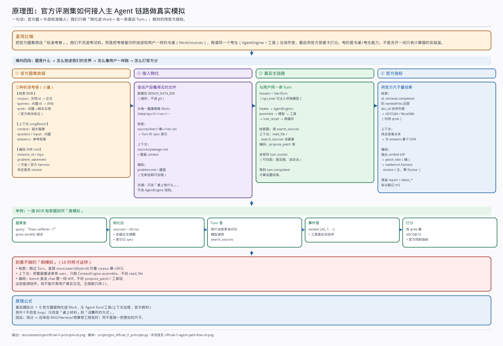
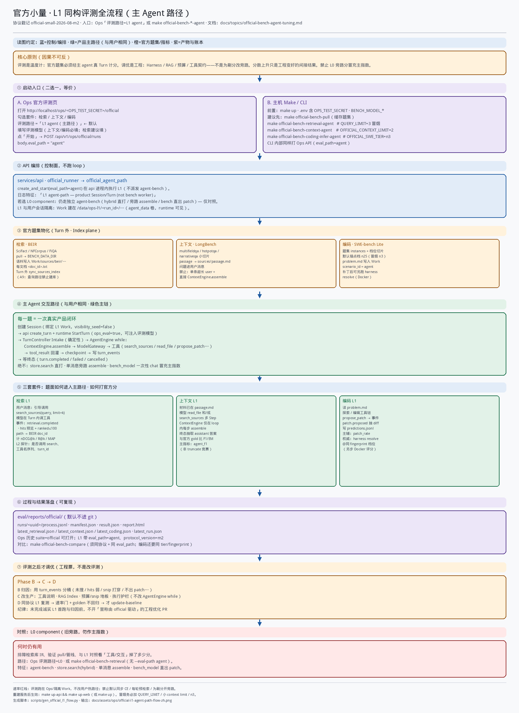

# Official Bench · Agent-path 调优方案

> **状态**：Phase A 立尺已接线（**`official-small-2026-08-m3`**）· C-1/C-2 已作**产品票**落地（非 official 驱动）· 待 m3 诚实锚 + 分桶后再宣称 Phase C official Δ  
> **协议戳记（L1）**：`official-small-2026-08-m3`（L0 对照仍可跑 m1 旁路；m2 为强制臂过渡基线）  
> **本轮施工**： [official-bench-agent-tuning-round1](official-bench-agent-tuning-round1.md)  
> **Free-L1 自含简报（检索+上下文 · 2026-08-03）**：[retrieval-free-l1-tuning-brief](retrieval-free-l1-tuning-brief.md)  
> **关联**：[ops-eval-console](ops-eval-console.md) · [eval/official/README](../../eval/official/README.md) · [rag-and-sources](rag-and-sources.md) · [05](../core/05-agent-runtime.md) · [06](../core/06-tools-and-context.md) · [13 R1–R5](../core/13-rate-redlines.md) · [baseline](../../eval/official/baseline/README.md)

本文定义两件事，且**因果不可反**：

1. **评测（温度计）**：官方题集必须经主 agent 真 Turn 计分，使分数与用户路径同构。  
2. **调优（加热的东西）**：改的是生产工程——Harness 厚度、RAG/Index、上下文预算、工具契约等；**不是**为刷分改评测臂或伪造路径。

分数上升只是工程变好的**间接结果**。禁止「够用 / 伪造」式旁路刷分。

### 原理与全流程（中文图）

**原理（题集如何接入主链路）**：[`docs/assets/ops/official-l1-principle-zh.png`](../assets/ops/official-l1-principle-zh.png)  
生成：`python3 scripts/gen_official_l1_principle.py`



**全流程（Ops/Make 操作链）**：[`docs/assets/ops/official-l1-agent-path-flow-zh.png`](../assets/ops/official-l1-agent-path-flow-zh.png)  
生成：`python3 scripts/gen_official_l1_flow.py`



---

## 0. 一句话

```text
用主 agent 路径吃官方题（量准）
  → 归因失败落在哪层工程
  → 调 Harness / RAG / 预算 / 工具契约（不改 loop、不伤速率）
  → 同协议复测 → 分数间接上升才入库
```

### 0.1 调优对象 vs 评测角色（审查用）

| | **评测（Phase A/B/D 的量测面）** | **调优（Phase C 的工程面 · 本文主旨）** |
|--|----------------------------------|----------------------------------------|
| 是什么 | 同构 runner、协议、SCORECARD、轨迹探针 | 生产代码：retrieval、ContextEngine 预算、工具/沙箱/补丁与测试门、Harness 可观测与护栏 |
| 不是什么 | 不是「为了分好看」改臂/注入答案 | 不是改 `AgentEngine` while、不是强制每轮检索、不是热路径加同步 LLM/CE |
| 成功标准 | 量的是真交互；可复现；能归因 | 用户路径质量↑；L1 分数**间接**↑；R1–R5 与 golden 不回归 |

**Phase A 立尺 ≠ 调优。** 立尺只校准温度计；没有 A/B，C 会调错层或调旁路。但交付价值与评审焦点在 **C：工程票**。

### 0.2 施工顺序（回答「先搭评测还是先写优化？」）

```text
① Phase A：搭好同构评测（m2 / L1 runner）
② 真跑一遍官方小量 → 得到诚实 L1 基线 + process / turn_events
③ Phase B：按失败桶归因（落在 RAG / 预算 / 工具 / 执行面哪一层）
④ 再输出「本轮工程调优方案」（从 §5.3 菜单里点菜，可增删）
⑤ Phase C 落地生产改动 → 同协议复测 → Phase D 入库
```

| 现在文档里有的 | 性质 |
|----------------|------|
| §5.3 杠杆表 | **候选菜单 + 优先级启发式**（成熟、不伤速率）；**不是**已锁定的施工清单 |
| §6 效果预测 | 量级预期，须被 ② 的真基线修正 |
| §9 首条产品票 | 仅建议；**以 ③ 归因结果为准** 再开票 |

**纪律：** 未完成 ②③ 之前，不合并「宣称由 official 驱动」的工程优化 PR（避免在假尺子或未归因时改生产）。立尺 PR 与归因报告可以先合。

---

## 1. 原则（硬约束）

| # | 原则 | 操作含义 |
|---|------|----------|
| **P0 工程为本** | 调的是真实交互路径上的工程，不是评测本身 | 每一张「调优票」必须改 `services/runtime`（或等价生产面）的 Harness/RAG/预算/工具等；仅改 bench 脚本/对照臂不算调优成功 |
| **P1 真实量测** | 评测依据 = 主 agent 交互 × 官方题集 | 必须经 `Session → Turn → AgentEngine loop → 工具 → 每 Step ContextEngine.assemble → 终态`；禁止用旁路路径当 **SCORECARD 主栏** |
| **P2 成熟** | 对齐成熟 agent 调优节奏 | 诚实基线 → 轨迹诊断 → **改生产工程** → 同协议复测；组件分只做探针 |
| **P3 可预期** | 先预测再改 | 每票写清：动哪一层工程、L1 间接指标方向、幅度量级、否决条件 |
| **P4 不伤交互** | 逻辑与速率不变 | 不改 `AgentEngine` while 语义；不强制每轮检索；不默认同步 CE / LLM compact；索引与重活在 Turn 外；评测负载在 Ops / 隔离面 |

### 1.1 明确禁止（即便涨分）

- 旁路 IR / middle-truncate / 一次性 chat 出 patch 写入 **SCORECARD 主栏**
- forced 注入 top-k 却宣称「agent 检索能力」
- 把全文塞进 prompt，绕过 `read_file` / `search_sources`
- coding 只数 nonempty patch、不开 harness，却当 resolve
- 为刷分开热路径默认同步 summarize / cross-encoder / 每轮预检索

### 1.2 与当前实现的差距（立尺动机）

| 套件 | 今日默认（`official-small-2026-08-m1`） | 与主 agent 的差 |
|------|----------------------------------------|-----------------|
| retrieval | `store.search(hybrid)` 直打 BEIR | 无 Turn、无工具、无 excerpt/budget |
| context | 单条超长 user + 直接 `ContextEngine.assemble` | 无 loop、无 read/search 分工 |
| coding | 默认 `bench_model` 直出 diff；`platform_turn` 可选且弱 | 默认绕过 agent；常无 harness resolve |

m1 基线保留为 **L0 组件对照史**；主栏迁到下文 **L1（agent-path）** 后须 **bump 协议**（建议 `official-small-2026-08-m2`）。

---

## 2. 成熟调优范式（对齐对象）

成熟编码/助手 agent（Cursor、Claude Code 一类）的共性：

```text
① 产品形态冻结：单 loop + 工具 + 上下文预算（非固定 pipeline）
② 评测与产品同构：题面进 workspace/会话，模型自己调工具
③ 官方裁判保留：排序指标 / 答案指标 / SWE harness resolve
④ 轨迹可解释：从 turn_events 看搜/读/压/步数
⑤ 分层改动：Index · 工具契约 · 预算策略 · 提示 — 不改 while
⑥ 热路径纪律：质量进 Index plane 与静态契约；速率红线一票否决
```

对应本仓库宪法：[05](../core/05-agent-runtime.md) · [06](../core/06-tools-and-context.md) · [15](rag-and-sources.md) · [13](../core/13-rate-redlines.md)。

---

## 3. 指标分层

| 层 | 名称 | 跑法 | 用途 |
|----|------|------|------|
| **L1** | Agent-path（**主指数**） | 官方题 → 真 Turn → 官方指标 | SCORECARD 主栏、调优决策、`update-baseline` |
| **L0** | 组件对照 | 直打 hybrid / 单测 assemble / bench 直出 patch | 排障、库与压缩器回归；**不进主栏** |
| **L2** | 轨迹探针 | 从 L1 的 `turn_events` / process 抽取 | 归因（是否调用 search、hit nDCG、compact_trace、步数、TTFB） |

**裁决规则**：只涨 L0、L1 不动 → 无效（伪造风险）；L1 涨但违 R1–R5 → 否决。

---

## 4. L1 评测契约（三套共用编排）

### 4.1 公共流程

```text
官方样本
  → 物化进该题隔离 workspace（sources/ · 长文文件 · 或 repo）
  → Turn 外 sync 索引（A9：查询路径不建库）
  → 创建 Session + StartTurn（与用户相同 API → runtime）
  → 等待终态（SSE / 状态机；禁止「发完 Turn 就当结束」）
  → 从 artifacts / 最终 assistant / tool_result 取作答或 patch
  → 官方指标打分 + process.jsonl（含 L2 探针）
```

| 约束 | 说明 |
|------|------|
| 隔离 | Ops / 隔离 workspace（及可选独立 DB）；不混用户日常会话 |
| 模型 | 路径必须是产品 Turn；可用评测专用 provider，但不得改走旁路 chat 冒充 L1 |
| 旁路降级 | `store.search` 直打、单消息 assemble、`bench_model` 直出 → **仅 L0** |
| 逐步可见 | Ops 官方页直播日志打 `turn start` / `tool.*` / `retrieval.*` / 心跳；`turn_id=` 链到 Raw 快照 |
| 档位 / 并行 | Ops 可调上下文档位、检索档位、SWE 档位；`并行 Turn`（默认 2）只缩短总等待，不改单题打分 |

### 4.2 Retrieval × BEIR

| 项 | 契约 |
|----|------|
| 物化 | 语料 → 题隔离 `sources/`；Turn 外 sync |
| 输入 | query → 用户消息；`scenario_id` 写入协议（writing 或 agent，固定一种） |
| 主指标 | 真实 `search_sources` hits 上的 nDCG@k / Recall@k / MAP（多轮合并规则写死进协议） |
| 查询集 | **仅 qrels 标注 query**（与 L0 `beir_run` / BEIR 官方一致）；禁止扫整份 `queries.jsonl` |
| 主臂 | **自由 agent**（模型自选是否搜、搜几次） |
| 诊断臂 | 可选「首轮必须 search」（L2，不进 SCORECARD 主栏） |
| 辅 | 若样本要求短答，可另报终答 EM/F1 |
| 档位 | Ops「全量 qrels」≈三集 ~1.3k Turn；50/20/10/5 为每集上限（冒烟） |

### 4.3 Context × LongBench

| 项 | 契约 |
|----|------|
| 物化 | passage **落盘**为文件；问题进 user message |
| 禁止主臂 | 单条超长 user + 直接 `ContextEngine.assemble`（m1 形态） |
| 交互 | Agent 经 `read_file` / `search_sources` 等多 Step；CE 仅在 loop 内触发 |
| 主指标 | 终答 F1 / EM（与官方 judge 一致） |
| 辅 | 相对 **oracle-Turn**（同模型、允许更充分读）的 retention |
| 含义 | 测「长材料下的交互式上下文治理」，不是 truncate 竞赛 |

### 4.4 Coding × SWE-bench Lite

| 项 | 契约 |
|----|------|
| 物化 | 实例 repo / 工作树进 workspace |
| 交互 | `scenario_id=agent`；等 Turn 终态；抽 `propose_patch` / 有效 unified diff |
| 主指标 | **官方 harness resolve@tier**（默认锚点档 **n25**，同 `instance_fingerprint`） |
| 辅 | patch_rate（nonempty）；不得单独作效果锚 |
| L0 | `bench_model` 直出；弱 `platform_turn`（不等终态 / 不挂 repo）不得进主栏 |
| 基线纪律 | m1 的 n3 + 无 harness **不作**效果锚 |

---

## 5. 程序：先量准，再改工程（阶段）

```text
Phase A  立尺（量测基建，非调优）：L1 runner + 协议 m2 + 诚实首基线
Phase B  归因（仍非调优）：失败落在 RAG / 预算 / Harness / 工具哪一层
Phase C  调优（唯一工程主战场）：改生产 Harness·RAG·预算·工具契约…
Phase D  验收入库：L1 间接 Δ 正向 ∧ 速率/golden 不回归
```

### 5.1 Phase A — 立尺（量测；优先于调优，但不是调优本身）

| 交付 | 说明 |
|------|------|
| 协议 | `official-small-2026-08-m2`（或等价 bump）；正文写明主栏 = agent-path |
| Runner | 三套共用 Turn 编排；终态等待；补丁/hits/答案抽取可测 |
| Ops | 官方页可跑 L1；保留 L0 为「组件对照」可选臂 |
| 基线 | 首跑入库 L1 SCORECARD；m1 JSON/MD 标注为 L0 历史 |
| 验收 | 同 fingerprint 可复现；process 含 L2 探针字段 |
| 边界 | **不**在本阶段为涨分改 retrieval/CE/提示；否则是「为评测调优」 |

### 5.2 Phase B — 归因分流

| 套件 | 典型失败桶（L2） |
|------|------------------|
| retrieval | 未调用 search · query 漂移 · hits 弱 · excerpt 裁没证据 · 搜次打满 |
| context | 一次读爆窗 · tool_result 被 snip 打穿 · 未读文件臆答 · 步数耗尽 |
| coding | 未挂 repo · 不出 patch · 格式不可 apply · 未跑/跑不过测 · 审批卡住 |

### 5.3 Phase C — 工程调优杠杆（主战场 · 菜单）

> **触发条件：** 仅在 Phase A 已能复现 L1，且 Phase B 归因报告指出主导失败桶之后，才从本表点菜开工程票。  
> 归因前本表只作评审「允许改哪些层」；禁止跳过真跑直接按预测改生产。

每张票改的是**用户也会走到的生产路径**；官方分只作复测。分层对应成熟 Harness / RAG，而非改交互剧本。

| 优先 | 工程层 | 改什么（生产代码） | 成熟依据 | 交互逻辑 / 速率 |
|------|--------|-------------------|----------|-----------------|
| 1 | **工具契约（Harness 薄说明）** | `tools` 描述、scenario `system.md`：何时搜、`path_prefix`、分段读、`propose_patch` 纪律 | 成熟 agent 增益多在工具面，不改 loop | 静态；不伤 TTFB；模型仍自选工具 |
| 2 | **RAG / Index plane** | 切块、embed 文本、hybrid/RRF 权重、换 embed、INDEX bump（Turn 外 sync） | [15 §9](rag-and-sources.md) RQ1；质量进入库而非热路径 | 守 A9；查询无新同步模型；loop 不变 |
| 3 | **Context / 预算（Harness 厚度）** | tool_result budget、单条 snip **地板**、大 read 策略（仍在 assemble） | 长任务可活；非每轮 LLM 摘要 | 不改 while；须测首包不劣化 |
| 4 | **执行面 / 护栏** | 沙箱测门、补丁抽取健壮性、审批策略、stall/超时已有护栏的标定 | SWE/长任务只认可验证结果 | 工具内；不把评测专用分支打进产品 |
| ✕ | 伪造与伤速率 | 热路径 CE、默认同步 LLM compact、每轮预检索、仅改 bench 臂刷分 | 不成熟 / 为分而调 | **否决** |

具体检索标定仍服从 [rag-and-sources §9](rag-and-sources.md)（RQ1；默认不开 CE）。  
**Harness 成熟度面**（Intake / Context / Tools / Model / Guard / Proof）见 [12](../core/12-model-harness.md)；本方案 C 票应落在这些面上的**生产实现**，而不是评测脚本。

### 5.4 Phase D — 入库门禁

同时满足才可 `make official-bench-update-baseline`（L1）：

1. 同 `protocol_version`（及 coding 的 tier + fingerprint）  
2. L1 主指标 Δ 达预定目标或明确「诚实零点入库」说明  
3. `make gate` / 相关 golden 与 runtime-test 不回归  
4. 无 R1–R5 违反（不挡 `turn.accepted`、首 token 前无新同步模型、热路径无默认同步 CE）

---

## 6. 效果预测（同模型、先 A 后 C）

> 区间为量级预期，不是承诺榜单名次。A 阶段变难看 = 尺子变真。

| 阶段 | Retrieval（tool nDCG@10） | Context（agent F1 / vs oracle retention） | Coding（resolve@n25） |
|------|---------------------------|------------------------------------------|------------------------|
| 现 m1 **L0 主栏** | ~0.41（旁路 IR） | ~0.27（误用 snip）；truncate≈0.41 | 0.67 patch@n3，无 resolve |
| **A：L1 首基线** | 自由臂常 ≤0.41，或因不搜更低 | 常 0.25–0.35 | 可能个位数～~15% resolve |
| **C 一轮**（说明 + snip 地板 + RRF 标定） | tool +0.02～0.06 | F1 → ~0.35–0.40；retention→oracle ≥~0.85 | resolve +少量 pp |
| **C 二轮**（更强 embed + SWE 执行对齐） | tool ~0.45–0.52；SciFact 不显著负于词法 | 稳定在上区间 | resolve 再 +5～15 pp 较现实 |

**无效优化信号**：L0↑ 且 L1 不动 → 回滚或降为对照，不入库主栏。

---

## 7. 与仓库命令 / 目录的衔接

| 现存 | 角色（方案落地后） |
|------|-------------------|
| `make official-bench-*` / Ops `/official` | 增加 **L1（agent-path）** 主路径；L0 保留为对照 |
| `eval/official/baseline/` | m2 起主栏为 L1；m1 文件保留并标注 L0 |
| `scripts/official_bench/` | 新增/扩展 Turn 编排与终态等待；coding 强化 platform + harness |
| `BENCH_CODING_VIA_PLATFORM` | 并入 L1 默认编码路径（完善挂载与等终态），不再是「可选弱臂」 |
| `agent-bench` 容器 | 可继续承担拉数/编排/隔离 DB；**执行必须回调产品 runtime Turn**，不得用旁路冒充 L1 |
| Golden / `make gate` | 契约与速率回归；**不**被 official L1 替代 |

日常调优闭环（L1）：

```bash
# 协议与 runner 落地后（名称以实施 PR 为准）
make official-bench-live          # 或显式 L1 目标
make official-bench-compare       # latest L1 vs 仓库锚点
make official-bench-update-baseline  # 仅门禁通过后
```

---

## 8. 拍板项（方案已选默认）

| # | 议题 | 默认（本文） | 备注 |
|---|------|--------------|------|
| 1 | SCORECARD 主栏 | **L1 agent-path**；m1 → L0 历史 | 实施时 bump 协议 |
| 2 | Retrieval 主臂 | **自由 agent** | forced-search 仅 L2 |
| 3 | Coding 首基线 | **允许 resolve 很低并入库** | 作调优零点 |
| 4 | 实施序 | **先 Phase A 立尺**，再动产品杠杆 | 禁止在假尺子上优化 |

变更默认须改本文并记一笔；勿 silent 改 SCORECARD 含义。

---

## 9. 实施清单（跟踪用）

- [x] 协议戳记 `m2`（L1 manifest `protocol_version` / `eval_path=agent`）  
- [x] L1 Turn runner（api `official_agent_path`：Work 隔离、sync、StartTurn、等终态）  
- [x] Retrieval L1：BEIR → sources → `search_sources` / `retrieval.completed` 计分  
- [x] Context L1：passage 落盘 + Turn 终答（oracle 臂后续补）  
- [x] Coding L1：platform Turn + patch 抽取（harness resolve 仍用既有 eval 目标）  
- [x] Ops UI：评测路径 L1/L0；CLI/make `*-agent`  
- [x] SCORECARD / baseline 双轨：首份 L1 基线入库（`m2` + `SCORECARD.md`；`m1` 留作 L0）  
- [x] 协议 bump **`m3`**：自由主臂 / oracle·forced 诊断臂 / L2 探针 / 分桶分类器 / coding checkout+harness / 双档 SCORECARD+档位 compare（round1 A-1…A-6）  
- [ ] Phase B 正式归因报告（m3 全量锚 + A-6 分桶勾掉 ⚠）——施工蓝图见 [official-bench-agent-tuning-round1](official-bench-agent-tuning-round1.md)  
- [x] C-1 / C-2 **产品落地**（大 read 预算 + snip 地板；agent 续读/RAG/diff 薄说明）——单测 + stub golden 绿；**不以 official 涨分作合入叙事**  
- [x] C-4 **离线面**（抽取/分桶单测；propose_patch apply 预检；Bugfix）——官方 resolve 仍挂锚  
- [ ] C-1/C-2/C-4 **官方 DoD**：m3 配对复测 + 分桶后再 `update-baseline`  
- [ ] C-3 **全量**网格 / embed 升级（可选后置）  
- [x] C-3 **冒烟**网格（2026-08-03：`c3-retrieval-grid` · 保持 `default` · 报告 `eval/reports/official/c3_grid_latest.json`；不改生产、不作 official Δ）
---

## 10. 维护纪律

1. 改 L1 语义或主指标 → **bump `protocol_version`**，旧锚点只读。  
2. 新优化票必须引用本文 Phase 与杠杆表；写明 L1 预期与 R1–R5 检查。  
3. 冲突时：本文（评测与调优）服从 [13](../core/13-rate-redlines.md) 与 [05](../core/05-agent-runtime.md) loop 冻结；RAG 细节服从 [15](rag-and-sources.md)。  
4. 不在本文扩写长排期表；落地细节进 PR / 实施票，完成后把「现行规则」收进本节清单状态。
