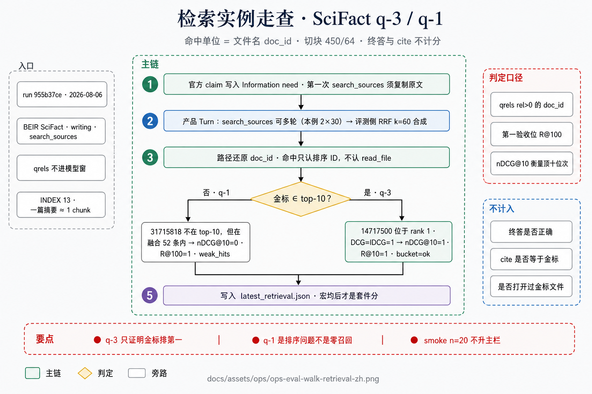
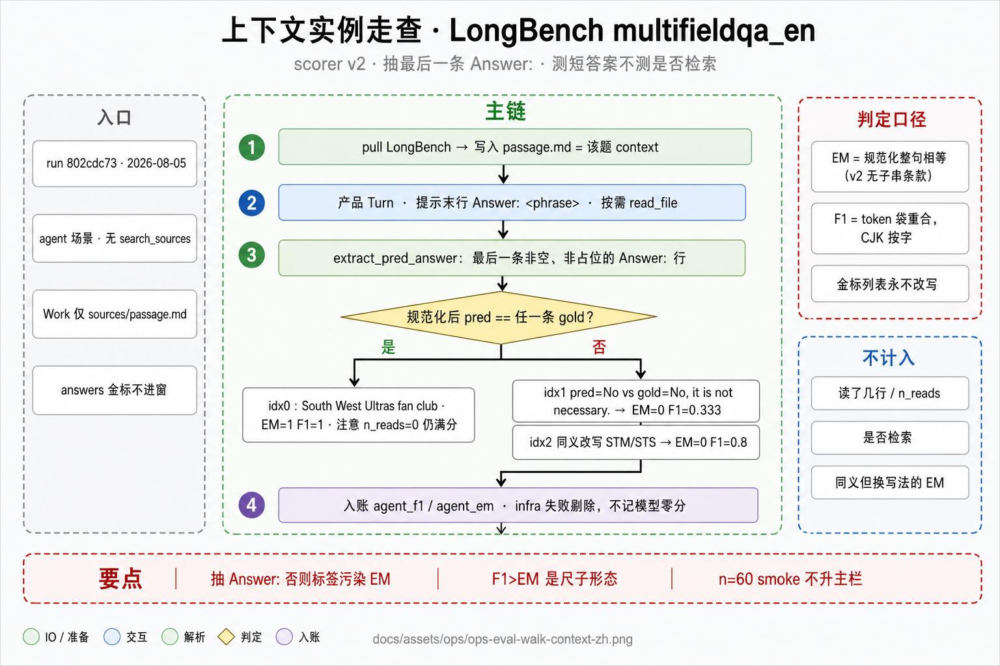
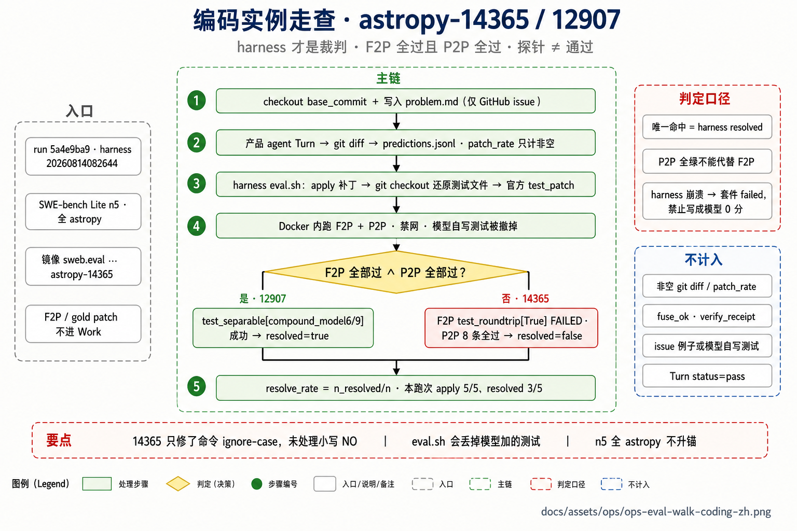

# 评测实例走查

本文用本地仍可复核的一次产物，把三套尺子落到具体题目上：官方给了什么、Agent 看见什么、过程如何结束、命中如何判定。Wiki 同文：`#ops-eval-walk`。

**权威顺序**：计分代码 > 本文 > 图注。套件宏分仍以 [`RESULTS.md`](../../eval/official/baseline/RESULTS.md) 为准。第 4 / 5 轮报告目录本机已不在；下列实例取自现存 `latest_*.json`、`eval/official/.local-data` 与本地 `sweb.eval` 镜像。

| 套件 | 跑次 | 题本 | 计分依据 |
|------|------|------|----------|
| 检索 | `955b37ce` · 2026-08-06 | SciFact `queries.jsonl` + `qrels/test.tsv` | 排序 `doc_id` ∈ qrels |
| 上下文 | `802cdc73` · 2026-08-05 | LongBench `multifieldqa_en.jsonl` | scorer v2 · F1 / EM |
| 编码 | `5a4e9ba9` · harness `20260814082644` | SWE-bench Lite `instances.jsonl` | harness `resolved` |

切块口径为 INDEX 13：**450 token / 64 overlap**。SciFact 摘要通常对应一个 chunk。检索命中单位是文件名还原的 **`doc_id`**，不是 chunk 下标。

---

## 1. 检索：SciFact query-id `3` 与 `1`



### 题目与可见范围

官方题是一条 **claim**（陈述句），不是检索指令。query-id `3` 原文：

> 1,000 genomes project enables mapping of genetic sequence variation consisting of rare variants with larger penetrance effects than common variants.

金标在 `qrels/test.tsv`，**不进入模型窗**：

```text
3	14717500	1
```

对应语料标题为 *Rare Variants Create Synthetic Genome-Wide Associations*（1849 字符），物化为 `sources/beir/scifact-micro/14717500.txt`。

smoke 取样为 qrels 出现顺序的前 20 条 query-id（`head_slice`，无随机）：`1, 3, 5, 13, …, 100`。

free 臂提示要求：第一次 `search_sources` **复制** Information need 原文。

### 执行记录（q-3）

跑次 `955b37ce` · case `beir.scifact.q-3` · arm=free。工具序为 `list_dir` → `search_sources`（原文）→ `read_file` ×2 → 第二次 `search_sources`（改写，`query_drift=0.0068`）→ `grep` ×2。两次检索各 30 条，评测侧 RRF（k=60）合成 48 条。

融合 top-10 的 `doc_id` 以 `14717500` 为首。

### 命中判定

命中定义为：融合排序中的 `doc_id` 落在该 query 的 qrels 且 `rel>0`。终答与 cite 质量不进入该分。

金标位于 **rank 1**、`rel=1` 时：

- DCG@10 = (2¹ − 1) / log₂(2) = 1
- IDCG = 1
- **nDCG@10 = 1，Recall@10 = 1**

case 记录：`ndcg_at_10=1.0` · `recall_at_100=1.0` · `bucket=ok`。本例虽读取了金标文件（`gold_read_n=1`），那是旁路统计；若不调用 `read_file`，只要排序含该 ID，nDCG 仍为 1。

### 对照：query-id `1`

claim：`0-dimensional biomaterials show inductive properties.`  
金标：`31715818`（*New opportunities: the use of nanotechnologies to manipulate and track stem cells.*）。

top-10 为 `24928817, 37762357, …`，**不含**金标，故 nDCG@10 = 0、R@10 = 0。融合列表 52 条中含该 ID（`gold_on_ranked_n=1`），故 **R@100 = 1.0**，nDCG@100 = 0.193，`bucket=weak_hits`。

第一验收位取 R@100 的原因在此可见：金标已入池，缺陷在排序，而不是零召回。交叉编码器无法补救从未入池的题目；本题已入池。

---

## 2. 上下文：LongBench `multifieldqa_en` idx 0 / 1 / 2



Work 内仅有 `sources/passage.md`（该题 `context`）。金标 `answers` 不提供给模型。裁判为抽最后一条非空 `Answer:` 之后的 scorer **v2**（规范化相等为 EM；token 袋重合为 F1；含 CJK 的金标按字计）。无 Docker harness。

| 实例 | 官方问题 | 金标 | 预测 | 判定 |
|------|----------|------|------|------|
| idx 0 | What is the name of the most active fan club? | `South West Ultras fan club.`（约 offset 3043） | `South West Ultras fan club` | 去句号后相等 → **EM=1，F1=1**。`n_reads=0` 仍满分：主指标不计量阅读次数。 |
| idx 1 | Is the ISR necessary for transgene reactivation? | `No, it is not necessary.`（45634 字符） | `No`（`n_reads=2`） | `{no}` 对五词金标 → P=1，R=1/5 → **EM=0，F1=0.333**。语义成立，EM 仍为零。 |
| idx 2 | What experimental techniques were used to study the quantum dot structures in this research? | `Low temperature scanning tunneling microscopy and spectroscopy (STM/STS).` | `Low-temperature STM/STS (scanning tunneling microscopy and spectroscopy).` | 规范化字符串不等 → **EM=0**；token 大部分重合 → **F1=0.8**。 |

若终答为推理段落加 `Answer: berlin`、金标为 `berlin`，必须先抽取最后一条 `Answer:` 行。否则标签词进入规范化，v2 EM 必为 0。

---

## 3. 编码：`astropy-14365` 与 `12907`



n5 为 HF test 顺序前 5 个 ID，全部为 astropy。本地已有对应 `sweb.eval` 镜像（约 2.7GB / 题）。跑次 `5a4e9ba9`：五题补丁均成功 apply，**`resolve_rate=0.6`（3/5）**。Turn 的 `status=pass` 仅表示产品 Turn 结束，不是官方通过。

### 可见范围

`problem.md` 仅为 GitHub issue。14365 题面要求：ascii.qdp 不应强制命令全大写；下列文件应能读入 Table：

```text
read serr 1 2
1 0.5 1 0.5
```

不写入 Work 的字段：`FAIL_TO_PASS = ["astropy/io/ascii/tests/test_qdp.py::test_roundtrip[True]"]`，以及官方 `patch` / `test_patch`。

模型补丁（`patch.diff`）将 `_command_re` 改为忽略大小写，并新增 `test_read_qdp_lowercase_commands`（内容接近 issue 示例）。

### Harness 角色

镜像：`swebench/sweb.eval.x86_64.astropy_1776_astropy-14365:latest`。`eval.sh` 顺序为：

1. 在 `/testbed` 激活评测环境  
2. apply 模型补丁  
3. `git checkout <base_commit> -- astropy/io/ascii/tests/test_qdp.py`（撤销模型对测试文件的改动）  
4. apply 官方 `test_patch`（将 `test_roundtrip` 参数化为 `[False, True]`；`True` 时把所有非注释行改为小写，包括数据中的 `NO`）  
5. 执行 F2P 与 P2P  

因此：issue 示例通过不构成命中；模型自写测试会被官方脚本移除。

### 命中判定

**resolved** 当且仅当 F2P 全部通过 **且** P2P 全部通过。

| | 14365 | 12907 |
|--|-------|-------|
| 补丁 apply | true | true |
| F2P | `test_roundtrip[True]` 失败（`Unrecognized QDP line: 53000.123456…`） | `test_separable[compound_model6/9]` 两条成功 |
| P2P | 8 条全部通过 | 全部通过 |
| **resolved** | **false** | **true** |

14365 仅处理了命令行 ignore-case，未覆盖金标补丁对数据 token `NO` 的 casefold。P2P 全绿不能替代 F2P。同一次跑次中 14182 的 F2P `test_rst_with_header_rows` 亦失败。五题 P2P 均无失败——回归未破坏，失败点是该题隐藏测。

---

## 4. 审阅含义

1. **检索** q-3 的 nDCG=1 只说明金标排在第一，不说明摘要正确。q-1 的 R@100=1 且 nDCG@10=0，应对症排序，而不是判定「完全未召回」。  
2. **上下文** idx 0 允许 `n_reads=0` 仍得满分；idx 1 / 2 表明语义正确仍可能被 EM 判零。若需要计量阅读过程，应另设指标。  
3. **编码** 14365 在 `patch_rate=1`、issue 示例测试与 P2P 全绿的情况下仍未通过。这是 SWE-bench 的定义（F2P ∧ P2P），不是平台附加门槛。

若不同意某项定义，应修改指标契约，而不是改 loop 去拟合上述三题。
