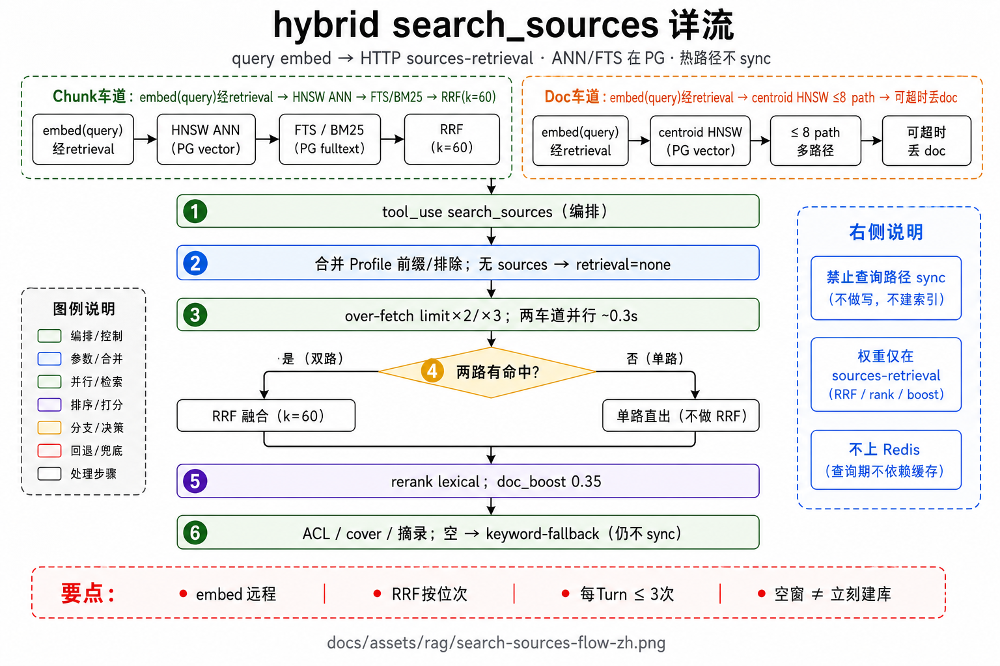
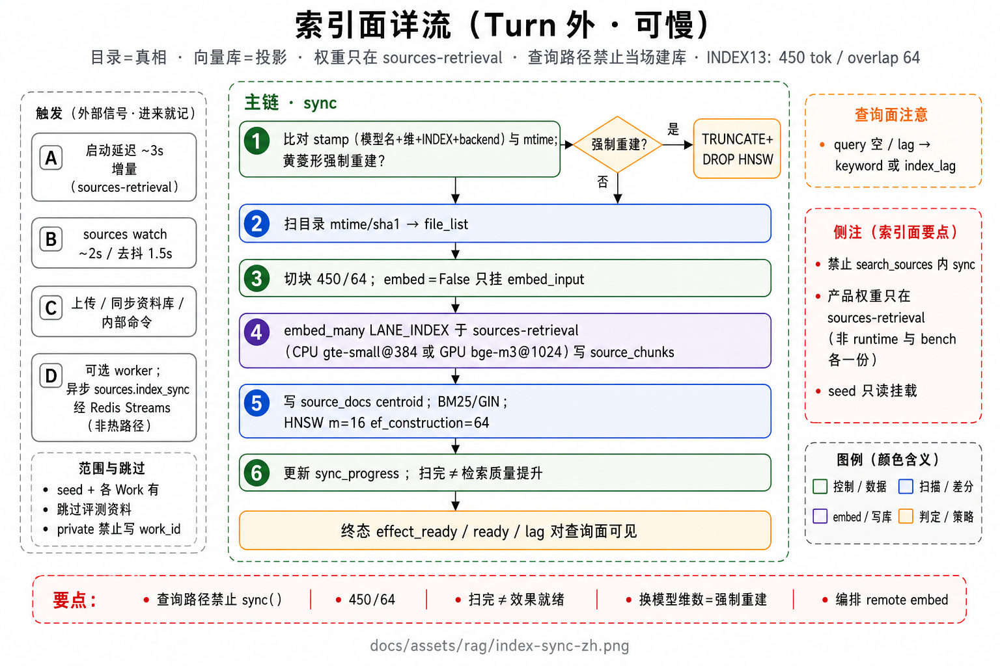

# RAG

索引面（Turn 外）与交互面（`search_sources`）。本文写清生产默认数字与逐步经过；图展开店内召回与建库细节。

## 图

1. [hybrid 店内召回详流](../assets/rag/search-sources-flow-zh.png) — Chunk/Doc 双车道 · RRF · rerank · cover · fallback  
2. [索引面详流](../assets/rag/index-sync-zh.png) — 触发 · 切块 · embed · HNSW/GIN · 进度  





## 1. 原则与两面

冲突裁决顺序：**速率/交互 → 检索质量 → 成熟形态**。

| 面 | 何时跑 | 硬规则 |
|----|--------|--------|
| **索引面** | 启动延迟同步、目录 watch、上传、`make sync-sources`、内部 `sync-sources-index` | 可慢；写 `source_chunks` / `source_docs` / FTS |
| **交互面** | Turn 内模型调 `search_sources` | 必须快；**禁止**查询路径 `sync()` / 整库重嵌 / 每轮预注入向量包 |

目录文件是真相；pgvector 是投影。检索结果只能经 `tool_result` 回灌下一轮 `ContextEngine.assemble`。

去留（一票否决向）：

| 做 | 不做 |
|----|------|
| 按需 `search_sources` · path_prefix · ACL · cite 纪律 | 每轮强制检索 · Turn 末 judge · 热路径 CE/query rewrite（默认关） |
| 个人默认 Work 私有库 + 可选 seed | Org 共享盘 · per-session 索引 |

## 2. 生产默认旋钮

| 项 | 默认 |
|----|------|
| `retrieval_mode` | `hybrid` |
| `retrieval_backend` | `pgvector` |
| 工具 `limit` | **30** |
| 每 Turn 调用上限 | **3** |
| Over-fetch | 无 prefix → `limit×2=60`；有 prefix → `limit×3=90` |
| RRF `k` | **60**；向量/BM25 权重默认 **1.0 / 1.0** |
| `doc_boost` | **0.35**（`vector_heavy` 档 0.45） |
| two-level | **ON**；超时 **0.3s**；doc 上限 **8** path |
| BM25 rescore | ON；Okapi `k1=1.5` `b=0.75` |
| Rerank | lexical **ON**；cross-encoder **OFF**；pool≥**20** |
| 摘录 | `excerpt_chars=400`；模型窗前 **5** 条带摘录 |
| Chunk（建库） | `max_tokens=450` · `overlap=64` token；tokenizer 不可用时 char 回退 **1800/200** |

代码入口：`tools/core/tools.py`（`search_sources`）· `retrieval/pgvector_store.py` · `retrieval/profile.py` · `retrieval/audit.py`。

## 3. 一次 hybrid `search_sources`（逐步）

### 3.1 入口

1. 解析 `query` / `limit` / `path_prefix`；合并 Scenario 默认 prefix（如 intel→`seed/intel`）与 excludes。  
2. 无 `sources/` → 直接 `retrieval=none`。  
3. `begin_audit_capture()` 开 L1/L2 槽。  
4. **不**调用 `store.sync()`。

### 3.2 `store.search_hybrid`（店内）

对传入的 `fetch_limit`（60/90），每侧 lane 深度大致：

```text
top_k = max(fetch_limit × 4, 20)
若开启 rerank：top_k = max(top_k, rerank_pool=20)
→ 常见 top_k = 240 或 360
```

**Chunk lane（主）：**

1. `embed(query)` 一次（毫秒～数十毫秒级）。  
2. **HNSW ANN**：表 `source_chunks`，`embedding vector_cosine_ops`，`ORDER BY embedding <=> q`，距离转相似度 `1-dist`。会话侧常开 `hnsw.iterative_scan=relaxed_order`，并抬 `max_scan_tuples`，避免 Work/seed 过滤后空窗。  
3. **FTS**：`to_tsvector` 对 `section_title||text`（A）+ `bm25_extra`（C）；查询优先强词 **OR** `tsquery`（强 token 最多约 12），否则 `plainto` AND。  
4. `@@` + `ts_rank_cd` 初排；再 **Okapi BM25** rescore（extra 分×0.35）。  
5. SQL **ACL**：`visibility='seed' OR work_id=$current`（或仅 work / 仅 seed，取决于开关）。  
6. `record_lane_hits(vector, bm25)` 备审计。

**Doc lane（两级，默认开，与 chunk 并行）：**

1. `source_docs` 上 HNSW（chunk embedding **centroid**），最多 **8** 条 path。  
2. 超时 **0.3s** 或空 → 用更宽 chunk ANN 去重 path 近似；超时则丢 doc、保 chunk。  

**融合：**

1. 两侧都有命中 → **RRF**：`score += weight/(k+rank+1)`，`k=60`，默认等权 → 记 **L1 `recall_pool`**（预览最多 20 行）。  
2. **Lexical rerank**（池至少 20）：token overlap / title / 短语 bonus；CE 默认关。记 **L2 `ranked`**。  
3. **`merge_doc_and_chunk_hits`**：path 落在 doc 赢家上的 chunk `score += doc_boost(0.35)`，boosted 优先，再截到 `fetch_limit`。

### 3.3 回到工具层

1. 再滤租户：`filter_hits_for_tenant`（seed 需 `visibility_seed`；private 必须本 Work；路径沙箱）。  
2. `path_prefix` / excludes → `hits[:30]`。  
3. **Cover**：特色词（如 CJK≥2、较长拉丁/实体）是否出现在任一 hit 的 path/excerpt。  
4. Cover 过：前 5 条保留 ≤400 字摘录，其余 path/title/score；可选 `score_rel`（相对分 0–100）。`retrieval=hybrid`。  
5. Cover 失败 / ANN 空 / 滤空 → **keyword-fallback**：扫盘 `sources/**` 词面命中；有结果则 `retrieval=keyword-fallback` 并提示 `index_lag`（重建走同步，**不在查询时**）。Keyword 仍空但曾有 ANN → **保留 ANN**（`kept_ann_despite_cover_miss`），禁止整集清空装无库。

### 3.4 审计三层（Ops 可读）

| 层 | 含义 |
|----|------|
| **L1 recall_pool** | 融合后、rerank 前；含 lane 深度统计 |
| **L2 ranked** | rerank 后顺序与 `rank_method` |
| **L3 entered_context** | 真正写入 `tool_result`、进模型窗的 hits |

旁路事件 `retrieval.completed`（含 audit）给 Ops；**不进**模型上下文。

## 4. 索引面（逐步）

### 4.1 触发

| 来源 | 行为 |
|------|------|
| 启动 | 约 **3s** 延迟后 `run_sources_index_sync(reason=startup)`（可关） |
| Watch | poll 约 **2s**，debounce 约 **1.5s** → 增量 |
| 手工 | `make sync-sources` · Web「同步资料库」· 内部命令 |
| Worker | `index_via_worker` 可把重活扔出 api/runtime 热路径 |

范围：seed（`visibility=seed`）+ 各 Work 私有库；跳过 `ops-l1` 一类评测面；禁止 NULL `work_id` 的 private。

### 4.2 `store.sync`

1. 比较 mtime / scope stamp（模型名、维数、INDEX 协议）→ 增量或 force。  
2. Force：drop/rebuild chunks/docs 上 HNSW。  
3. `chunk_source_text`：H1–H6 / Setext 切节，超长叶按段落/行/句边界滑窗（**450 token / overlap 64**）；宽表 detach 后另派生行线性化 chunk。  
4. Embed 文本前加标题面包屑（只进向量，不改存库 body）；path/tags 仍默认不焊进向量前缀。bge-m3@512 对应 **INDEX 13**，换戳会 force reindex。  
5. Chunk centroid → `source_docs`；`bm25_extra` 摊到 chunk；维护 FTS GIN。  
6. 私有路径可存 `__work__/{work_id}/…`，展示时剥前缀。  
7. 进度写入 `sync_progress.json`（资料库 / Ops 条）；ingestion 与效果平面分开，避免「扫完=可宣称效果」。

查询撞上空索引或滞后：**只** keyword-fallback / 提示重建，**绝不**在 `search_sources` 里同步建库。

### 4.3 Embedding 档位

由部署解析（如 `make resolve-embedding`）：常见 CPU **gte-small@384**，GPU 充足时 **bge-m3@1024** 等。换模型/维数会推动 force reindex。

### 4.4 种子语料

写作常设 seed 只读挂到工作区 `sources/seed/writing/...`（不拷进用户可写沙箱）。账户开关 `visibility_seed`：关则本 Work 检索/资料库 UI 看不见 seed，挂载与索引仍可保留供其他 Work。下一 Turn 生效。

## 5. 验证怎么读

| 闸 | 证明什么 | 注意 |
|----|----------|------|
| 契约 / golden / stub | 协议与主路径不炸 | **不能**冒充生产召回 |
| `make retrieval-bench-prod` 等真相档 | 离线召回/排序 | 需 live embed + pgvector |
| 工作台自然问句 | hybrid 轨迹、cite、polish **0 搜** | 时间线 + `/retrieval` 审计漏斗 |
| Ops `/official` L1 | BEIR / C-MTEB agent-path 宏分 | 独立 schema；**≠** 契约 golden；见[工作台 · Bench](workbench.md) |
| Ops `suite=ci` / `make ci-proof` | 主路径不炸 + gate | **≠** 生产召回分数 |

三标尺同时满足才谈「检索变好」：不伤 TTFB、效果闸有对照、形态仍是工具中介而非每轮预注入。
