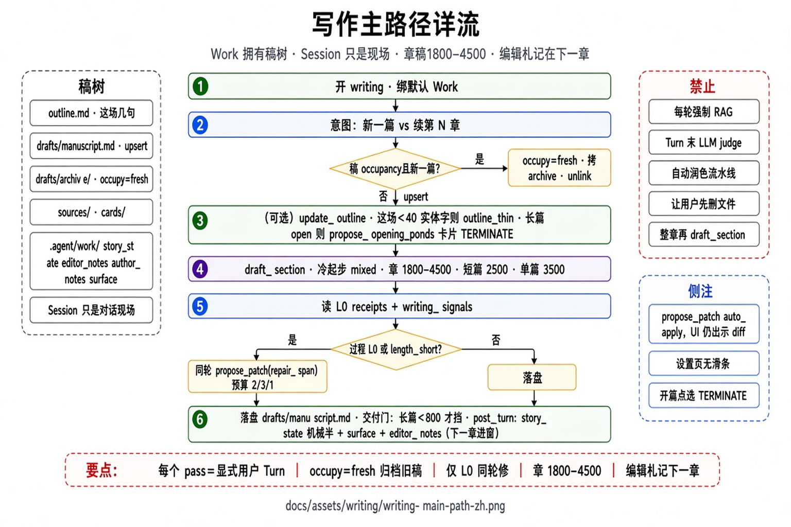
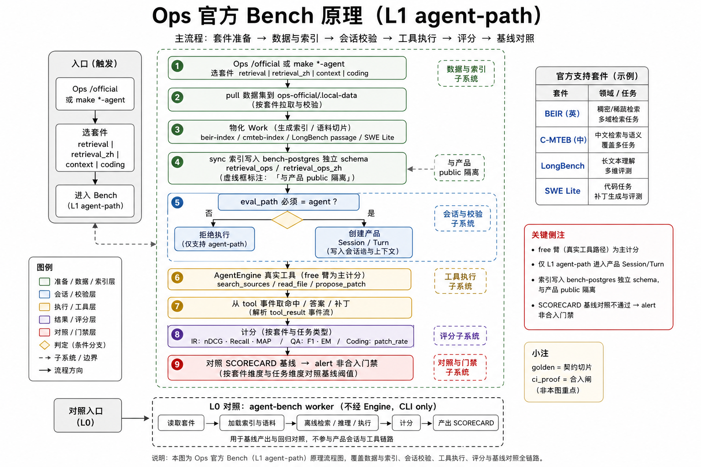

# 工作台（写作 · Ops Bench · 证明）

写作主路径、Ops **官方 Bench 效果温度计**、契约切片与合入证明。沙箱/组窗见「工具与上下文」；检索店内细节见「RAG」；分模块发布见「架构」。

## 图

1. [写作主路径](../assets/writing/writing-main-path-zh.png) — Work 树 · 按需检索 · diff-first  
2. [Ops Bench 原理](../assets/ops/ops-bench-principle-zh.png) — L1 agent-path · 套件 · bench-postgres 隔离 · SCORECARD  





## 1. 写作：Work over Session

用户心智是「一本书 / 一份稿」；工程上 **Work** 拥有树，**Session** 只是对话线程。

```text
work_root/
  outline.md
  manuscript.md 或 sections/
  drafts/                 # 在编
  sources/                # 资料；sources/cards/ 文风与设定卡
  .agent/work/            # 作品级元数据（非 per-session 私树）
```

同一账号默认一个 Work；多 Session 换聊天线，不换世界。`/compact` 或新开会话 **不该**把章节拆进 `sessions/{id}/revisions/...` 那种「会话私有稿林」。

### 1.1 用户可见主路径

```text
意图
  →（可选）/outline · update_outline
  → 成稿：按需 search_sources（少次）+ draft_section / propose_patch
  → 改稿：diff-first · 通常 0 搜
  →（可选）/polish · export 确定性 lint · /verify
```

规则：

- **每个 pass = 用户显式 Turn**；平台不自动串成 polish pipeline。  
- 质量杠杆：稳定前缀（`scenarios/writing/system.md` + 卡 pin）+ 少次有 cite 的检索；**不是**资料越多越好。  
- **禁止默认**：每轮强制 RAG、Turn 末 judge、Skills 扛质量、自动串联多模型裁判。

### 1.2 场景与工具（写作）

| 场景 | 主杠杆 | 是否检索 |
|------|--------|----------|
| 立人设 / 文风 | 卡 pin | 否 |
| 据材料新写 | RAG + cite + 卡 | 要（控制次数） |
| 局部改稿 | patch + 卡 | 通常跳过 |
| `/polish` | Don't / Samples | 跳过 |
| 导出 | export lint | 否 |

写盘走 `propose_patch` → 用户批准 → apply；同 Turn 写盘可粘性免批，Shell 仍逐步审（见 Runtime 图）。

## 2. Ops 官方 Bench（重点）

路径：`/ops/<OPS_TEST_SECRET>/official`（密钥在 `.env` / 启动日志）。  
**效果温度计，不是合入门禁**：alert + SCORECARD 对照；服从 R1–R5（不改 Engine 语义、不污染产品索引）。

### 2.1 三层别搞混

| 层 | 是什么 | 挡合并？ |
|----|--------|----------|
| **Bench（本节目）** | 官方小集效果：BEIR / C-MTEB / LongBench / SWE | **否** |
| **Golden** | `eval/golden` 接口/契约切片（`/test`） | 否 |
| **ci_proof** | `scripts/ci_proof.sh` ≡ Actions unit+gate | **是** |

### 2.2 L1 agent-path（Ops 验收唯一路径）

Ops UI **强制** `eval_path=agent`：分数必须来自**产品 Session/Turn → AgentEngine → 真实工具**，禁止为刷分绕过 loop。

```text
/official 或 make *-agent
  → POST /api/v1/ops/official/runs
  → official_runner（拒非 agent）
  → official_agent_path.run_l1_targets
       ├─ retrieval     → run_retrieval_l1（BEIR）
       ├─ retrieval_zh  → 同上（C-MTEB；别名 cmteb）
       ├─ context       → run_context_l1（LongBench）
       └─ coding        → run_coding_l1（SWE Lite → coding_infer）
  → 从 tool / turn 事件取结果 → 官方指标 → 对照 SCORECARD
```

协议钉：`eval/official/suites.small.yaml` 里 L1 = `official-small-2026-08-m3`（改 pull/指标要刻意 bump）。  
计分臂：**free**（自然搜/读/改）为主；forced/oracle 仅诊断，不进 Ops 验收主栏。

依赖：`make up-bench`（`agent-bench-postgres` + 可选 worker）；**不需要** docker.sock（那是 ci_proof 的）。

### 2.3 套件原理

| 套件 | 官方源 | 物化 / 索引面 | Turn 里主要工具 | 主指标 |
|------|--------|---------------|-----------------|--------|
| **retrieval** | BEIR：scifact · nfcorpus · fiqa | `/data/ops-l1/beir-index` → schema **`retrieval_ops`** | `search_sources` | nDCG@10 · Recall@100 · MAP@100 |
| **retrieval_zh** | C-MTEB：Covid/Medical/Ecom（约 50k 封顶） | `cmteb-index` → schema **`retrieval_ops_zh`** | 同上 | 同上（**勿与 BEIR 宏分混栏**） |
| **context** | LongBench 小切 | Work 内 `sources/passage.md` 等 | `read_file` 等 | agent F1 / EM |
| **coding** | SWE-bench Lite（tier n3…n25/full） | checkout 可选 | `edit_file` / `write_file` | patch_rate；**resolve 须 harness+Docker** |

近期 n5 L1 实测纪要：[`docs/topics/swe-l1-n5-results.md`](./swe-l1-n5-results.md)。

共用 embedder（GPU 时常 **bge-m3**）；BEIR 与 ZH **只分 schema/HNSW**，模型维数要一致才可纵向比。换模型后勿跨 SCORECARD 裸比。

准备例：

```bash
make up-bench
make ops-cmteb-prepare && make sync-ops-cmteb   # 中文检索索引
make official-bench-retrieval-agent             # 或 Ops UI 点 retrieval
make official-bench-retrieval-zh-agent
make official-bench-context-agent
make official-bench-coding-infer-agent          # OFFICIAL_SWE_TIER=…
```

数据落 `BENCH_DATA_DIR`（宿主常 `eval/official/.local-data` ↔ 容器 `/data/ops-official/data`），**不进 git**。

### 2.4 与产品面隔离（硬规则）

| 平面 | 库 / schema | 谁写 |
|------|-------------|------|
| 用户资料 | `agent-postgres` · `public` | 日常写作/Agent |
| Ops BEIR | `bench-postgres` · `retrieval_ops` | L1 sync |
| Ops C-MTEB | `bench-postgres` · `retrieval_ops_zh` | L1 sync |
| 离线 retrieval-bench | 常 `retrieval_bench` | `make retrieval-bench-prod` |

Bench **不得**为刷分改产品检索默认、也不得把 ops-l1 语料焊进用户 Work 可见库（seed/visibility 规则见 RAG）。

### 2.5 L0 component（对照，非 Ops 验收）

CLI / `agent-bench` worker：`beir_run` · `context_run` · `swe_run` —— **不经** AgentEngine（除非显式平台开关）。  
用途：组件级 hybrid vs BM25、上下文三臂、编码直推。Ops `/official` **拒**非 agent 路径。  
入口：`make official-bench-retrieval|context|coding-*|all`（无 `-agent` 后缀的多为 L0）。

### 2.6 旁路观测（配合 Bench，不是另一套分数）

| 入口 | 用途 |
|------|------|
| `/retrieval` | 真实 Turn 的召回池 / 排序 / 进窗（L1·L2·L3 **审计层**，勿与套件名 L1 混淆） |
| envelope / raw | 同 Turn 组窗与 `turn_events` 只读 |
| `p1_lexical_micro` | SciFact FTS vs Okapi 微实验：无 Turn、无 embed |

审计层口诀：套件 **L1 = agent-path 计分路径**；`/retrieval` 页的 L1/L2/L3 = **单次召回漏斗诊断**。

## 3. Golden：契约 / 接口切片（非重点）

`/ops/.../test` · `suite=golden`：对现网 api→runtime 跑 `eval/golden` YAML，断言协议与主路径行为（stub/live/recorded）。  

- 证明「接口与 loop 没炸」，**不能**冒充生产召回/写作效果。  
- **不阻断合并**；合入看下一节 ci_proof。  
- 需专用 overlay 的标签（ha/queue/stall/recorded）默认跳过。

## 4. 完整证明（阻断合并）

三个入口跑 **同一脚本** `scripts/ci_proof.sh`：

1. GitHub Actions `ci.yml`  
2. 本地 `make ci-proof`  
3. Ops `/test` · `suite=ci`（需一次 `make up-ops-eval`；会写粘性 `deploy/ops-eval.auto.env`，部署看板 / `up-api` 保留 docker.sock）  

顺序：stub bootstrap → `unit.*`（ux/runtime cov/api/contracts）→ `make gate`（smoke + eval-all）。  
步骤展开图：[`ci-proof-zh.png`](../assets/ops/ci-proof-zh.png)。

| 旁路 | 含义 |
|------|------|
| `make preflight` | unit 快闸 ≠ 完整证明 |
| Ops Bench / golden / `/retrieval` | 效果或切片 ≠ 合入门禁 |
| nightly live | alert-only |

日常：`make smoke` · `make gate`；效果看 `/official` + SCORECARD；召回店内细节见 RAG。
